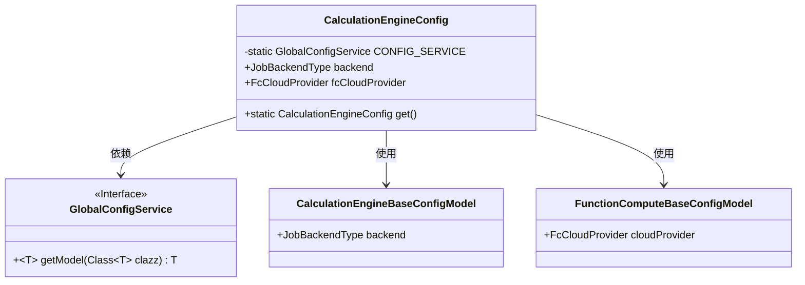
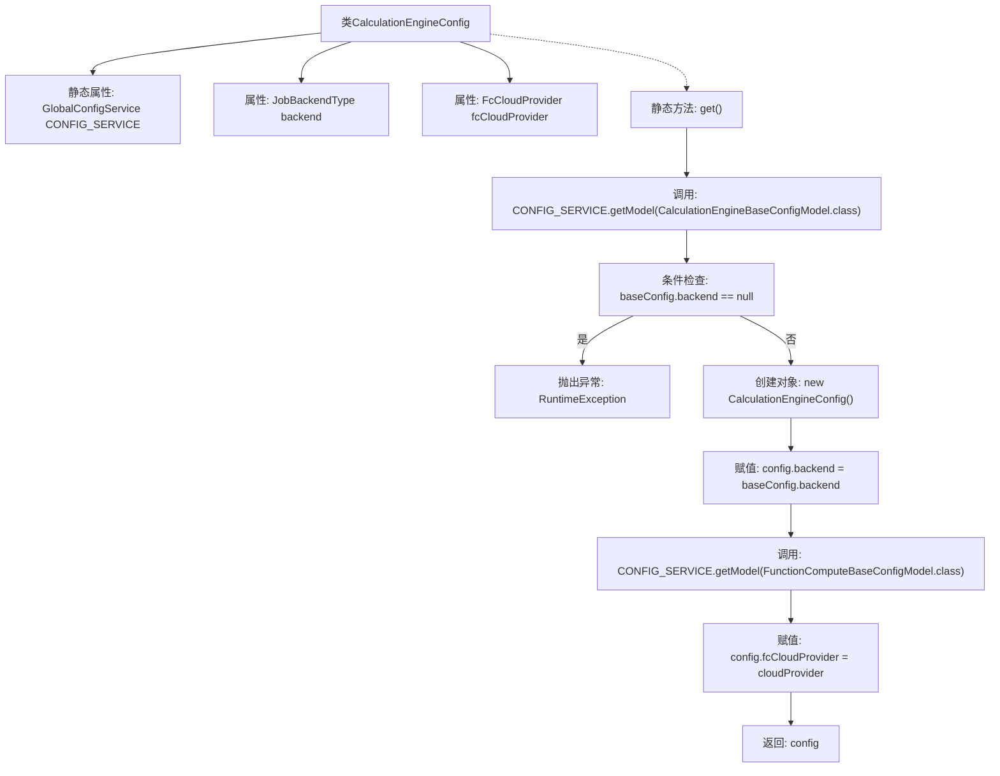

# 基础信息

|      |      |
|------|------|
| 名称 | CalculationEngineConfig |
| 编码语言 | .java |
| 代码路径 | WeFe/board/board-service/src/main/java/com/welab/wefe/board/service/dto/kernel/machine_learning/CalculationEngineConfig.java |
| 包名 | com.welab.wefe.board.service.dto.kernel.machine_learning |
| 依赖项 | ['com.alibaba.fastjson.annotation.JSONField', 'com.welab.wefe.board.service.service.globalconfig.GlobalConfigService', 'com.welab.wefe.common.web.Launcher', 'com.welab.wefe.common.wefe.dto.global_config.calculation_engine.CalculationEngineBaseConfigModel', 'com.welab.wefe.common.wefe.dto.global_config.calculation_engine.fc.FunctionComputeBaseConfigModel', 'com.welab.wefe.common.wefe.enums.FcCloudProvider', 'com.welab.wefe.common.wefe.enums.JobBackendType'] |
| 概述说明 | CalculationEngineConfig类定义了计算引擎配置，包含后端类型和函数计算服务商。通过get方法从全局配置获取并验证配置，若未指定则抛出异常。 |

# 说明

该代码定义了一个名为CalculationEngineConfig的类，用于管理计算引擎配置。它包含两个公共字段：backend表示作业后端类型，fcCloudProvider表示函数计算服务提供商。类中提供了一个静态方法get()，用于从全局配置服务中获取基础配置并构建配置对象。该方法首先检查backend字段是否为空，若为空则抛出异常提示用户指定计算环境。然后从全局配置服务中获取相关配置模型，填充config对象的字段并返回。整个类主要用于封装和获取计算引擎的全局配置信息。

# 类列表 Class Summary

| 名称   | 类型  | 说明 |
|-------|------|-------------|
| CalculationEngineConfig | class | CalculationEngineConfig类定义计算引擎配置，包含后端类型和函数计算提供商，通过get方法从全局配置获取并校验必填项。 |

## 类 CalculationEngineConfig

|      |      |
|------|------|
| 访问范围 | public |
| 类型 | class |
| 名称 | CalculationEngineConfig |
| 说明 | CalculationEngineConfig类定义计算引擎配置，包含后端类型和函数计算提供商，通过get方法从全局配置获取并校验必填项。 |

### UML类图

这段代码展示了一个计算引擎配置类`CalculationEngineConfig`，它通过静态方法`get()`从全局配置服务`GlobalConfigService`中获取基础配置模型。类中包含后端类型和云服务提供商两个公有字段，通过检查配置有效性后构建配置对象。类图中清晰体现了与配置服务接口和两个配置模型类的依赖关系，整体结构简洁但完整覆盖了核心业务逻辑。

### 内部方法调用关系图

这段代码定义了一个计算引擎配置类，包含获取全局配置的静态方法。流程图展示了从调用get()方法开始，通过获取基础配置模型、检查后端类型是否为空、创建配置对象并赋值属性，到最后返回配置对象的完整流程。其中包含异常处理分支，当未指定计算环境时会抛出运行时异常。

### 字段列表 Field List

| 名称  | 类型  | 说明 |
|-------|-------|------|
| CONFIG_SERVICE = Launcher.getBean(GlobalConfigService.class) | GlobalConfigService | 获取全局配置服务实例，通过Launcher获取GlobalConfigService类的Bean。 |
| backend | JobBackendType | JobBackendType类型的后端变量backend。 |
| fcCloudProvider | FcCloudProvider | 声明一个FcCloudProvider类型的公有变量fcCloudProvider。 |

### 方法列表

| 名称  | 类型  | 说明 |
|-------|-------|------|
| get | CalculationEngineConfig | 获取计算引擎配置，检查后端设置，未配置则报错。返回包含后端和云服务商的配置对象。 |

