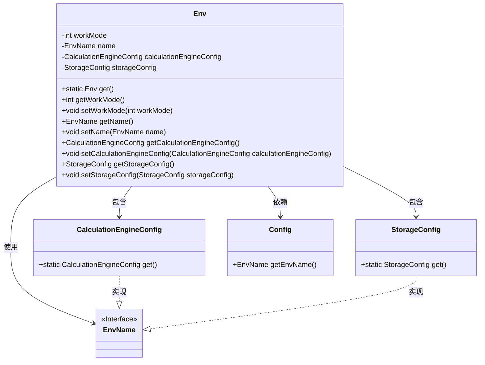
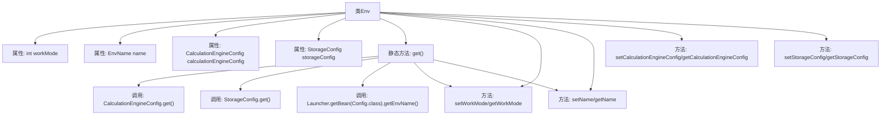

# 基础信息

|      |      |
|------|------|
| 名称 | Env |
| 编码语言 | .java |
| 代码路径 | WeFe/board/board-service/src/main/java/com/welab/wefe/board/service/dto/kernel/machine_learning/Env.java |
| 包名 | com.welab.wefe.board.service.dto.kernel.machine_learning |
| 依赖项 | ['com.alibaba.fastjson.annotation.JSONField', 'com.welab.wefe.board.service.constant.Config', 'com.welab.wefe.common.web.Launcher', 'com.welab.wefe.common.wefe.enums.env.EnvName'] |
| 概述说明 | Env类封装环境配置，包含工作模式、名称、计算引擎和存储配置。默认集群模式（1），通过网关交互，支持getter/setter方法。 |

# 说明

Env类封装了环境配置信息，包含工作模式、环境名称、计算引擎配置和存储配置。工作模式分为集群模式（1）和单机模式（0），集群模式需通过网关交互，单机模式直接写入MySQL。通过get方法初始化配置，默认设置为集群模式，并获取环境名称。类提供各属性的getter和setter方法。

# 类列表 Class Summary

| 名称   | 类型  | 说明 |
|-------|------|-------------|
| Env | class | Env类包含工作模式、名称、计算引擎和存储配置。默认工作模式为集群模式（1），通过网关访问，支持getter/setter方法。 |

## 类 Env

|      |      |
|------|------|
| 访问范围 | public |
| 类型 | class |
| 名称 | Env |
| 说明 | Env类包含工作模式、名称、计算引擎和存储配置。默认工作模式为集群模式（1），通过网关访问，支持getter/setter方法。 |

### UML类图

这段代码展示了一个环境配置类Env，它封装了工作模式、环境名称、计算引擎配置和存储配置等核心属性。类图清晰地呈现了Env与CalculationEngineConfig、StorageConfig的包含关系，以及与Config类的依赖关系。EnvName作为接口被多个配置类实现，体现了良好的抽象设计。通过静态工厂方法get()集中管理环境配置的初始化，确保配置的一致性和易用性。

### 内部方法调用关系图

这段代码定义了一个Env类，用于管理环境配置。核心功能是通过静态方法get()初始化环境实例，加载计算引擎和存储配置，设置工作模式和名称。工作模式分为集群模式(1)和单机模式(0)，名称通过Launcher从配置中获取。类包含标准getter/setter方法，并通过@JSONField注解控制序列化行为。流程图展示了类结构、方法调用关系和属性访问路径。

### 字段列表 Field List

| 名称  | 类型  | 说明 |
|-------|-------|------|
| storageConfig | StorageConfig | 私有存储配置对象 |
| workMode | int | 私有整型变量workMode，用于表示工作模式。 |
| name | EnvName | 私有环境变量名称。 |
| calculationEngineConfig | CalculationEngineConfig | 私有计算引擎配置对象。 |

### 方法列表

| 名称  | 类型  | 说明 |
|-------|-------|------|
| get | Env | 方法get()创建Env对象，设置计算引擎和存储配置。任务模式设为集群模式(1)，需网关交互，名称从配置获取。单机模式(0)直接写MySQL。 |
| setWorkMode | void | 设置工作模式的方法，参数为workMode，赋值给当前对象的workMode属性。 |
| getCalculationEngineConfig | CalculationEngineConfig | 获取计算引擎配置的方法，返回calculationEngineConfig对象。 |
| setCalculationEngineConfig | void | 设置计算引擎配置的方法，将传入的配置对象赋值给当前对象的成员变量。 |
| getStorageConfig | StorageConfig | 获取存储配置对象的方法。 |
| setStorageConfig | void | 设置存储配置方法，将输入参数赋值给类的存储配置变量。 |
| setName | void | 设置对象名称的方法，将参数name赋值给对象的name属性。 |
| getName | EnvName | 获取当前环境名称的方法，返回EnvName类型变量name。 |
| getWorkMode | int | 方法返回当前工作模式值。 |

