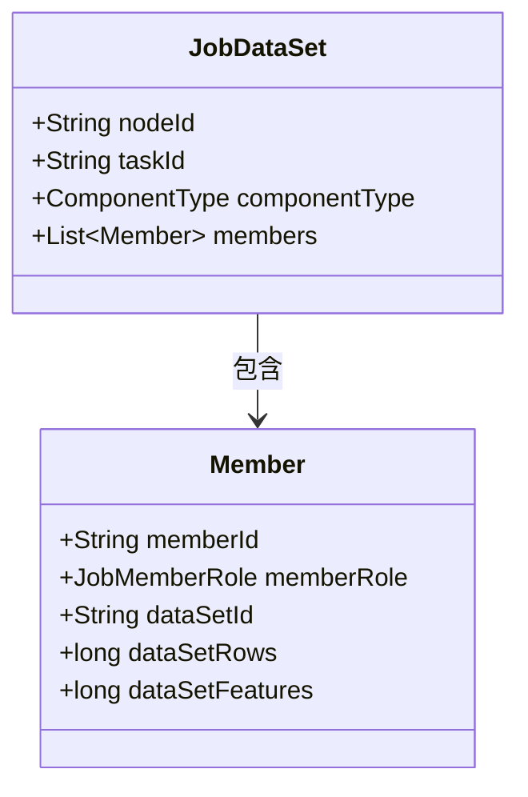
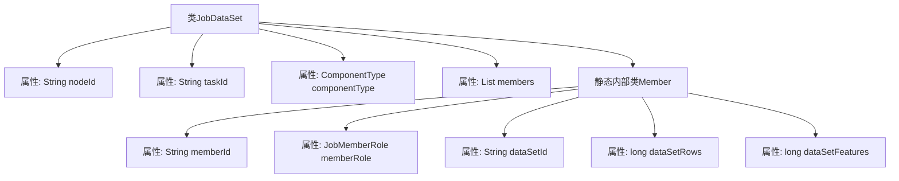

# 基础信息

|      |      |
|------|------|
| 名称 | JobDataSet |
| 编码语言 | .java |
| 代码路径 | WeFe/board/board-service/src/main/java/com/welab/wefe/board/service/dto/kernel/machine_learning/JobDataSet.java |
| 包名 | com.welab.wefe.board.service.dto.kernel.machine_learning |
| 依赖项 | ['com.welab.wefe.common.wefe.enums.ComponentType', 'com.welab.wefe.common.wefe.enums.JobMemberRole', 'java.util.List'] |
| 概述说明 | JobDataSet类包含节点ID、任务ID、组件类型和成员列表。每个成员有ID、角色、数据集ID、行数和特征数。 |

# 说明

JobDataSet类包含节点ID、任务ID、组件类型和成员列表四个主要属性。成员列表由Member类构成，每个Member包含成员ID、角色、数据集ID、数据集行数和特征数五个字段。该结构用于描述任务相关的数据集信息，包括参与成员及其对应的数据集详情。

# 类列表 Class Summary

| 名称   | 类型  | 说明 |
|-------|------|-------------|
| JobDataSet | class | JobDataSet类包含节点ID、任务ID、组件类型和成员列表。Member类定义成员ID、角色、数据集ID、行数和特征数。 |

## 类 JobDataSet

|      |      |
|------|------|
| 访问范围 | public |
| 类型 | class |
| 名称 | JobDataSet |
| 说明 | JobDataSet类包含节点ID、任务ID、组件类型和成员列表。Member类定义成员ID、角色、数据集ID、行数和特征数。 |

### UML类图

这段类图展示了JobDataSet类及其嵌套类Member的结构。JobDataSet包含节点ID、任务ID、组件类型和一个Member对象列表；Member类则存储成员ID、角色、数据集ID及数据规模信息。两者构成简单的聚合关系，反映了数据集与成员间的层级结构。

### 内部方法调用关系图

这段代码定义了一个名为JobDataSet的类，包含四个属性：nodeId、taskId、componentType和members。其中members是一个Member类型的列表。Member是一个静态内部类，包含五个属性：memberId、memberRole、dataSetId、dataSetRows和dataSetFeatures。流程图清晰地展示了类与内部类之间的层级关系，以及各自的属性构成。

### 字段列表 Field List

| 名称  | 类型  | 说明 |
|-------|-------|------|
| members | List<Member> | 声明一个名为members的公共列表，存储Member类型对象。 |
| nodeId | String | 声明一个公开的字符串类型变量nodeId。 |
| taskId | String | 声明一个公共字符串变量taskId。 |
| componentType | ComponentType | 定义组件类型的公共变量。 |

### 方法列表

| 名称  | 类型  | 说明 |
|-------|-------|------|

