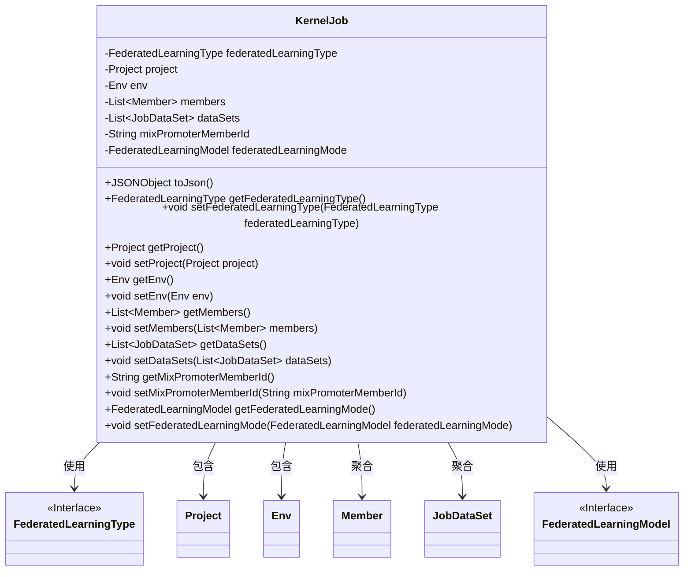
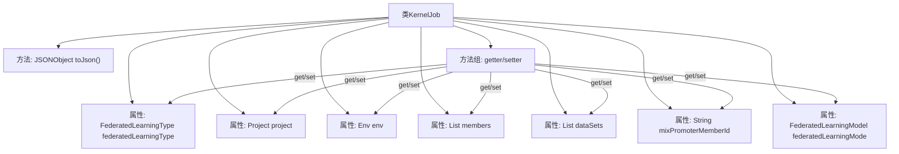

# 基础信息

|      |      |
|------|------|
| 名称 | KernelJob |
| 编码语言 | .java |
| 代码路径 | WeFe/board/board-service/src/main/java/com/welab/wefe/board/service/dto/kernel/machine_learning/KernelJob.java |
| 包名 | com.welab.wefe.board.service.dto.kernel.machine_learning |
| 依赖项 | ['com.alibaba.fastjson.JSONObject', 'com.welab.wefe.board.service.dto.kernel.Member', 'com.welab.wefe.common.fieldvalidate.annotation.Check', 'com.welab.wefe.common.wefe.enums.FederatedLearningModel', 'com.welab.wefe.common.wefe.enums.FederatedLearningType', 'java.util.List'] |
| 概述说明 | KernelJob类包含联邦学习类型、项目、环境、成员、数据集等属性，提供getter/setter方法和JSON转换功能。 |

# 说明

KernelJob类定义了联邦学习任务的核心属性，包含联邦学习类型、项目信息、环境配置、成员列表、数据集列表、混合联邦发起者ID和联邦学习模型。类中提供了所有属性的getter和setter方法，以及将对象转换为JSON格式的toJson方法。该类用于封装联邦学习任务的完整配置信息。

# 类列表 Class Summary

| 名称   | 类型  | 说明 |
|-------|------|-------------|
| KernelJob | class | KernelJob类包含联邦学习类型、项目、环境、成员、数据集等属性，提供getter/setter方法和JSON转换功能。 |

## 类 KernelJob

|      |      |
|------|------|
| 访问范围 | public |
| 类型 | class |
| 名称 | KernelJob |
| 说明 | KernelJob类包含联邦学习类型、项目、环境、成员、数据集等属性，提供getter/setter方法和JSON转换功能。 |

### UML类图

这段类图展示了KernelJob类的结构及其与其他类的关系。KernelJob是一个核心工作类，包含联邦学习类型、项目信息、环境配置、成员列表、数据集列表等私有属性，并通过getter/setter方法提供访问接口。该类实现了toJson()方法用于对象序列化，同时与FederatedLearningType、Project、Env等类存在关联关系，其中Member和JobDataSet以聚合形式存在。所有关联类均保持单向依赖，体现了清晰的职责划分。

### 内部方法调用关系图

该流程图展示了KernelJob类的完整结构，包含7个私有属性和对应的getter/setter方法组，以及核心的toJson()序列化方法。所有属性均通过标准JavaBean规范进行封装，其中mixPromoterMemberId属性带有自定义注解校验标记。toJson()方法通过JSON库实现对象到JSON字符串的转换，体现了类的主要数据交换功能。

### 字段列表 Field List

| 名称  | 类型  | 说明 |
|-------|-------|------|
| dataSets | List<JobDataSet> | 私有JobDataSet类型列表变量dataSets。 |
| project | Project | 私有项目对象project。 |
| members | List<Member> | 成员列表，存储Member对象。 |
| mixPromoterMemberId | String | 定义私有字符串mixPromoterMemberId，用于检查混合联邦的promoter_id。 |
| federatedLearningType | FederatedLearningType | 私有联邦学习类型变量federatedLearningType。 |
| federatedLearningMode | FederatedLearningModel | 私有联邦学习模型变量federatedLearningMode。 |
| env | Env | 私有环境变量实例env。 |

### 方法列表

| 名称  | 类型  | 说明 |
|-------|-------|------|
| getDataSets | List<JobDataSet> | 获取数据集列表的方法，返回存储的数据集集合。 |
| setProject | void | 设置当前对象的项目属性为指定项目。 |
| toJson | JSONObject | 方法将当前对象转换为JSON字符串，再解析为JSONObject并返回。 |
| setFederatedLearningType | void | 设置联邦学习类型的方法，参数为FederatedLearningType类型。 |
| getFederatedLearningMode | FederatedLearningModel | 获取联邦学习模型的当前模式。返回值为FederatedLearningModel类型。 |
| setFederatedLearningMode | void | 设置联邦学习模式的方法，参数为FederatedLearningModel类型。 |
| getEnv | Env | 获取环境对象的方法，返回env实例。 |
| getProject | Project | 获取当前项目对象的方法。 |
| getMixPromoterMemberId | String | 获取mixPromoterMemberId的字符串值。 |
| setEnv | void | 设置环境变量方法，将传入的env参数赋值给当前对象的env属性。 |
| setDataSets | void | 设置数据集列表的方法，将输入参数赋值给类成员变量dataSets。 |
| setMembers | void | 设置成员列表方法，将输入参数members赋值给当前对象的members属性。 |
| getFederatedLearningType | FederatedLearningType | 获取联邦学习类型的方法，返回当前设置的federatedLearningType值。 |
| setMixPromoterMemberId | void | 设置混合推广成员ID的方法，将参数值赋给类成员变量mixPromoterMemberId。 |
| getMembers | List<Member> | 获取成员列表的方法，直接返回成员集合。 |

