# 基础信息

|      |      |
|------|------|
| 名称 | KernelTask |
| 编码语言 | .java |
| 代码路径 | WeFe/board/board-service/src/main/java/com/welab/wefe/board/service/dto/kernel/machine_learning/KernelTask.java |
| 包名 | com.welab.wefe.board.service.dto.kernel.machine_learning |
| 依赖项 | ['com.welab.wefe.board.service.dto.kernel.Member', 'com.welab.wefe.common.fieldvalidate.annotation.Check', 'java.util.List'] |
| 概述说明 | KernelTask类包含成员列表和提供者相关属性，如主节点标识、ID等，提供getter和setter方法。 |

# 说明

KernelTask类是一个包含成员列表和相关提供者信息的类。它有两个构造函数，一个无参，一个接受成员列表。类中包含一个私有成员列表members，以及多个标注了@Check的字段，包括mixPromoterMemberId（混合联盟发起者ID）、providerMaster（是否为主节点）、providerInnerId（当前提供者ID）、providerMasterInnerId（主节点ID）和providerOtherInnerId（其他提供者ID列表）。类为每个字段提供了对应的getter和setter方法，用于访问和修改这些属性。

# 类列表 Class Summary

| 名称   | 类型  | 说明 |
|-------|------|-------------|
| KernelTask | class | KernelTask类包含成员列表和提供者相关属性，如主节点标识、ID等，提供getter和setter方法。 |


## 类 KernelTask

|      |      |
|------|------|
| 访问范围 | public |
| 类型 | class |
| 名称 | KernelTask |
| 说明 | KernelTask类包含成员列表和提供者相关属性，如主节点标识、ID等，提供getter和setter方法。 |


### UML类图

```mermaid
classDiagram
    class KernelTask {
        -List~Member~ members
        -String mixPromoterMemberId <<Check("Mixed Federation promoter_id")>>
        -boolean providerMaster <<Check("Whether it is the main node of the current provider")>>
        -String providerInnerId <<Check("The id of the current provider")>>
        -String providerMasterInnerId <<Check("The primary node id of the current provider")>>
        -List~String~ providerOtherInnerId <<Check("Other id of the current provider, not including itself")>>
        +KernelTask()
        +KernelTask(List~Member~ members)
        +List~Member~ getMembers()
        +void setMembers(List~Member~ members)
        +String getMixPromoterMemberId()
        +void setMixPromoterMemberId(String mixPromoterMemberId)
        +boolean isProviderMaster()
        +void setProviderMaster(boolean providerMaster)
        +String getProviderInnerId()
        +void setProviderInnerId(String providerInnerId)
        +String getProviderMasterInnerId()
        +void setProviderMasterInnerId(String providerMasterInnerId)
        +List~String~ getProviderOtherInnerId()
        +void setProviderOtherInnerId(List~String~ providerOtherInnerId)
    }
```

该类图展示了KernelTask类的结构，它是一个包含成员列表和各种提供者相关属性的任务类。该类具有两个构造函数（默认构造和带成员列表构造），以及多个带有@Check注解的属性，这些属性用于验证混合联邦推广者ID、当前提供者的主节点状态、提供者内部ID等信息。所有属性都有对应的getter和setter方法，实现了对成员数据和提供者相关配置的封装管理。


### 内部方法调用关系图

```mermaid
graph TD
    A["类KernelTask"]
    B["属性: List<Member> members"]
    C["属性: @Check String mixPromoterMemberId"]
    D["属性: @Check boolean providerMaster"]
    E["属性: @Check String providerInnerId"]
    F["属性: @Check String providerMasterInnerId"]
    G["属性: @Check List<String> providerOtherInnerId"]
    H["构造方法: KernelTask()"]
    I["构造方法: KernelTask(List<Member>)"]
    J["方法: getMembers()"]
    K["方法: setMembers(List<Member>)"]
    L["方法: getMixPromoterMemberId()"]
    M["方法: setMixPromoterMemberId(String)"]
    N["方法: isProviderMaster()"]
    O["方法: setProviderMaster(boolean)"]
    P["方法: getProviderInnerId()"]
    Q["方法: setProviderInnerId(String)"]
    R["方法: getProviderMasterInnerId()"]
    S["方法: setProviderMasterInnerId(String)"]
    T["方法: getProviderOtherInnerId()"]
    U["方法: setProviderOtherInnerId(List<String>)"]

    A --> B
    A --> C
    A --> D
    A --> E
    A --> F
    A --> G
    A --> H
    A --> I
    A --> J
    A --> K
    A --> L
    A --> M
    A --> N
    A --> O
    A --> P
    A --> Q
    A --> R
    A --> S
    A --> T
    A --> U
```



这段代码描述了一个名为KernelTask的类，主要用于管理成员列表和提供者相关的信息。类中包含多个带有@Check注解的属性，用于验证数据的合法性。该类提供了两个构造方法，一个无参构造方法和一个接受成员列表的构造方法。此外，还提供了多个getter和setter方法，用于访问和修改类的私有属性。整体设计体现了封装性，通过方法暴露对属性的操作，同时使用注解标记需要检查的属性。

### 字段列表 Field List

| 名称  | 类型  | 说明 |
|-------|-------|------|
| providerMaster | boolean | 检查当前节点是否为提供者的主节点，布尔类型字段providerMaster。 |
| providerInnerId | String | 当前提供商的ID校验字段。 |
| providerOtherInnerId | List<String> | 当前提供者的其他内部ID列表（不包含自身）。 |
| providerMasterInnerId | String | 当前提供方的主节点ID检查字段。 |
| mixPromoterMemberId | String | 私有字符串变量mixPromoterMemberId，用于检查混合联邦的promoter_id。 |
| members | List<Member> | 成员列表，存储Member对象。 |

### 方法列表

| 名称  | 类型  | 说明 |
|-------|-------|------|
| setMembers | void | 设置成员列表的方法，将输入参数赋值给类成员变量members。 |
| setMixPromoterMemberId | void | 设置混合推广成员ID的方法，将参数值赋给类成员变量mixPromoterMemberId。 |
| getMembers | List<Member> | 获取成员列表的方法，返回成员集合。 |
| getMixPromoterMemberId | String | 获取混合推广成员ID的方法，返回字符串类型的mixPromoterMemberId。 |
| setProviderMaster | void | 设置providerMaster属性的布尔值方法。 |
| isProviderMaster | boolean | 检查是否为提供者主节点。 |
| setProviderInnerId | void | 设置内部供应商ID的方法，将参数值赋给类的成员变量providerInnerId。 |
| getProviderInnerId | String | 获取providerInnerId的公共方法，返回字符串类型的providerInnerId值。 |
| getProviderMasterInnerId | String | 获取providerMasterInnerId的字符串值的方法。 |
| setProviderMasterInnerId | void | 设置提供商标识的内部ID方法。 |
| getProviderOtherInnerId | List<String> | 获取providerOtherInnerId列表的方法，返回类型为List<String>。 |
| setProviderOtherInnerId | void | 设置providerOtherInnerId列表的方法，用于更新类中的providerOtherInnerId字段。 |


