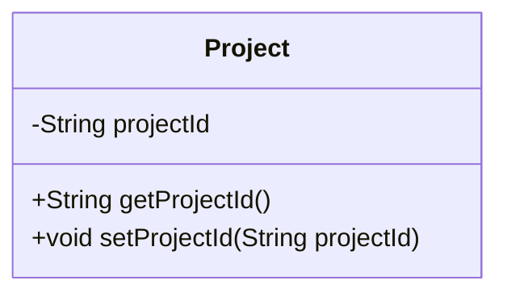
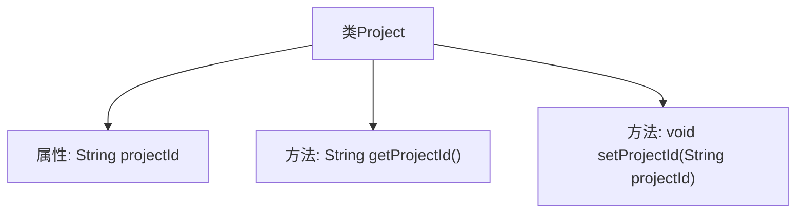

# 基础信息

|      |      |
|------|------|
| 名称 | Project |
| 编码语言 | .java |
| 代码路径 | WeFe/board/board-service/src/main/java/com/welab/wefe/board/service/dto/kernel/machine_learning/Project.java |
| 包名 | com.welab.wefe.board.service.dto.kernel.machine_learning |
| 依赖项 | [] |
| 概述说明 | Project类包含私有字段projectId及其getter和setter方法。 |

# 说明

这段内容定义了一个名为Project的Java类，包含一个私有字符串类型成员变量projectId。类中提供了对该变量的公共访问方法，包括getProjectId()用于获取变量值，setProjectId(String projectId)用于设置变量值。通过getter和setter方法实现了对私有变量的封装和访问控制。整个类结构简洁，仅包含一个属性和其对应的访问方法。

# 类列表 Class Summary

| 名称   | 类型  | 说明 |
|-------|------|-------------|
| Project | class | Project类包含私有字段projectId及其getter和setter方法。 |

## 类 Project

|      |      |
|------|------|
| 访问范围 | public |
| 类型 | class |
| 名称 | Project |
| 说明 | Project类包含私有字段projectId及其getter和setter方法。 |

### UML类图

这段代码定义了一个简单的Project类，包含一个私有字符串属性projectId和对应的getter/setter方法。类图清晰地展示了类的结构：私有属性projectId被封装，通过公有方法getProjectId()和setProjectId()进行访问和修改。这种设计遵循了面向对象编程的封装原则，使得属性访问可控且易于维护。类图简洁明了地呈现了类的成员和方法，便于理解类的功能和使用方式。

### 内部方法调用关系图

这段流程图描述了Project类的结构，包含一个私有属性projectId以及对应的getter和setter方法。getProjectId()用于获取项目ID，setProjectId(String)用于设置项目ID。类通过这两个方法实现对私有属性的封装，符合面向对象编程的基本原则，确保数据的安全性和可控性。整个设计简洁明了，便于维护和扩展。

### 字段列表 Field List

| 名称  | 类型  | 说明 |
|-------|-------|------|
| projectId | String | 定义私有字符串变量projectId。 |

### 方法列表

| 名称  | 类型  | 说明 |
|-------|-------|------|
| getProjectId | String | 获取项目ID的方法，返回字符串类型的projectId。 |
| setProjectId | void | 设置项目ID的方法，将输入参数projectId赋值给当前对象的projectId属性。 |

