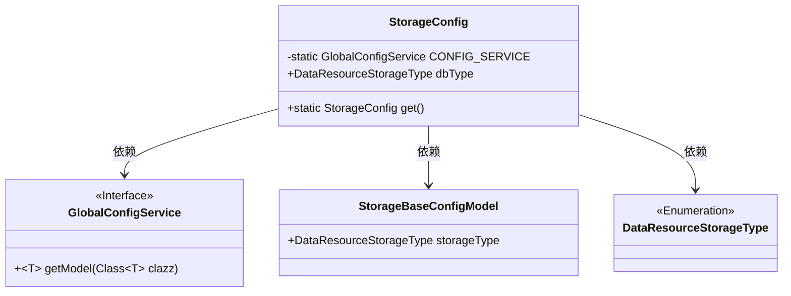
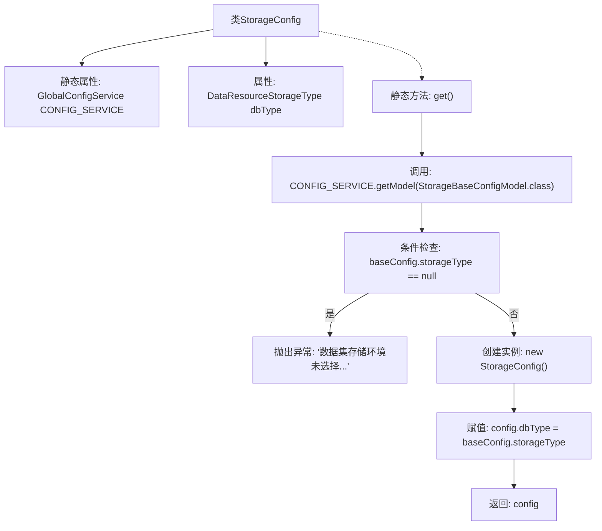

# 基础信息

|      |      |
|------|------|
| 名称 | StorageConfig |
| 编码语言 | .java |
| 代码路径 | WeFe/board/board-service/src/main/java/com/welab/wefe/board/service/dto/kernel/machine_learning/StorageConfig.java |
| 包名 | com.welab.wefe.board.service.dto.kernel.machine_learning |
| 依赖项 | ['com.alibaba.fastjson.annotation.JSONField', 'com.welab.wefe.board.service.service.globalconfig.GlobalConfigService', 'com.welab.wefe.common.web.Launcher', 'com.welab.wefe.common.wefe.dto.global_config.storage.StorageBaseConfigModel', 'com.welab.wefe.common.wefe.enums.DataResourceStorageType'] |
| 概述说明 | StorageConfig类通过静态方法get获取存储类型配置，若未配置则抛出异常。使用GlobalConfigService和JSONField注解。 |

# 说明

StorageConfig类用于获取数据集存储配置。它包含一个静态变量CONFIG_SERVICE，通过Launcher获取GlobalConfigService实例。类中定义了dbType字段表示存储类型。get方法是一个静态方法，使用@JSONField注解禁止序列化。该方法从CONFIG_SERVICE获取StorageBaseConfigModel实例，检查storageType是否为空，若为空则抛出异常提示用户指定存储类型。最后创建StorageConfig实例并设置dbType后返回。

# 类列表 Class Summary

| 名称   | 类型  | 说明 |
|-------|------|-------------|
| StorageConfig | class | StorageConfig类通过静态方法get获取存储类型配置，未配置时抛出异常。使用GlobalConfigService加载配置并返回StorageConfig实例。 |

## 类 StorageConfig

|      |      |
|------|------|
| 访问范围 | public |
| 类型 | class |
| 名称 | StorageConfig |
| 说明 | StorageConfig类通过静态方法get获取存储类型配置，未配置时抛出异常。使用GlobalConfigService加载配置并返回StorageConfig实例。 |

### UML类图

这段代码描述了一个存储配置类`StorageConfig`，它通过静态方法`get()`从全局配置服务`GlobalConfigService`中获取基础配置模型`StorageBaseConfigModel`，并验证存储类型是否已设置。若未设置则抛出异常，否则返回包含存储类型枚举`DataResourceStorageType`的配置实例。类图中展示了`StorageConfig`与三个依赖组件的关系，包括接口、数据模型和枚举类型。

### 内部方法调用关系图

该流程图描述了StorageConfig类的静态方法get()的执行逻辑。首先通过CONFIG_SERVICE获取基础配置模型，检查存储类型是否为空，若为空则抛出异常，否则创建新实例并设置dbType属性后返回。整个过程实现了对数据集存储类型的配置检查和封装返回。

### 字段列表 Field List

| 名称  | 类型  | 说明 |
|-------|-------|------|
| dbType | DataResourceStorageType | 数据库资源存储类型变量dbType。 |
| CONFIG_SERVICE = Launcher.getBean(GlobalConfigService.class) | GlobalConfigService | 获取全局配置服务实例，通过Launcher的getBean方法注入GlobalConfigService类。 |

### 方法列表

| 名称  | 类型  | 说明 |
|-------|-------|------|
| get | StorageConfig | 静态方法get()获取存储配置，若未设置存储类型则抛出异常，否则返回包含存储类型的配置对象。 |

