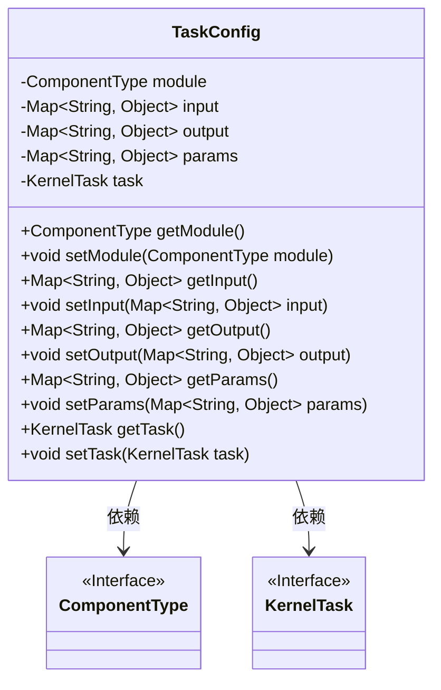

# 基础信息

|      |      |
|------|------|
| 名称 | TaskConfig |
| 编码语言 | .java |
| 代码路径 | WeFe/board/board-service/src/main/java/com/welab/wefe/board/service/dto/kernel/machine_learning/TaskConfig.java |
| 包名 | com.welab.wefe.board.service.dto.kernel.machine_learning |
| 依赖项 | ['com.welab.wefe.common.fieldvalidate.annotation.Check', 'com.welab.wefe.common.wefe.enums.ComponentType', 'java.util.Map'] |
| 概述说明 | TaskConfig类包含模块类型、输入输出信息和参数配置，以及与KernelTask的关联，提供完整的getter/setter方法。 |

# 说明

TaskConfig类定义了任务配置的核心结构，包含五个主要字段：module表示组件类型，input和output分别存储组件的输入输出信息（带@Check注解），params保存组件参数（需大写字母开头以兼容kernel），task关联KernelTask实例。所有字段均通过getter/setter方法访问，采用标准的JavaBean规范实现数据封装。

# 类列表 Class Summary

| 名称   | 类型  | 说明 |
|-------|------|-------------|
| TaskConfig | class | TaskConfig类包含模块类型、输入输出映射、参数映射和任务对象，提供getter/setter方法。 |

## 类 TaskConfig

|      |      |
|------|------|
| 访问范围 | public |
| 类型 | class |
| 名称 | TaskConfig |
| 说明 | TaskConfig类包含模块类型、输入输出映射、参数映射和任务对象，提供getter/setter方法。 |

### UML类图

类图描述：TaskConfig类用于配置任务信息，包含模块类型(ComponentType)、输入输出参数(Map<String, Object>)和任务参数(params)等私有字段，通过公有getter/setter方法进行访问和修改。该类依赖于ComponentType和KernelTask两个接口，分别表示模块类型和内核任务的核心功能。注解@Check用于标记输入输出参数的校验信息。

### 内部方法调用关系图

```mermaid
graph TD
    A["类TaskConfig"]
    B["属性: ComponentType module"]
    C["属性: Map<String,Object> input"]
    D["属性: Map<String,Object> output"]
    E["属性: Map<String,Object> params"]
    F["属性: KernelTask task"]
    G["方法: getModule()"]
    H["方法: setModule(ComponentType)"]
    I["方法: getInput()"]
    J["方法: setInput(Map)"]
    K["方法: getOutput()"]
    L["方法: setOutput(Map)"]
    M["方法: getParams()"]
    N["方法: setParams(Map)"]
    O["方法: getTask()"]
    P["方法: setTask(KernelTask)"]

    A --> B
    A --> C
    A --> D
    A --> E
    A --> F
    A --> G
    A --> H
    A --> I
    A --> J
    A --> K
    A --> L
    A --> M
    A --> N
    A --> O
    A --> P
```

这段代码定义了一个名为TaskConfig的类，用于管理任务配置信息。该类包含五个主要属性：module表示组件类型，input和output分别存储组件的输入输出信息（带有@Check注解），params保存组件参数，task关联内核任务。为每个属性提供了标准的getter/setter方法，实现了对配置数据的封装访问。注解表明input/output字段需要被校验，params字段的注释说明其命名需符合kernel规范。

### 字段列表 Field List

| 名称  | 类型  | 说明 |
|-------|-------|------|
| module | ComponentType | 声明一个私有模块组件类型的变量module。 |
| task | KernelTask | 私有内核任务对象。 |
| input | Map<String, Object> | 组件输入信息检查，存储键值对映射。 |
| params | Map<String, Object> | 私有映射变量params，键为字符串，值为对象。 |
| output | Map<String, Object> | 定义组件输出信息的检查注解，类型为键值对映射。 |

### 方法列表

| 名称  | 类型  | 说明 |
|-------|-------|------|
| getParams | Map<String, Object> | 返回params映射的键值对集合。 |
| setParams | void | 该方法用于设置参数，接收一个键为字符串、值为对象的Map，并将其赋值给类的params成员变量。 |
| getModule | ComponentType | 获取模块的组件类型。 |
| getInput | Map<String, Object> | 方法getInput返回一个Map，键为String类型，值为Object类型，直接返回成员变量input。 |
| setModule | void | 设置组件类型模块的方法。 |
| setInput | void | 设置输入参数，类型为Map<String, Object>。 |
| setOutput | void | 设置输出对象的方法，接收键值对映射参数并赋值给类成员变量output。 |
| getOutput | Map<String, Object> | 获取output映射表的方法。 |
| setTask | void | 设置当前任务对象。 |
| getTask | KernelTask | 获取当前KernelTask实例。 |

