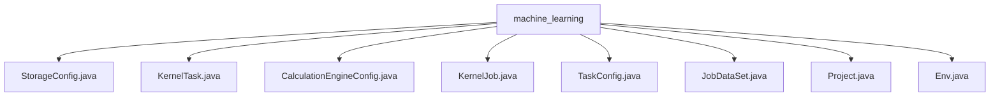

# 基础信息

|      |      |
|------|------|
| 名称 | machine_learning |
| 编码语言 | .java |
| 代码路径 | WeFe/board/board-service/src/main/java/com/welab/wefe/board/service/dto/kernel/machine_learning |
| 包名 | docs.board.board-service.src.main.java.com.welab.wefe.board.service.dto.kernel.machine_learning |
| 概述说明 | StorageConfig类获取存储配置，检查类型非空。KernelTask类管理成员列表和提供者信息。CalculationEngineConfig类管理计算引擎配置，检查后端类型。KernelJob类封装联邦学习任务配置。TaskConfig类定义任务结构，含输入输出参数。JobDataSet类描述任务数据集信息。Project类封装项目ID。Env类管理环境配置和工作模式。 |

# 说明

## 概述  
该模块核心职责是管理联邦学习任务的全局配置与执行环境，类似任务调度中心的配置中枢。接口规范遵循JavaBean标准，通过静态方法获取全局配置（如StorageConfig.get()），关键字段使用@Check/@JSONField注解控制序列化行为。  

关键数据结构包括：StorageBaseConfigModel（存储类型）、KernelTask（成员拓扑）、CalculationEngineConfig（计算后端）、KernelJob（任务元数据）三层封装。外部依赖GlobalConfigService进行配置拉取，依赖MySQL在单机模式下持久化数据。例如Env类通过工作模式开关（0/1）切换存储策略。  

## 主要业务场景  
模块支持联邦学习任务全生命周期管理，采用"配置驱动执行"模式。典型流程为：初始化Env环境→加载StorageConfig→构建KernelJob→通过TaskConfig派发计算任务。交互类似事件总线模式，各组件通过标准getter/setter交换数据。  

完整功能覆盖：成员拓扑管理（如KernelTask记录混合联盟发起者）、多后端支持（如CalculationEngineConfig切换FC云厂商）、任务编排（如JobDataSet绑定数据集与成员）。API集成案例包括：toJson()序列化任务配置、get()动态加载环境变量。例如Project类通过projectId关联任务实例。

### 包内部结构视图

该流程图展示了machine_learning目录下的所有文件结构关系。根节点为machine_learning文件夹，其下直接包含8个Java类文件，包括StorageConfig、KernelTask等，这些文件都属于机器学习内核相关的配置和任务类，没有更深层级的子目录结构。所有文件都位于同一层级，直接隶属于machine_learning目录。

# 文件列表

| 名称   | 类型  | 说明 |
|-------|------|-------------|
| [StorageConfig.java](StorageConfig.md) | file | StorageConfig类通过静态方法get获取存储类型配置，若未配置则抛出异常。使用GlobalConfigService和JSONField注解。 |
| [KernelTask.java](KernelTask.md) | file | KernelTask类包含成员列表和提供者相关属性，如主节点标识、ID等，提供getter和setter方法。 |
| [CalculationEngineConfig.java](CalculationEngineConfig.md) | file | CalculationEngineConfig类定义了计算引擎配置，包含后端类型和函数计算服务商。通过get方法从全局配置获取并验证配置，若未指定则抛出异常。 |
| [KernelJob.java](KernelJob.md) | file | KernelJob类包含联邦学习类型、项目、环境、成员、数据集等属性，提供getter/setter方法和JSON转换功能。 |
| [TaskConfig.java](TaskConfig.md) | file | TaskConfig类包含模块类型、输入输出信息和参数配置，以及与KernelTask的关联，提供完整的getter/setter方法。 |
| [JobDataSet.java](JobDataSet.md) | file | JobDataSet类包含节点ID、任务ID、组件类型和成员列表。每个成员有ID、角色、数据集ID、行数和特征数。 |
| [Project.java](Project.md) | file | Project类包含私有字段projectId及其getter和setter方法。 |
| [Env.java](Env.md) | file | Env类封装环境配置，包含工作模式、名称、计算引擎和存储配置。默认集群模式（1），通过网关交互，支持getter/setter方法。 |

