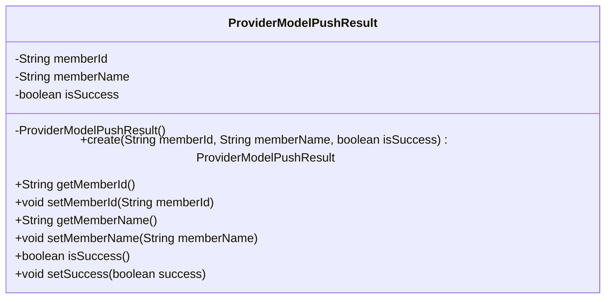
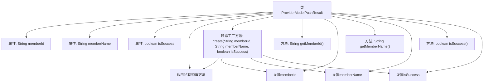

# 基础信息

|      |      |
|------|------|
| 名称 | ProviderModelPushResult |
| 编码语言 | .java |
| 代码路径 | WeFe/board/board-service/src/main/java/com/welab/wefe/board/service/dto/serving/ProviderModelPushResult.java |
| 包名 | com.welab.wefe.board.service.dto.serving |
| 依赖项 | [] |
| 概述说明 | ProviderModelPushResult类包含成员ID、名称和操作状态，提供创建和访问方法。 |

# 说明

ProviderModelPushResult类用于记录模型推送结果，包含三个核心属性：memberId表示成员标识，memberName表示成员名称，isSuccess表示推送是否成功。该类通过私有构造方法强制使用静态工厂方法create进行实例化，并提供标准的getter和setter方法用于属性访问和修改。

# 类列表 Class Summary

| 名称   | 类型  | 说明 |
|-------|------|-------------|
| ProviderModelPushResult | class | ProviderModelPushResult类封装成员ID、名称及推送状态，提供构造和访问方法。 |

## 类 ProviderModelPushResult

|      |      |
|------|------|
| 访问范围 | public |
| 类型 | class |
| 名称 | ProviderModelPushResult |
| 说明 | ProviderModelPushResult类封装成员ID、名称及推送状态，提供构造和访问方法。 |

### UML类图

该类图展示了ProviderModelPushResult类的结构，它是一个用于封装提供者模型推送结果的实体类。该类包含三个私有字段：memberId（成员ID）、memberName（成员名称）和isSuccess（操作是否成功标志）。通过工厂方法create()构造实例，并提供标准的getter/setter方法访问字段。值得注意的是构造函数被设为私有，强制使用静态工厂方法创建对象，这是一种常见的设计模式，可以更好地控制对象创建过程。

### 内部方法调用关系图

该流程图展示了ProviderModelPushResult类的结构和内部调用关系。类包含三个私有属性和七个方法，其中create()是核心静态工厂方法，通过调用私有构造器并设置属性值来创建对象。其他方法包括标准的getter/setter方法，用于访问和修改成员变量。流程图清晰呈现了工厂方法内部对私有构造器和属性赋值方法的调用链。

### 字段列表 Field List

| 名称  | 类型  | 说明 |
|-------|-------|------|
| isSuccess | boolean | 布尔型变量isSuccess，用于表示成功状态。 |
| memberName | String | 成员变量，字符串类型，名称memberName。 |
| memberId | String | 成员ID字符串变量 |

### 方法列表

| 名称  | 类型  | 说明 |
|-------|-------|------|
| create | ProviderModelPushResult | 创建ProviderModelPushResult对象，设置成员ID、名称和成功状态并返回。 |
| isSuccess | boolean | 方法isSuccess返回布尔值isSuccess的状态。 |
| setMemberName | void | 设置成员变量memberName的方法。 |
| getMemberName | String | 获取成员名称的方法，返回成员变量memberName的值。 |
| setMemberId | void | 设置成员ID的方法，将输入参数赋值给类的成员变量memberId。 |
| setSuccess | void | 设置操作成功状态的布尔值方法。 |
| getMemberId | String | 获取成员ID的方法，返回成员ID字符串。 |

