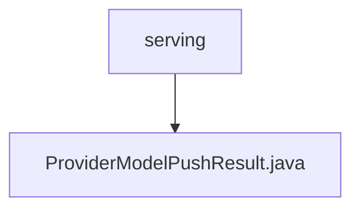

# 基础信息

|      |      |
|------|------|
| 名称 | serving |
| 编码语言 | .java |
| 代码路径 | WeFe/board/board-service/src/main/java/com/welab/wefe/board/service/dto/serving |
| 包名 | docs.board.board-service.src.main.java.com.welab.wefe.board.service.dto.serving |
| 概述说明 | ProviderModelPushResult类包含成员ID、名称和操作状态，提供创建和访问方法。 |

# 说明

ProviderModelPushResult类用于记录模型推送结果，包含三个核心属性：memberId表示成员标识，memberName表示成员名称，isSuccess表示推送是否成功。该类通过私有构造方法强制使用静态工厂方法create进行实例化，并提供标准的getter和setter方法用于属性访问和修改。

### 包内部结构视图

该流程图展示了serving目录与ProviderModelPushResult.java文件之间的层级关系。serving作为父级目录，包含一个子文件ProviderModelPushResult.java。结构简单清晰，体现了Java项目中DTO层的典型文件组织方式。

# 文件列表

| 名称   | 类型  | 说明 |
|-------|------|-------------|
| [ProviderModelPushResult.java](ProviderModelPushResult.md) | file | ProviderModelPushResult类包含成员ID、名称和操作状态，提供创建和访问方法。 |

