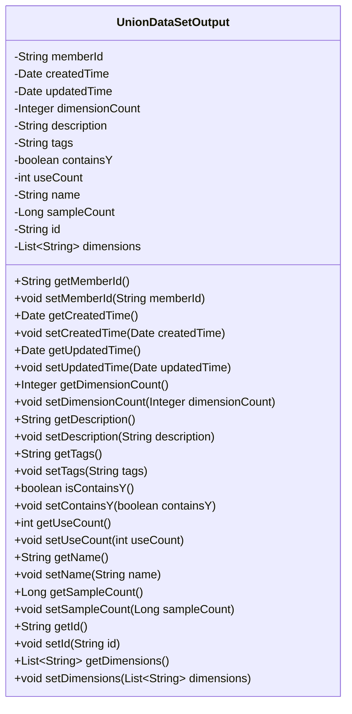

# 基础信息

|      |      |
|------|------|
| 名称 | UnionDataSetOutput |
| 编码语言 | .java |
| 代码路径 | WeFe/board/board-service/src/main/java/com/welab/wefe/board/service/dto/union/UnionDataSetOutput.java |
| 包名 | com.welab.wefe.board.service.dto.union |
| 依赖项 | ['java.util.Date', 'java.util.List'] |
| 概述说明 | UnionDataSetOutput类包含成员ID、创建更新时间、维度数、描述、标签、是否含Y、使用次数、名称、样本数、ID和维度列表等属性及其getter/setter方法。 |

# 说明

UnionDataSetOutput类是一个包含数据集相关属性的Java类，主要用于存储和管理数据集的基本信息。该类包含成员ID、创建时间、更新时间、维度数量、描述、标签、是否包含Y标志、使用次数、名称、样本数量、唯一ID以及维度列表等字段。每个字段都有对应的getter和setter方法，用于访问和修改属性值。

# 类列表 Class Summary

| 名称   | 类型  | 说明 |
|-------|------|-------------|
| UnionDataSetOutput | class | UnionDataSetOutput类包含成员ID、创建更新时间、维度数、描述、标签、是否含Y、使用次数、名称、样本数、ID和维度列表等属性及其getter/setter方法。 |

## 类 UnionDataSetOutput

|      |      |
|------|------|
| 访问范围 | public |
| 类型 | class |
| 名称 | UnionDataSetOutput |
| 说明 | UnionDataSetOutput类包含成员ID、创建更新时间、维度数、描述、标签、是否含Y、使用次数、名称、样本数、ID和维度列表等属性及其getter/setter方法。 |

### UML类图

这段代码定义了一个名为UnionDataSetOutput的Java类，它是一个典型的数据传输对象(DTO)，用于封装数据集的相关信息。类中包含12个私有字段，分别记录成员ID、创建时间、更新时间、维度数量、描述、标签、是否包含Y标志、使用次数、名称、样本数量、ID和维度列表。每个字段都有对应的getter和setter方法，提供了对这些私有字段的标准访问和修改接口。这个类的主要作用是作为数据容器，方便在不同层之间传递结构化的数据集信息。

### 内部方法调用关系图

```mermaid
graph TD
    A["类UnionDataSetOutput"]
    B["属性: String memberId"]
    C["属性: Date createdTime"]
    D["属性: Date updatedTime"]
    E["属性: Integer dimensionCount"]
    F["属性: String description"]
    G["属性: String tags"]
    H["属性: boolean containsY"]
    I["属性: int useCount"]
    J["属性: String name"]
    K["属性: Long sampleCount"]
    L["属性: String id"]
    M["属性: List<String> dimensions"]
    N["方法: getMemberId()/setMemberId()"]
    O["方法: getCreatedTime()/setCreatedTime()"]
    P["方法: getUpdatedTime()/setUpdatedTime()"]
    Q["方法: getDimensionCount()/setDimensionCount()"]
    R["方法: getDescription()/setDescription()"]
    S["方法: getTags()/setTags()"]
    T["方法: isContainsY()/setContainsY()"]
    U["方法: getUseCount()/setUseCount()"]
    V["方法: getName()/setName()"]
    W["方法: getSampleCount()/setSampleCount()"]
    X["方法: getId()/setId()"]
    Y["方法: getDimensions()/setDimensions()"]

    A --> B
    A --> C
    A --> D
    A --> E
    A --> F
    A --> G
    A --> H
    A --> I
    A --> J
    A --> K
    A --> L
    A --> M
    A --> N
    A --> O
    A --> P
    A --> Q
    A --> R
    A --> S
    A --> T
    A --> U
    A --> V
    A --> W
    A --> X
    A --> Y
```

这段代码定义了一个名为UnionDataSetOutput的Java类，包含12个私有属性和对应的getter/setter方法。该类主要用于封装数据集输出相关的元信息，包括成员ID、创建/更新时间、维度数量、描述、标签、是否包含Y标志、使用计数、名称、样本数量、唯一标识符以及维度列表等。每个属性都通过标准化的getter/setter方法提供访问和修改接口，符合JavaBean规范，适用于数据封装和序列化场景。

### 字段列表 Field List

| 名称  | 类型  | 说明 |
|-------|-------|------|
| createdTime | Date | 创建时间字段，类型为Date。 |
| name | String | 私有字符串变量name。 |
| containsY | boolean | 布尔变量，标识是否包含Y。 |
| tags | String | 私有字符串变量tags，用于存储标签信息。 |
| dimensions | List<String> | 私有字符串列表变量dimensions。 |
| useCount | int | 私有整型变量，记录使用次数。 |
| id | String | 私有字符串类型变量id。 |
| description | String | 私有字符串类型变量description |
| sampleCount | Long | 私有长整型变量sampleCount，用于记录样本数量。 |
| dimensionCount | Integer | 私有整型变量，用于记录维度数量。 |
| updatedTime | Date | 字段updatedTime用于记录更新时间，类型为Date。 |
| memberId | String | 成员ID字符串类型私有变量 |

### 方法列表

| 名称  | 类型  | 说明 |
|-------|-------|------|
| setUseCount | void | Java方法：设置useCount变量的值。 |
| setDescription | void | 设置对象描述的方法，将输入字符串赋值给对象的description属性。 |
| setContainsY | void | 这是一个Java方法，用于设置布尔类型成员变量containsY的值。方法接受一个布尔参数，并将其赋值给当前对象的containsY属性。 |
| setId | void | 设置对象ID的方法，将参数id赋值给当前对象的id属性。 |
| getName | String | 这是一个Java方法，返回私有成员变量name的值。 |
| setTags | void | 设置对象的标签属性为指定字符串。 |
| getId | String | 这是一个Java方法，返回字符串类型的id属性值。 |
| setName | void | 这是一个Java方法，用于设置对象的名称属性。方法接收一个字符串参数name，并将其赋值给当前对象的name字段。 |
| getSampleCount | Long | 这是一个Java方法，返回名为sampleCount的Long类型变量值。 |
| isContainsY | boolean | 这是一个Java方法，返回布尔值containsY的状态。 |
| setUpdatedTime | void | 设置更新时间的公共方法，参数为Date类型。 |
| getDimensions | List<String> | 方法返回字符串列表dimensions。 |
| getUpdatedTime | Date | 方法返回更新时间对象。 |
| getDescription | String | 获取描述信息的方法，返回字符串类型的description值。 |
| getDimensionCount | Integer | 获取维度数量的方法，返回整型值dimensionCount。 |
| setCreatedTime | void | 设置创建时间的方法，参数为Date类型。 |
| setMemberId | void | 设置成员ID的方法，将输入参数赋值给类的成员变量memberId。 |
| setDimensionCount | void | 设置维度数量的方法，参数为整数类型。 |
| getMemberId | String | 方法返回成员ID字符串。 |
| getTags | String | 方法getTags返回字符串类型的tags变量值。 |
| setSampleCount | void | Java方法：设置sampleCount属性值为传入的Long类型参数。 |
| getCreatedTime | Date | 获取创建时间的方法，返回Date类型的createdTime字段。 |
| getUseCount | int | 获取使用次数的整数值。 |
| setDimensions | void | 这是一个Java方法，用于设置类成员变量dimensions的值，参数为字符串列表类型。 |

