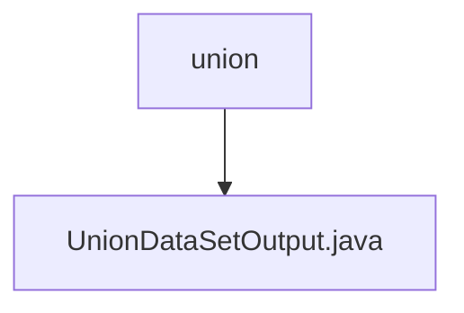

# 基础信息

|      |      |
|------|------|
| 名称 | union |
| 编码语言 | .java |
| 代码路径 | WeFe/board/board-service/src/main/java/com/welab/wefe/board/service/dto/union |
| 包名 | docs.board.board-service.src.main.java.com.welab.wefe.board.service.dto.union |
| 概述说明 | UnionDataSetOutput类包含成员ID、创建更新时间、维度数、描述、标签、是否含Y、使用次数、名称、样本数、ID和维度列表等属性及其getter/setter方法。 |

# 说明

UnionDataSetOutput类是一个包含数据集相关属性的Java类，主要用于存储和管理数据集的基本信息。该类包含成员ID、创建时间、更新时间、维度数量、描述、标签、是否包含Y标志、使用次数、名称、样本数量、唯一ID以及维度列表等字段。每个字段都有对应的getter和setter方法，用于访问和修改属性值。

### 包内部结构视图

该流程图展示了WeFe项目中board-service模块下的DTO目录结构。根节点"union"表示联合数据集的数据传输对象包，其下级节点"UnionDataSetOutput.java"是该包中定义的具体输出数据传输类。这个结构清晰地反映了DTO层中联合数据集相关类的组织方式，符合典型Java项目的分层规范。

# 文件列表

| 名称   | 类型  | 说明 |
|-------|------|-------------|
| [UnionDataSetOutput.java](UnionDataSetOutput.md) | file | UnionDataSetOutput类包含成员ID、创建更新时间、维度数、描述、标签、是否含Y、使用次数、名称、样本数、ID和维度列表等属性及其getter/setter方法。 |

