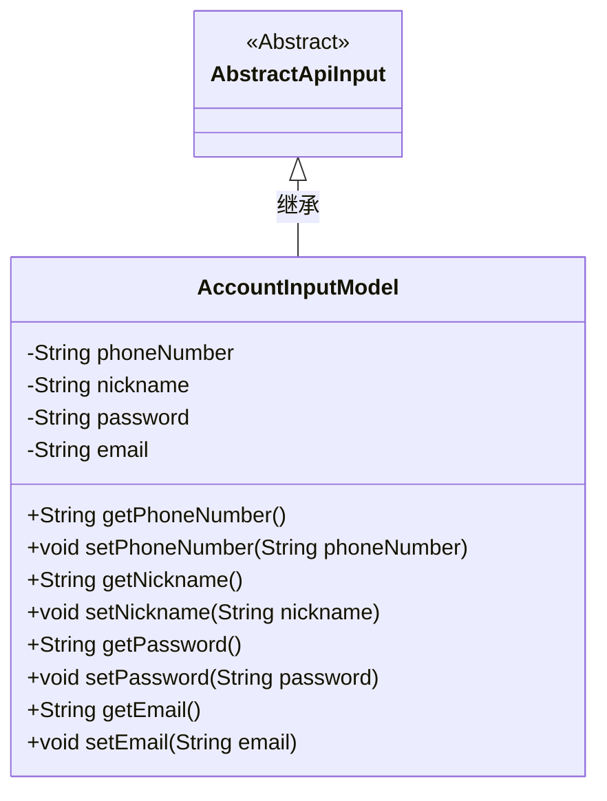

# 基础信息

|      |      |
|------|------|
| 名称 | AccountInputModel |
| 编码语言 | .java |
| 代码路径 | WeFe/board/board-service/src/main/java/com/welab/wefe/board/service/dto/vo/AccountInputModel.java |
| 包名 | com.welab.wefe.board.service.dto.vo |
| 依赖项 | ['com.welab.wefe.common.fieldvalidate.StandardFieldType', 'com.welab.wefe.common.fieldvalidate.annotation.Check', 'com.welab.wefe.common.web.dto.AbstractApiInput'] |
| 概述说明 | AccountInputModel类包含四个必填字段：电话号码、昵称、密码和邮箱，每个字段都有相应的格式校验规则。 |

# 说明

AccountInputModel类继承自AbstractApiInput，用于封装账户输入数据。包含四个必填字段：phoneNumber需符合电话号码格式，nickname长度限制2-15字符，password长度限制6-128字符，email需符合邮箱格式。每个字段均有对应的getter和setter方法。

# 类列表 Class Summary

| 名称   | 类型  | 说明 |
|-------|------|-------------|
| AccountInputModel | class | AccountInputModel类包含手机号、昵称、密码和邮箱字段，均需校验，各有长度或格式要求。 |

## 类 AccountInputModel

|      |      |
|------|------|
| 访问范围 | public |
| 类型 | class |
| 名称 | AccountInputModel |
| 说明 | AccountInputModel类包含手机号、昵称、密码和邮箱字段，均需校验，各有长度或格式要求。 |

### UML类图

这段代码展示了一个继承自AbstractApiInput的AccountInputModel类，主要用于封装账户相关的输入数据。该类包含四个私有字段（phoneNumber、nickname、password、email）及其对应的getter和setter方法，每个字段都通过@Check注解进行了格式校验约束。类图清晰地反映了继承关系和字段/方法的可见性，体现了Java Bean的标准设计模式。

### 内部方法调用关系图

```mermaid
graph TD
    A["类AccountInputModel"]
    B["继承: AbstractApiInput"]
    C["属性: String phoneNumber"]
    D["属性: String nickname"]
    E["属性: String password"]
    F["属性: String email"]
    G["方法: getPhoneNumber()"]
    H["方法: setPhoneNumber(String)"]
    I["方法: getNickname()"]
    J["方法: setNickname(String)"]
    K["方法: getPassword()"]
    L["方法: setPassword(String)"]
    M["方法: getEmail()"]
    N["方法: setEmail(String)"]

    A --> B
    A --> C
    A --> D
    A --> E
    A --> F
    A --> G
    A --> H
    A --> I
    A --> J
    A --> K
    A --> L
    A --> M
    A --> N
```

这段代码定义了一个名为AccountInputModel的类，该类继承自AbstractApiInput。类中包含四个私有属性：phoneNumber、nickname、password和email，每个属性都有对应的getter和setter方法。phoneNumber和email属性通过@Check注解进行了类型验证，phoneNumber必须是电话号码格式，email必须是电子邮件格式。nickname和password属性通过@Check注解进行了正则表达式验证，nickname长度必须在2到15个字符之间，password长度必须在6到128个字符之间。这些验证规则确保了输入数据的有效性和安全性。

### 字段列表 Field List

| 名称  | 类型  | 说明 |
|-------|-------|------|
| password | String | 密码字段校验：必填，长度6-128字符，正则匹配任意字符。 |
| email | String | 代码定义了一个私有字符串变量email，使用@Check注解标记为必填字段，并指定验证类型为标准邮箱格式。 |
| nickname | String | 代码定义了一个私有字符串变量nickname，通过@Check注解要求该字段必填且长度在2到15个字符之间。 |
| phoneNumber | String | 代码定义了一个私有字符串变量phoneNumber，使用@Check注解标记为必填且类型为电话号码。 |

### 方法列表

| 名称  | 类型  | 说明 |
|-------|-------|------|
| getNickname | String | 获取昵称方法，返回字符串类型变量nickname。 |
| setPhoneNumber | void | 设置电话号码的方法，将输入参数赋值给类的phoneNumber成员变量。 |
| getPhoneNumber | String | 这是一个Java方法，返回字符串类型的phoneNumber变量值。 |
| setNickname | void | 设置用户昵称的方法，将输入参数赋值给成员变量nickname。 |
| getPassword | String | 获取密码的方法，返回字符串类型密码值。 |
| setPassword | void | 设置密码方法，将输入字符串赋值给类成员变量password。 |
| getEmail | String | 获取email字符串的方法。 |
| setEmail | void | 这是一个Java方法，用于设置对象的email属性。方法接收一个字符串参数email，并将其赋值给当前对象的email字段。 |

