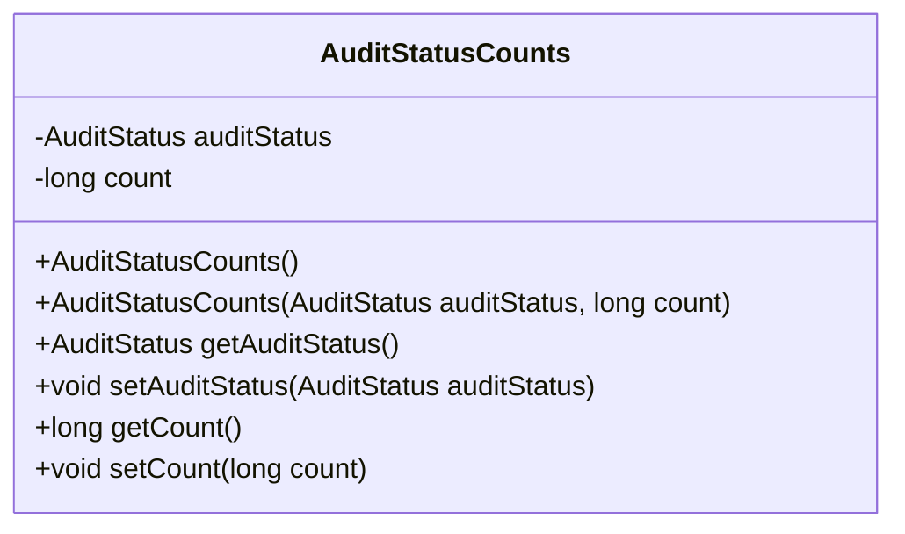
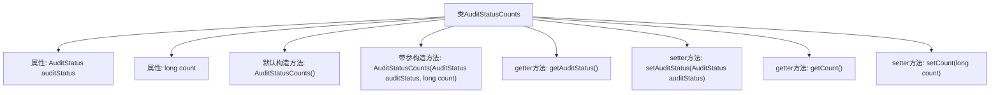

# 基础信息

|      |      |
|------|------|
| 名称 | AuditStatusCounts |
| 编码语言 | .java |
| 代码路径 | WeFe/board/board-service/src/main/java/com/welab/wefe/board/service/dto/vo/AuditStatusCounts.java |
| 包名 | com.welab.wefe.board.service.dto.vo |
| 依赖项 | ['com.welab.wefe.common.wefe.enums.AuditStatus'] |
| 概述说明 | AuditStatusCounts类包含审计状态和计数字段，提供构造方法和getter/setter。 |

# 说明

AuditStatusCounts类用于统计审计状态的数量，包含两个私有属性：auditStatus表示审计状态，count表示该状态的数量。类提供了无参构造方法和带参构造方法，支持通过getter和setter方法访问和修改属性。该类结构简洁，功能明确，适用于记录和管理不同审计状态的计数情况。

# 类列表 Class Summary

| 名称   | 类型  | 说明 |
|-------|------|-------------|
| AuditStatusCounts | class | AuditStatusCounts类包含审计状态和计数字段，提供构造方法和getter/setter。 |

## 类 AuditStatusCounts

|      |      |
|------|------|
| 访问范围 | public |
| 类型 | class |
| 名称 | AuditStatusCounts |
| 说明 | AuditStatusCounts类包含审计状态和计数字段，提供构造方法和getter/setter。 |

### UML类图

该代码定义了一个名为`AuditStatusCounts`的类，用于记录审计状态及其对应的计数。类中包含两个私有字段：`auditStatus`（审计状态）和`count`（计数），并提供了构造方法和相应的getter/setter方法。该类主要用于封装审计状态统计信息，便于数据传递和处理。

### 内部方法调用关系图

这段代码定义了一个名为AuditStatusCounts的类，主要用于封装审计状态及其对应的计数信息。类中包含两个私有属性：auditStatus（审计状态）和count（计数），提供了默认构造方法和带参构造方法，以及对应的getter和setter方法用于访问和修改这两个属性。该类的设计模式符合JavaBean规范，便于在其他代码中实例化和操作审计状态计数对象。

### 字段列表 Field List

| 名称  | 类型  | 说明 |
|-------|-------|------|
| count | long | 私有长整型变量count。 |
| auditStatus | AuditStatus | 私有审计状态变量auditStatus。 |

### 方法列表

| 名称  | 类型  | 说明 |
|-------|-------|------|
| setAuditStatus | void | 设置审计状态方法，将传入的auditStatus赋值给当前对象的auditStatus字段。 |
| getAuditStatus | AuditStatus | 方法返回审计状态auditStatus。 |
| getCount | long | 获取计数值的方法，直接返回变量count的值。 |
| setCount | void | 设置count属性的方法，参数为长整型count。 |

