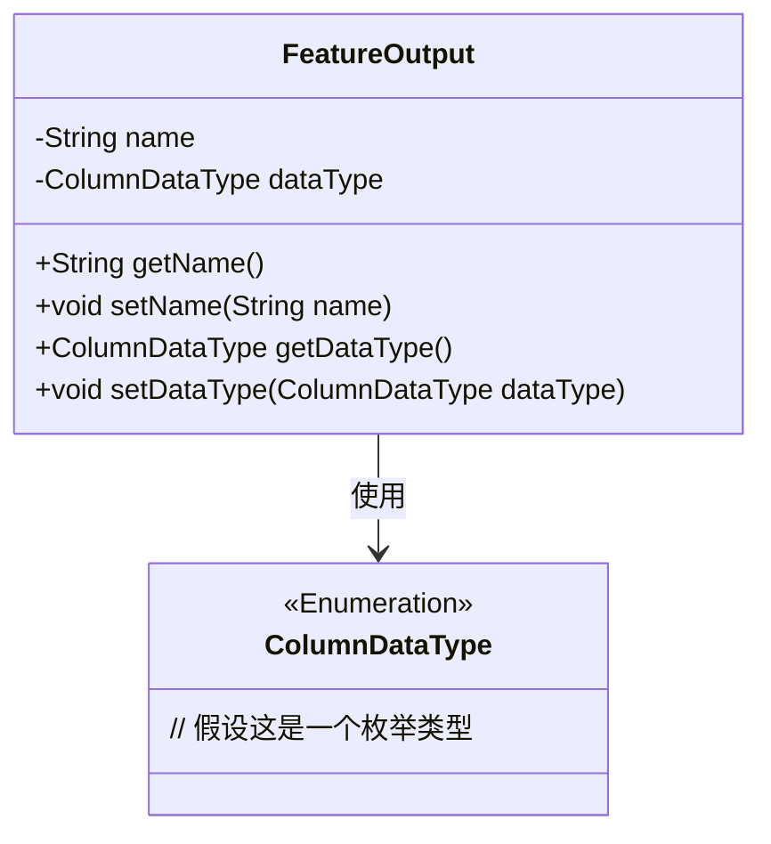
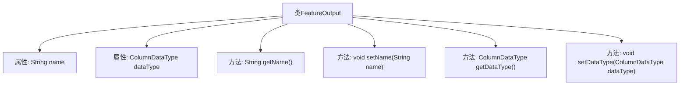

# 基础信息

|      |      |
|------|------|
| 名称 | FeatureOutput |
| 编码语言 | .java |
| 代码路径 | WeFe/board/board-service/src/main/java/com/welab/wefe/board/service/dto/vo/FeatureOutput.java |
| 包名 | com.welab.wefe.board.service.dto.vo |
| 依赖项 | ['com.welab.wefe.common.wefe.enums.ColumnDataType'] |
| 概述说明 | FeatureOutput类包含name和dataType字段，提供对应的getter和setter方法。 |

# 说明

FeatureOutput类是一个包含字段名称和数据类型的Java类。该类有两个私有属性：name表示字段名称，dataType表示数据类型，类型为ColumnDataType。提供了这两个属性的getter和setter方法，用于获取和设置属性值。类结构简单，主要用于封装字段的基本信息。

# 类列表 Class Summary

| 名称   | 类型  | 说明 |
|-------|------|-------------|
| FeatureOutput | class | FeatureOutput类包含name和dataType字段及对应的getter/setter方法。 |

## 类 FeatureOutput

|      |      |
|------|------|
| 访问范围 | public |
| 类型 | class |
| 名称 | FeatureOutput |
| 说明 | FeatureOutput类包含name和dataType字段及对应的getter/setter方法。 |

### UML类图

这段代码展示了一个简单的Java类`FeatureOutput`，它包含两个私有字段`name`和`dataType`，分别表示字段名称和数据类型。类中提供了标准的getter和setter方法来访问和修改这些字段。`dataType`字段的类型是`ColumnDataType`，这是一个枚举类型（假设），用于限定数据类型的取值范围。类图清晰地展示了`FeatureOutput`与`ColumnDataType`之间的依赖关系，其中`FeatureOutput`使用了`ColumnDataType`作为其字段类型。

### 内部方法调用关系图

这段代码定义了一个名为FeatureOutput的类，包含两个私有属性name和dataType，分别表示字段名称和数据类型。类中提供了四个公共方法：getName()和setName()用于获取和设置name属性，getDataType()和setDataType()用于获取和设置dataType属性。这是一个典型的数据封装类，通过getter和setter方法控制对私有属性的访问和修改。

### 字段列表 Field List

| 名称  | 类型  | 说明 |
|-------|-------|------|
| name | String | 私有字符串变量name |
| dataType | ColumnDataType | 私有字段dataType，类型为ColumnDataType。 |

### 方法列表

| 名称  | 类型  | 说明 |
|-------|-------|------|
| getName | String | 这是一个Java方法，返回私有变量name的值。 |
| getDataType | ColumnDataType | 获取数据类型的方法，返回ColumnDataType对象。 |
| setName | void | 设置对象名称的方法，将参数name赋值给对象的name属性。 |
| setDataType | void | 这是一个Java方法，用于设置列的数据类型。方法名为setDataType，接受一个ColumnDataType类型的参数dataType，并将其赋值给当前对象的dataType属性。 |

