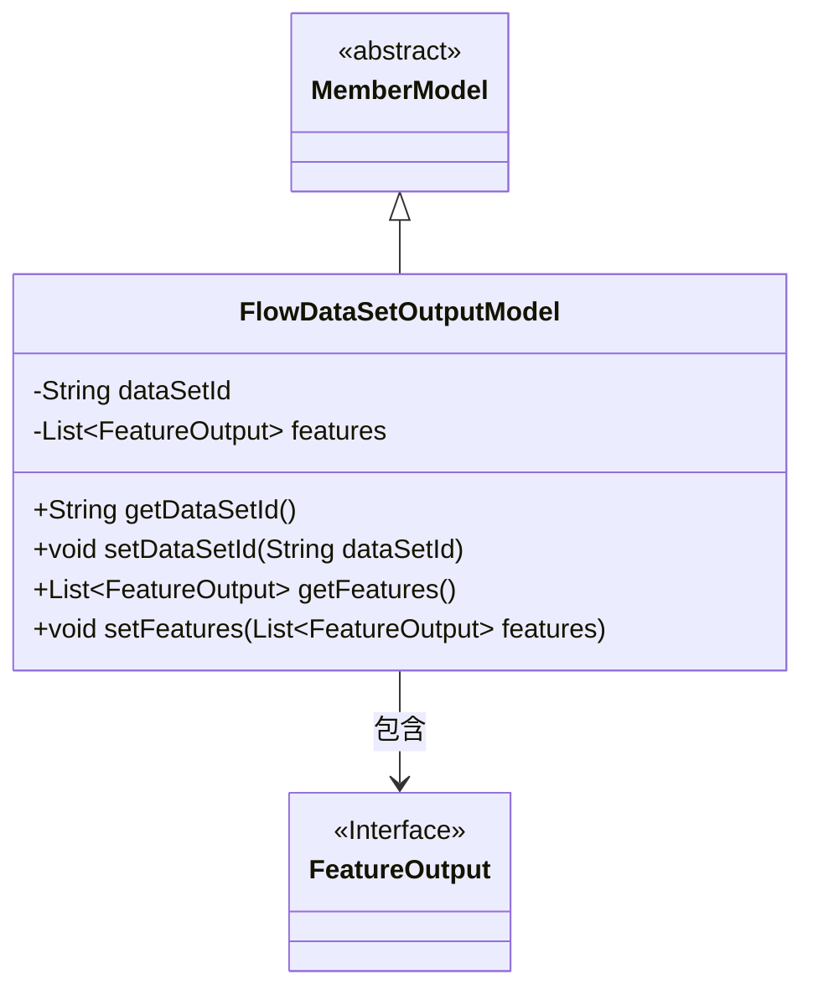
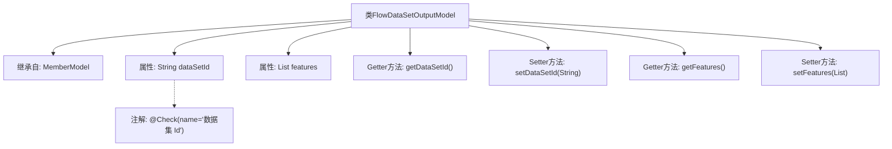

# 基础信息

|      |      |
|------|------|
| 名称 | FlowDataSetOutputModel |
| 编码语言 | .java |
| 代码路径 | WeFe/board/board-service/src/main/java/com/welab/wefe/board/service/dto/vo/FlowDataSetOutputModel.java |
| 包名 | com.welab.wefe.board.service.dto.vo |
| 依赖项 | ['com.welab.wefe.board.service.dto.entity.MemberModel', 'com.welab.wefe.common.fieldvalidate.annotation.Check', 'java.util.List'] |
| 概述说明 | FlowDataSetOutputModel继承MemberModel，包含数据集ID和特征列表，提供getter/setter方法。 |

# 说明

FlowDataSetOutputModel类继承自MemberModel，包含两个主要属性：dataSetId和features。dataSetId是一个字符串类型，用于存储数据集ID，并通过@Check注解进行校验。features是一个FeatureOutput类型的列表，用于存储特征输出数据。该类提供了这两个属性的getter和setter方法，用于获取和设置属性值。整体结构清晰，符合JavaBean规范。

# 类列表 Class Summary

| 名称   | 类型  | 说明 |
|-------|------|-------------|
| FlowDataSetOutputModel | class | FlowDataSetOutputModel继承MemberModel，包含数据集ID和特征列表，提供getter/setter方法。 |

## 类 FlowDataSetOutputModel

|      |      |
|------|------|
| 访问范围 | public |
| 类型 | class |
| 名称 | FlowDataSetOutputModel |
| 说明 | FlowDataSetOutputModel继承MemberModel，包含数据集ID和特征列表，提供getter/setter方法。 |

### UML类图

这段类图展示了FlowDataSetOutputModel继承自抽象类MemberModel，并包含一个FeatureOutput接口列表的结构。FlowDataSetOutputModel作为具体实现类，管理数据集ID和特征输出列表，通过getter/setter方法提供对这些私有字段的访问控制。FeatureOutput作为接口定义了特征输出的规范，与主类形成聚合关系。整体设计体现了面向对象的封装性和扩展性。

### 内部方法调用关系图

这段代码定义了一个名为FlowDataSetOutputModel的类，该类继承自MemberModel。类中包含两个主要属性：dataSetId（带有@Check注解的字符串类型）和features（FeatureOutput类型的列表）。提供了标准的getter和setter方法来访问和修改这些属性。流程图清晰地展示了类的继承关系、属性定义以及方法结构，其中dataSetId属性特别标注了其校验注解。

### 字段列表 Field List

| 名称  | 类型  | 说明 |
|-------|-------|------|
| features | List<FeatureOutput> | 私有特征输出列表。 |
| dataSetId | String | 数据集ID校验字段声明。 |

### 方法列表

| 名称  | 类型  | 说明 |
|-------|-------|------|
| getDataSetId | String | 获取数据集ID的方法，返回字符串类型的数据集ID。 |
| setDataSetId | void | 设置数据集ID的方法，将输入参数赋值给类的dataSetId成员变量。 |
| getFeatures | List<FeatureOutput> | 获取特征列表的方法，返回features变量。 |
| setFeatures | void | 设置特征列表的方法，将输入的特征列表赋值给当前对象的特征属性。 |

