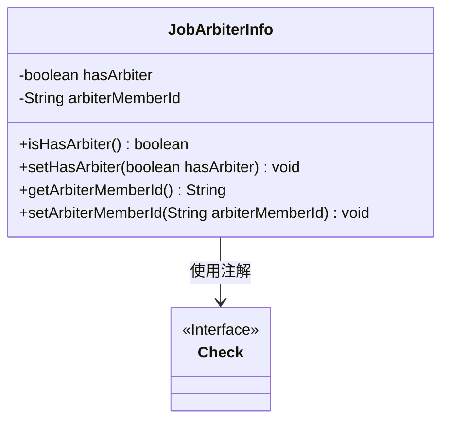
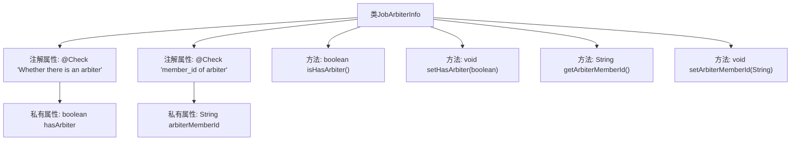

# 基础信息

|      |      |
|------|------|
| 名称 | JobArbiterInfo |
| 编码语言 | .java |
| 代码路径 | WeFe/board/board-service/src/main/java/com/welab/wefe/board/service/dto/vo/JobArbiterInfo.java |
| 包名 | com.welab.wefe.board.service.dto.vo |
| 依赖项 | ['com.welab.wefe.common.fieldvalidate.annotation.Check'] |
| 概述说明 | JobArbiterInfo类包含两个属性：hasArbiter表示是否有仲裁者，arbiterMemberId存储仲裁者成员ID，提供getter和setter方法。 |

# 说明

JobArbiterInfo类用于表示仲裁者信息，包含两个主要属性：hasArbiter布尔值表示是否存在仲裁者，带有检查注解；arbiterMemberId字符串存储仲裁者成员ID，同样带有检查注解。类提供了标准的getter和setter方法用于属性访问和修改。

# 类列表 Class Summary

| 名称   | 类型  | 说明 |
|-------|------|-------------|
| JobArbiterInfo | class | JobArbiterInfo类包含两个属性：hasArbiter表示是否有仲裁者，arbiterMemberId存储仲裁者成员ID，提供getter和setter方法。 |

## 类 JobArbiterInfo

|      |      |
|------|------|
| 访问范围 | public |
| 类型 | class |
| 名称 | JobArbiterInfo |
| 说明 | JobArbiterInfo类包含两个属性：hasArbiter表示是否有仲裁者，arbiterMemberId存储仲裁者成员ID，提供getter和setter方法。 |

### UML类图

这段代码定义了一个`JobArbiterInfo`类，用于存储仲裁者相关信息，包含两个私有字段`hasArbiter`和`arbiterMemberId`，分别表示是否存在仲裁者及其成员ID。类中提供了标准的getter和setter方法，并使用`@Check`注解对字段进行校验标记。类图清晰地展示了类结构及其与`Check`注解接口的依赖关系。

### 内部方法调用关系图

这段代码定义了一个名为JobArbiterInfo的类，包含两个带有@Check注解的私有属性hasArbiter和arbiterMemberId，分别表示是否存在仲裁者和仲裁者的成员ID。类中提供了四个方法：isHasArbiter()用于获取hasArbiter的值，setHasArbiter()用于设置hasArbiter的值，getArbiterMemberId()用于获取arbiterMemberId的值，setArbiterMemberId()用于设置arbiterMemberId的值。流程图清晰地展示了类结构与属性、方法之间的关系。

### 字段列表 Field List

| 名称  | 类型  | 说明 |
|-------|-------|------|
| arbiterMemberId | String | 检查仲裁者成员ID的字段。 |
| hasArbiter | boolean | 检查是否存在仲裁者，私有布尔变量hasArbiter。 |

### 方法列表

| 名称  | 类型  | 说明 |
|-------|-------|------|
| setHasArbiter | void | 设置仲裁标志的方法，参数为布尔值hasArbiter，用于更新当前对象的hasArbiter属性。 |
| isHasArbiter | boolean | 检查是否存在仲裁者的布尔方法，返回hasArbiter的值。 |
| getArbiterMemberId | String | 获取仲裁成员ID的方法，返回字符串类型的成员ID变量arbiterMemberId。 |
| setArbiterMemberId | void | 设置仲裁成员ID的方法，将参数值赋给类的成员变量。 |

