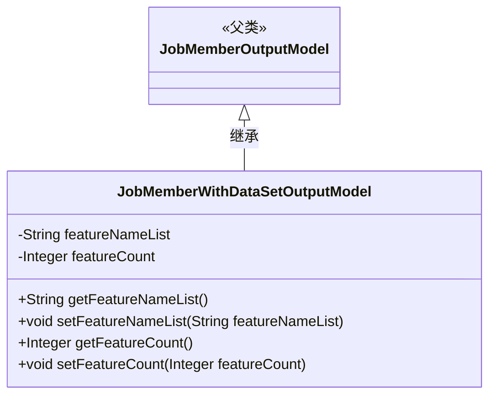
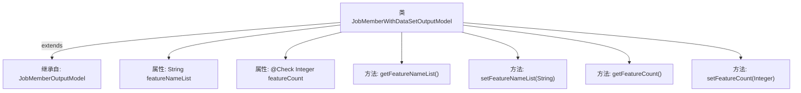

# 基础信息

|      |      |
|------|------|
| 名称 | JobMemberWithDataSetOutputModel |
| 编码语言 | .java |
| 代码路径 | WeFe/board/board-service/src/main/java/com/welab/wefe/board/service/dto/vo/JobMemberWithDataSetOutputModel.java |
| 包名 | com.welab.wefe.board.service.dto.vo |
| 依赖项 | ['com.welab.wefe.board.service.dto.entity.job.JobMemberOutputModel', 'com.welab.wefe.common.fieldvalidate.annotation.Check'] |
| 概述说明 | JobMemberWithDataSetOutputModel继承JobMemberOutputModel，包含特征名列表featureNameList和特征数量featureCount字段及其getter/setter方法。 |

# 说明

该代码定义了一个名为JobMemberWithDataSetOutputModel的Java类，继承自JobMemberOutputModel。类中包含两个私有属性：featureNameList（字符串类型，存储特征名称列表）和featureCount（整数类型，带有Check注解用于验证特征数量）。提供了这两个属性的getter和setter方法，用于获取和设置属性值。

# 类列表 Class Summary

| 名称   | 类型  | 说明 |
|-------|------|-------------|
| JobMemberWithDataSetOutputModel | class | JobMemberWithDataSetOutputModel继承JobMemberOutputModel，包含特征名列表和特征数量属性及其getter/setter方法。 |

## 类 JobMemberWithDataSetOutputModel

|      |      |
|------|------|
| 访问范围 | public |
| 类型 | class |
| 名称 | JobMemberWithDataSetOutputModel |
| 说明 | JobMemberWithDataSetOutputModel继承JobMemberOutputModel，包含特征名列表和特征数量属性及其getter/setter方法。 |

### UML类图

这段类图展示了JobMemberWithDataSetOutputModel继承自JobMemberOutputModel的关系。子类包含两个私有属性featureNameList和featureCount，以及对应的getter和setter方法。其中featureCount属性带有@Check注解标注的"特征数量"校验标记。该设计模式体现了Java中常见的POJO类结构，通过继承实现模型扩展，同时保持封装性。

### 内部方法调用关系图

该流程图展示了JobMemberWithDataSetOutputModel类的结构，它继承自JobMemberOutputModel类，包含两个私有属性featureNameList和带有@Check注解的featureCount，以及对应的getter和setter方法。图中清晰呈现了类的继承关系和属性方法之间的关联，属性标注了类型和注解信息，方法展示了参数和返回值类型。

### 字段列表 Field List

| 名称  | 类型  | 说明 |
|-------|-------|------|
| featureCount | Integer | 字段featureCount用@Check注解标记，表示需校验特征数量。 |
| featureNameList | String | 私有字符串变量featureNameList，用于存储特征名称列表。 |

### 方法列表

| 名称  | 类型  | 说明 |
|-------|-------|------|
| getFeatureNameList | String | 方法返回特征名称列表。 |
| setFeatureNameList | void | 设置特征名称列表的方法，将输入字符串赋值给类成员变量featureNameList。 |
| getFeatureCount | Integer | 获取特征数量方法，返回整型变量featureCount的值。 |
| setFeatureCount | void | 设置特征数量方法，将输入参数赋给类变量featureCount。 |

