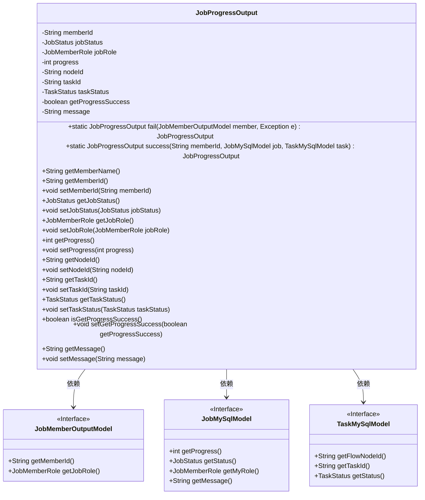
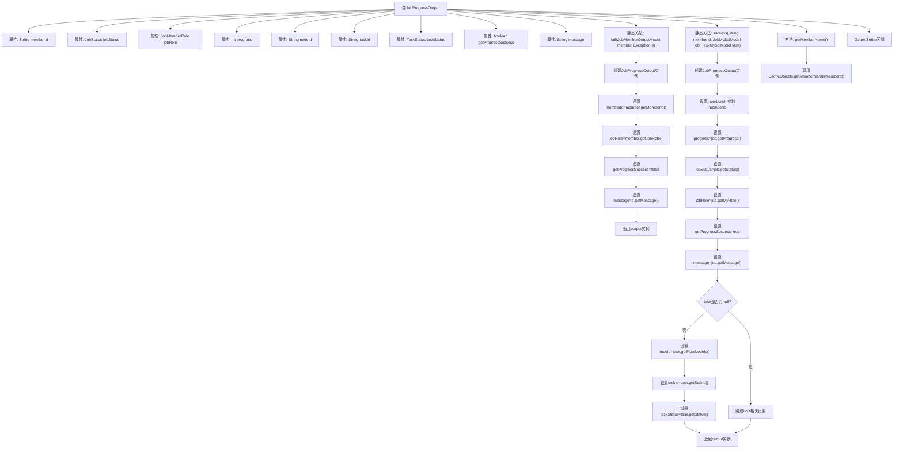

# 基础信息

|      |      |
|------|------|
| 名称 | JobProgressOutput |
| 编码语言 | .java |
| 代码路径 | WeFe/board/board-service/src/main/java/com/welab/wefe/board/service/dto/vo/JobProgressOutput.java |
| 包名 | com.welab.wefe.board.service.dto.vo |
| 依赖项 | ['com.welab.wefe.board.service.database.entity.job.JobMySqlModel', 'com.welab.wefe.board.service.database.entity.job.TaskMySqlModel', 'com.welab.wefe.board.service.dto.entity.job.JobMemberOutputModel', 'com.welab.wefe.board.service.service.CacheObjects', 'com.welab.wefe.common.wefe.enums.JobMemberRole', 'com.welab.wefe.common.wefe.enums.JobStatus', 'com.welab.wefe.common.wefe.enums.TaskStatus'] |
| 概述说明 | JobProgressOutput类用于跟踪任务进度，包含成员ID、任务状态、进度等字段，提供成功/失败静态构造方法及getter/setter。 |

# 说明

JobProgressOutput类用于封装任务进度信息，包含成员ID、任务状态、成员角色、进度值、节点ID、任务ID、任务状态、操作成功标志及消息字段。提供两个静态工厂方法：fail方法用于构建失败响应，接收成员模型和异常对象；success方法用于构建成功响应，接收成员ID、任务模型和子任务模型。类中包含各字段的getter/setter方法，以及通过成员ID获取成员名称的辅助方法。

# 类列表 Class Summary

| 名称   | 类型  | 说明 |
|-------|------|-------------|
| JobProgressOutput | class | JobProgressOutput类用于跟踪任务进度，包含成员ID、任务状态、进度等信息，提供成功和失败两种构造方法及相应getter/setter。 |

## 类 JobProgressOutput

|      |      |
|------|------|
| 访问范围 | public |
| 类型 | class |
| 名称 | JobProgressOutput |
| 说明 | JobProgressOutput类用于跟踪任务进度，包含成员ID、任务状态、进度等信息，提供成功和失败两种构造方法及相应getter/setter。 |

### UML类图

类图描述：JobProgressOutput类用于封装任务进度输出信息，包含成员ID、任务状态、角色、进度等私有字段，提供静态工厂方法fail()和success()分别处理失败和成功场景。该类依赖三个接口：JobMemberOutputModel提供成员基础信息，JobMySqlModel提供任务数据，TaskMySqlModel提供子任务数据。通过getter/setter方法管理字段访问，其中getMemberName()方法通过缓存获取成员名称。

### 内部方法调用关系图

该流程图展示了JobProgressOutput类的完整结构，包含9个私有属性、2个核心静态工厂方法和1个业务方法。fail()方法处理异常情况，通过成员对象和异常对象构建失败响应；success()方法处理正常情况，根据任务对象是否存在决定是否设置任务相关字段。所有属性均通过标准Getter/Setter管理，getMemberName()方法依赖外部缓存服务获取成员名称。流程图特别突出了success()方法中的条件判断逻辑，清晰展现了任务数据存在与否的分支处理流程。

### 字段列表 Field List

| 名称  | 类型  | 说明 |
|-------|-------|------|
| taskStatus | TaskStatus | 私有任务状态变量taskStatus。 |
| jobStatus | JobStatus | 私有变量jobStatus，类型为JobStatus。 |
| getProgressSuccess | boolean | 获取进度成功状态布尔值 |
| nodeId | String | 私有字符串类型变量nodeId。 |
| taskId | String | 私有字符串类型变量taskId，用于存储任务标识。 |
| progress | int | 私有整型变量progress，用于记录进度。 |
| jobRole | JobMemberRole | 私有变量jobRole，类型为JobMemberRole。 |
| memberId | String | 声明一个私有字符串类型变量memberId。 |
| message | String | 私有字符串变量message |

### 方法列表

| 名称  | 类型  | 说明 |
|-------|-------|------|
| setNodeId | void | 这是一个Java方法，用于设置对象的nodeId属性值。方法接收一个字符串参数nodeId，并将其赋值给当前对象的同名成员变量。 |
| setTaskStatus | void | 方法setTaskStatus用于设置任务状态，参数为TaskStatus类型，直接赋值给成员变量taskStatus。 |
| getNodeId | String | 获取节点ID的方法，返回字符串类型的nodeId。 |
| setJobStatus | void | 设置任务状态的方法，将传入的jobStatus赋值给当前对象的jobStatus属性。 |
| getMemberName | String | 获取成员名称的方法，通过成员ID从缓存中返回名称。 |
| setMemberId | void | 定义公共方法setMemberId，用于设置成员变量memberId的值。 |
| success | JobProgressOutput | 静态方法`success`创建并返回`JobProgressOutput`对象，包含成员ID、任务进度、状态、角色及成功标志。若任务非空，还包含节点ID、任务ID和状态。 |
| setJobRole | void | 方法setJobRole用于设置成员的工作角色，参数为JobMemberRole类型。 |
| getMemberId | String | 这是一个Java方法，返回成员ID字符串。 |
| setTaskId | void | 设置任务ID的方法，将传入的taskId赋值给当前对象的taskId属性。 |
| fail | JobProgressOutput | 静态方法`fail`创建并返回一个`JobProgressOutput`对象，包含成员ID、角色、失败状态和异常信息。 |
| getJobStatus | JobStatus | 获取当前任务状态的方法，返回JobStatus对象。 |
| setProgress | void | 设置进度值的方法，将参数progress赋值给成员变量progress。 |
| getProgress | int | 获取当前进度值的方法，返回整数类型的progress变量值。 |
| getJobRole | JobMemberRole | 方法返回jobRole的值，类型为JobMemberRole。 |
| isGetProgressSuccess | boolean | 检查获取进度是否成功的布尔方法，返回getProgressSuccess值。 |
| getTaskId | String | 获取任务ID的方法，返回字符串类型的taskId。 |
| getTaskStatus | TaskStatus | 获取当前任务状态的方法，返回TaskStatus对象。 |
| setMessage | void | 这是一个Java方法，用于设置类的message属性值。方法接收一个字符串参数message，并将其赋值给当前对象的message成员变量。 |
| getMessage | String | 获取message字符串的方法。 |
| setGetProgressSuccess | void | 设置获取进度成功状态的方法，参数为布尔值。 |

