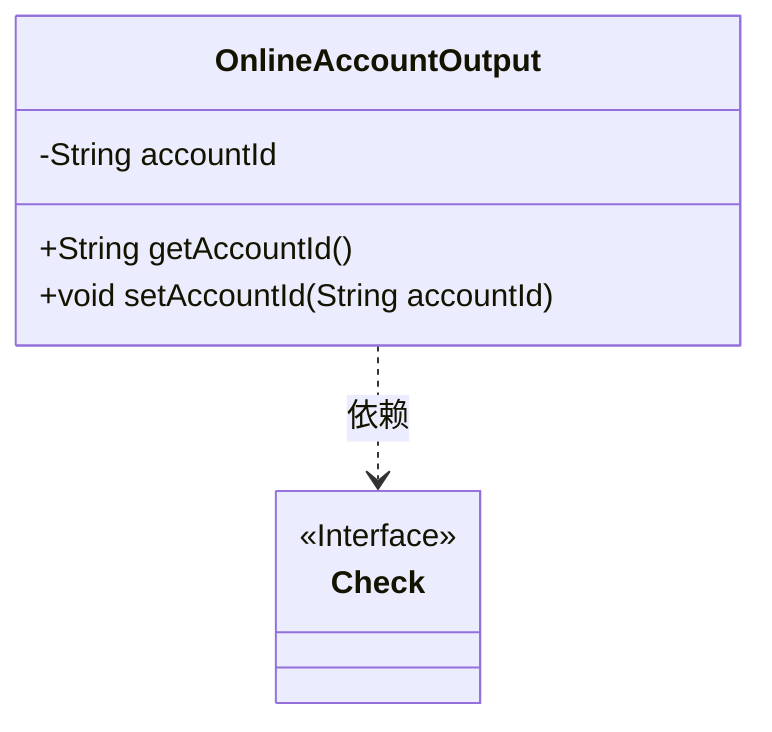
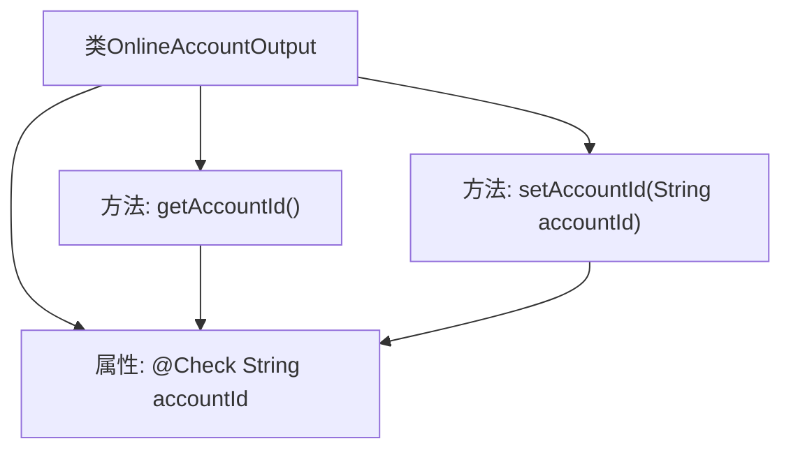

# 基础信息

|      |      |
|------|------|
| 名称 | OnlineAccountOutput |
| 编码语言 | .java |
| 代码路径 | WeFe/board/board-service/src/main/java/com/welab/wefe/board/service/dto/vo/OnlineAccountOutput.java |
| 包名 | com.welab.wefe.board.service.dto.vo |
| 依赖项 | ['com.welab.wefe.common.fieldvalidate.annotation.Check'] |
| 概述说明 | OnlineAccountOutput类包含账号ID属性及其getter和setter方法。 |

# 说明

这是一个名为OnlineAccountOutput的公开类，用于表示在线账号的输出信息。类中包含一个私有字符串类型字段accountId，该字段通过@Check注解标注了校验名称为"账号ID"。类提供了标准的getter和setter方法，分别用于获取和设置accountId字段的值。这个类主要用于封装账号ID数据，并通过方法提供对该数据的访问和修改能力。

# 类列表 Class Summary

| 名称   | 类型  | 说明 |
|-------|------|-------------|
| OnlineAccountOutput | class | OnlineAccountOutput类包含accountId属性，带有账号ID校验注解，提供getter和setter方法。 |

## 类 OnlineAccountOutput

|      |      |
|------|------|
| 访问范围 | public |
| 类型 | class |
| 名称 | OnlineAccountOutput |
| 说明 | OnlineAccountOutput类包含accountId属性，带有账号ID校验注解，提供getter和setter方法。 |

### UML类图

这段代码展示了一个简单的OnlineAccountOutput类，包含私有accountId属性和对应的getter/setter方法。该类通过@Check注解对accountId字段进行校验，与Check接口形成依赖关系。类图清晰地呈现了类的成员结构、方法签名以及注解依赖关系，体现了Java Bean的基本设计模式。

### 内部方法调用关系图

这段代码定义了一个名为OnlineAccountOutput的类，包含一个带有@Check注解的accountId属性，以及对应的getter和setter方法。流程图展示了类结构、属性与方法之间的关联关系，其中setAccountId和getAccountId均操作accountId属性，且该属性受注解校验约束。类设计符合JavaBean规范，用于封装在线账号的输出数据。

### 字段列表 Field List

| 名称  | 类型  | 说明 |
|-------|-------|------|
| accountId | String | 账号ID字段的字符串类型私有变量，使用Check注解标记。 |

### 方法列表

| 名称  | 类型  | 说明 |
|-------|-------|------|
| setAccountId | void | 这是一个Java方法，用于设置类的accountId属性值。方法接收一个字符串参数accountId，并将其赋值给类的同名成员变量。 |
| getAccountId | String | 这是一个Java方法，返回字符串类型的accountId成员变量值。 |

