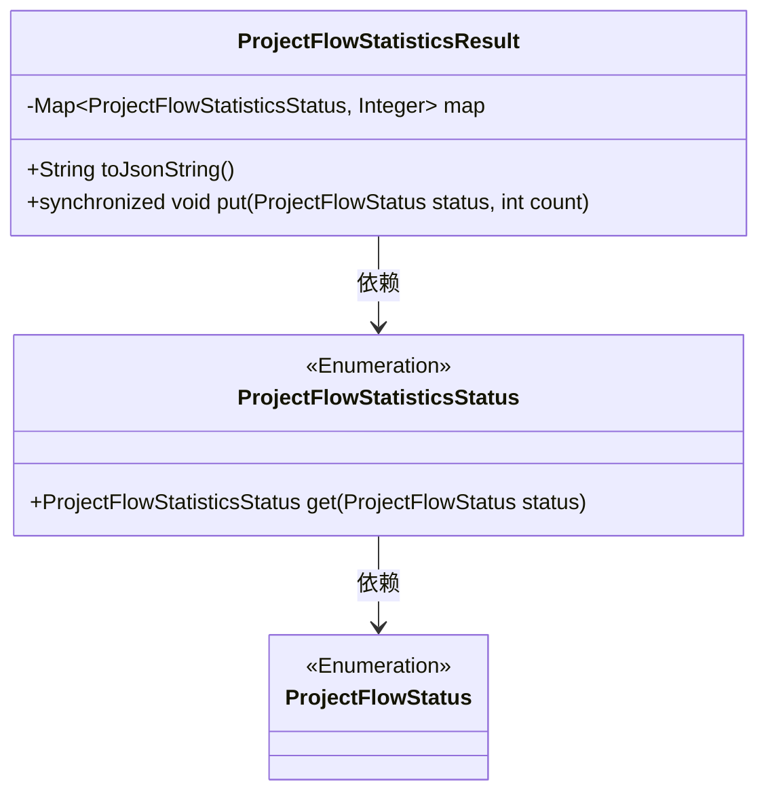
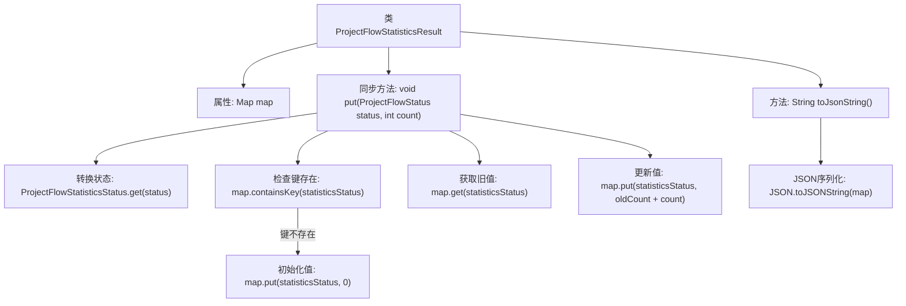

# 基础信息

|      |      |
|------|------|
| 名称 | ProjectFlowStatisticsResult |
| 编码语言 | .java |
| 代码路径 | WeFe/board/board-service/src/main/java/com/welab/wefe/board/service/dto/vo/ProjectFlowStatisticsResult.java |
| 包名 | com.welab.wefe.board.service.dto.vo |
| 依赖项 | ['com.alibaba.fastjson.JSON', 'com.welab.wefe.common.wefe.enums.ProjectFlowStatisticsStatus', 'com.welab.wefe.common.wefe.enums.ProjectFlowStatus', 'java.util.HashMap', 'java.util.Map'] |
| 概述说明 | ProjectFlowStatisticsResult类用于统计项目流程状态，通过map存储状态与计数的映射，提供线程安全的put方法更新计数，并支持转换为JSON字符串。 |

# 说明

该代码定义了一个名为ProjectFlowStatisticsResult的类，用于统计项目流程状态数据。类中包含一个私有HashMap成员变量map，用于存储项目流程统计状态与对应计数的键值对。提供了toJsonString方法将map转换为JSON字符串。通过同步方法put实现线程安全的状态计数更新，先检查状态是否存在，不存在则初始化为0，再累加新计数到原有值。

# 类列表 Class Summary

| 名称   | 类型  | 说明 |
|-------|------|-------------|
| ProjectFlowStatisticsResult | class | ProjectFlowStatisticsResult类用HashMap存储项目流程状态统计，提供线程安全的put方法累加计数，支持转换为JSON字符串。 |

## 类 ProjectFlowStatisticsResult

|      |      |
|------|------|
| 访问范围 | public |
| 类型 | class |
| 名称 | ProjectFlowStatisticsResult |
| 说明 | ProjectFlowStatisticsResult类用HashMap存储项目流程状态统计，提供线程安全的put方法累加计数，支持转换为JSON字符串。 |

### UML类图

类图描述：ProjectFlowStatisticsResult类通过HashMap存储项目流统计状态与计数的映射关系，提供线程安全的put方法更新计数，并能转换为JSON字符串。它依赖ProjectFlowStatisticsStatus枚举类来转换状态，后者又依赖ProjectFlowStatus枚举类。整体设计实现了状态统计的线程安全操作和序列化能力。

### 内部方法调用关系图

该流程图描述了ProjectFlowStatisticsResult类的核心逻辑。类通过同步方法put实现线程安全的统计数据累加，先转换状态枚举，检查并初始化缺失的键，最后原子更新计数值。toJsonString方法将map序列化为JSON字符串。流程突出显示了状态转换、线程安全检查和数值累加三个关键阶段，箭头清晰展示了方法调用和数据流转路径。

### 字段列表 Field List

| 名称  | 类型  | 说明 |
|-------|-------|------|
| map = new HashMap<>() | Map<ProjectFlowStatisticsStatus, Integer> | 定义了一个私有HashMap变量map，键为ProjectFlowStatisticsStatus枚举类型，值为Integer类型。 |

### 方法列表

| 名称  | 类型  | 说明 |
|-------|-------|------|
| toJsonString | String | 将map转为JSON字符串的方法。 |
| put | void | 同步方法put接收状态和数量，检查状态是否存在，不存在则初始化为0，然后累加数量到对应状态。 |

