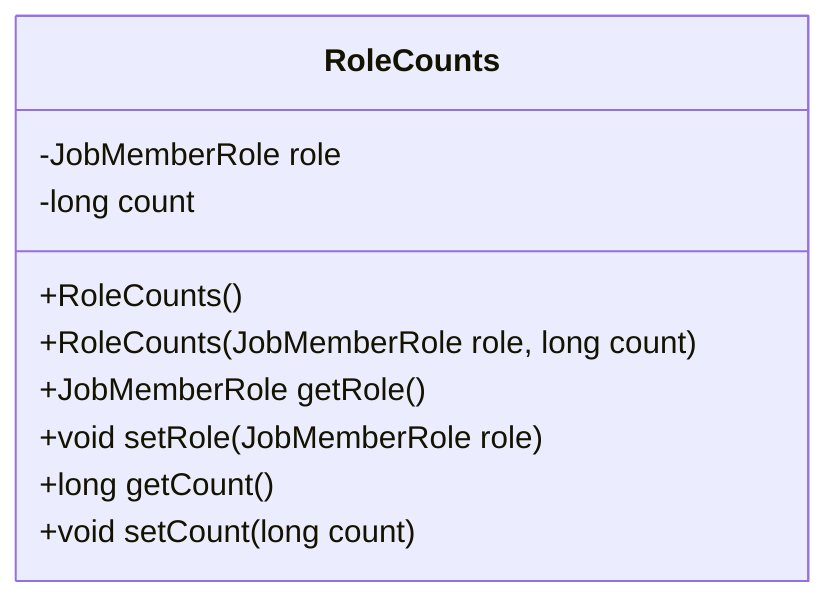
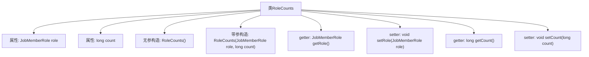

# 基础信息

|      |      |
|------|------|
| 名称 | RoleCounts |
| 编码语言 | .java |
| 代码路径 | WeFe/board/board-service/src/main/java/com/welab/wefe/board/service/dto/vo/RoleCounts.java |
| 包名 | com.welab.wefe.board.service.dto.vo |
| 依赖项 | ['com.welab.wefe.common.wefe.enums.JobMemberRole'] |
| 概述说明 | RoleCounts类包含JobMemberRole角色和long类型计数，提供构造方法和getter/setter。 |

# 说明

RoleCounts类用于统计特定角色的数量，包含JobMemberRole类型的role属性和long类型的count属性。提供无参构造方法和带参构造方法，支持通过getter和setter方法访问和修改这两个属性。

# 类列表 Class Summary

| 名称   | 类型  | 说明 |
|-------|------|-------------|
| RoleCounts | class | RoleCounts类用于统计角色数量，包含JobMemberRole角色和long类型计数，提供构造方法和getter/setter。 |

## 类 RoleCounts

|      |      |
|------|------|
| 访问范围 | public |
| 类型 | class |
| 名称 | RoleCounts |
| 说明 | RoleCounts类用于统计角色数量，包含JobMemberRole角色和long类型计数，提供构造方法和getter/setter。 |

### UML类图

该代码定义了一个名为`RoleCounts`的类，用于封装角色（`JobMemberRole`）及其对应的计数（`count`）。类中包含两个私有字段、两个构造函数（默认构造和带参构造）以及对应的getter和setter方法。通过这个类可以方便地管理角色与计数的关联数据，适用于统计或记录不同角色的数量信息。

### 内部方法调用关系图

该流程图展示了RoleCounts类的完整结构，包含两个私有属性(role和count)、两个构造函数(无参和带参初始化)以及对应的getter/setter方法。类通过封装JobMemberRole类型和long类型的字段，提供了对角色和计数的安全访问机制。带参构造直接初始化字段，而无参构造允许后续通过setter方法赋值，体现了灵活的对象创建方式。所有方法均围绕核心数据展开，形成标准的数据封装模式。

### 字段列表 Field List

| 名称  | 类型  | 说明 |
|-------|-------|------|
| count | long | 私有长整型计数器变量。 |
| role | JobMemberRole | 类成员变量role，类型为JobMemberRole，表示工作成员角色。 |

### 方法列表

| 名称  | 类型  | 说明 |
|-------|-------|------|
| getRole | JobMemberRole | 方法getRole返回JobMemberRole类型的成员变量role的值。 |
| setCount | void | 这是一个Java方法，用于设置类成员变量count的值。方法接受一个long类型参数，并将其赋值给当前对象的count属性。 |
| setRole | void | 方法setRole用于设置成员角色，参数为JobMemberRole类型，直接赋值给当前对象的role属性。 |
| getCount | long | 这是一个Java方法，返回长整型变量count的值。 |

