# 基础信息

|      |      |
|------|------|
| 名称 | vo |
| 编码语言 | .java |
| 代码路径 | WeFe/board/board-service/src/main/java/com/welab/wefe/board/service/dto/vo |
| 包名 | docs.board.board-service.src.main.java.com.welab.wefe.board.service.dto.vo |
| 概述说明 | 该模块统一管理多类型数据资源（图像/表格/布隆过滤器）的增删改查，采用分层输入模型设计。支持数据资源审核、消息内容生成、标注信息管理等功能，涵盖标签统计、格式转换、状态计数等场景。各类通过继承实现差异化校验，依赖XStream和JSON库，形成标准化管理流程。 |

# 说明

## 概述  
该模块核心职责是统一管理多类型业务实体（数据资源/消息/标注/任务）的全生命周期操作，采用分层设计与模板方法模式。接口规范形成三大体系：1)数据资源类继承AbstractDataResourceUpdateInputModel实现差异化校验 2)消息类遵循AbstractMessageContent模板方法 3)标注类分表格侧(LabelDistribution)和图像侧(Annotation)双轨处理。关键数据结构呈现领域特征：资源标识字段（id/dataResourceId）、消息载体（auditStatus/projectId）、标注坐标（Bndbox）和任务统计（RoleCounts）。外部依赖包含XStream序列化框架、JSON库和CacheObjects缓存。例如ImageDataSetAddInputModel验证文件存在性，类似ETL工具的数据源配置。

## 主要业务场景  
模块支持四类核心流程：1)数据资源管理（图像/表格/布隆过滤器的CRUD）2)消息通知（审核/邀请的模板生成）3)标注处理（标签统计与格式转换）4)任务统计（角色/状态计数）。交互模式均采用对象封装但策略各异：资源类通过AddInputModel继承实现校验（如BloomFilterAddInputModel校验fieldInfoList），消息类依赖getTitle动态组装内容（如生成"成员A邀请加入项目B"），标注类区分表格聚合计算与图像结构组合。典型应用包括生成标签质量报告、处理遮挡标注、仲裁者信息管理，API覆盖构造器、状态检查和线程安全计数（如ProjectFlowStatisticsResult的同步put）。例如通过publicMemberList控制资源可见性，类似RBAC权限模型。

### 包内部结构视图

```mermaid
graph TD
    vo --> data_resource
    vo --> message
    vo --> data_set
    vo --> RoleCounts.java
    vo --> AuditStatusCounts.java
    vo --> FeatureOutput.java
    vo --> JobMemberWithDataSetOutputModel.java
    vo --> OnlineAccountOutput.java
    vo --> AccountInputModel.java
    vo --> JobArbiterInfo.java
    vo --> JobProgressOutput.java
    vo --> ProjectFlowStatisticsResult.java
    vo --> FlowDataSetOutputModel.java
    
    data_resource --> image_data_set
    data_resource --> DataResourceAddOutputModel.java
    data_resource --> TableDataSetAddInputModel.java
    data_resource --> ImageDataSetAddInputModel.java
    data_resource --> AbstractDataResourceUpdateInputModel.java
    data_resource --> TableDataSetUpdateInputModel.java
    data_resource --> BloomFilterAddInputModel.java
    data_resource --> BloomFilterUpdateInputModel.java
    data_resource --> ImageDataSetUpdateInputModel.java
    
    image_data_set --> Bndbox.java
    image_data_set --> Size.java
    image_data_set --> Annotation.java
    image_data_set --> Source.java
    image_data_set --> LabelInfo.java
    image_data_set --> Object.java
    
    message --> AuditApplyDataResourceMessageContent.java
    message --> AuditJoinProjectMessageContent.java
    message --> AbstractMessageContent.java
    message --> ApplyJoinProjectMessageContent.java
    message --> TextMessageContent.java
    message --> AbstractMessageContentWithProject.java
    message --> ApplyDataResourceMessageContent.java
    
    data_set --> table_data_set
    data_set --> image_data_set
    
    table_data_set --> LabelDistributionItem.java
    table_data_set --> LabelDistribution.java
    
    image_data_set --> Bndbox.java
    image_data_set --> Size.java
    image_data_set --> Annotation.java
    image_data_set --> Source.java
    image_data_set --> LabelInfo.java
    image_data_set --> Object.java
```

该流程图展示了WeFe项目中board-service模块的DTO值对象层级结构。顶层vo目录下包含data_resource、message、data_set三个主要子目录及多个独立文件。其中data_resource和data_set都包含image_data_set子目录，message目录包含各类消息内容类，data_set还包含table_data_set子目录。每个子目录下都有对应的具体实现类，形成了清晰的多层级结构。

# 文件列表

| 名称   | 类型  | 说明 |
|-------|------|-------------|
| [RoleCounts.java](RoleCounts.md) | file | RoleCounts类包含JobMemberRole角色和long类型计数，提供构造方法和getter/setter。 |
| [AuditStatusCounts.java](AuditStatusCounts.md) | file | AuditStatusCounts类包含审计状态和计数字段，提供构造方法和getter/setter。 |
| [FeatureOutput.java](FeatureOutput.md) | file | FeatureOutput类包含name和dataType字段，提供对应的getter和setter方法。 |
| [JobMemberWithDataSetOutputModel.java](JobMemberWithDataSetOutputModel.md) | file | JobMemberWithDataSetOutputModel继承JobMemberOutputModel，包含特征名列表featureNameList和特征数量featureCount字段及其getter/setter方法。 |
| [OnlineAccountOutput.java](OnlineAccountOutput.md) | file | OnlineAccountOutput类包含账号ID属性及其getter和setter方法。 |
| [AccountInputModel.java](AccountInputModel.md) | file | AccountInputModel类包含四个必填字段：电话号码、昵称、密码和邮箱，每个字段都有相应的格式校验规则。 |
| [JobArbiterInfo.java](JobArbiterInfo.md) | file | JobArbiterInfo类包含两个属性：hasArbiter表示是否有仲裁者，arbiterMemberId存储仲裁者成员ID，提供getter和setter方法。 |
| [JobProgressOutput.java](JobProgressOutput.md) | file | JobProgressOutput类用于跟踪任务进度，包含成员ID、任务状态、进度等字段，提供成功/失败静态构造方法及getter/setter。 |
| [ProjectFlowStatisticsResult.java](ProjectFlowStatisticsResult.md) | file | ProjectFlowStatisticsResult类用于统计项目流程状态，通过map存储状态与计数的映射，提供线程安全的put方法更新计数，并支持转换为JSON字符串。 |
| [FlowDataSetOutputModel.java](FlowDataSetOutputModel.md) | file | FlowDataSetOutputModel继承MemberModel，包含数据集ID和特征列表，提供getter/setter方法。 |
| [data_resource](data_resource/_module.md) | package | 该模块管理图像数据集标注，含边界框、尺寸和对象属性。支持标注全流程，依赖XStream序列化。包含多个输入输出模型类，处理数据资源添加、更新及校验，如DataResourceAddOutputModel、TableDataSetAddInputModel等。 |
| [data_set](data_set/_module.md) | package | 标签管理模块封装标签数据统计及JSON序列化功能，支持排序和格式转换。图像标注模块处理边界框、尺寸及对象属性，支持Pascal VOC格式标注流程。 |
| [message](message/_module.md) | package | 消息类结构：AbstractMessageContent为基类，定义标题和关联ID方法。其子类包括处理数据审核的AuditApplyDataResourceMessageContent、项目成员审核的AuditJoinProjectMessageContent、项目邀请的ApplyJoinProjectMessageContent、纯文本的TextMessageContent。AbstractMessageContentWithProject扩展基类添加项目相关字段。ApplyDataResourceMessageContent处理数据资源申请消息。 |

