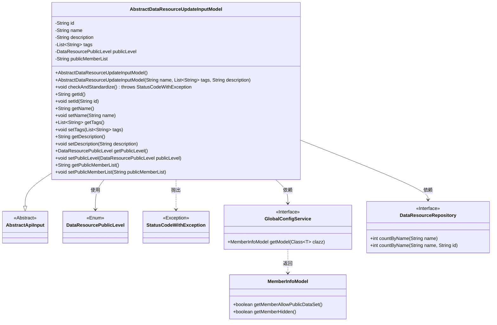
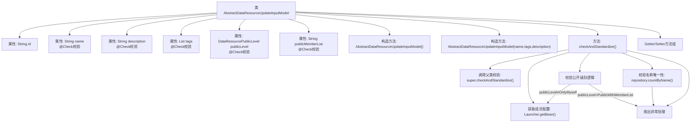

# 基础信息

|      |      |
|------|------|
| 名称 | AbstractDataResourceUpdateInputModel |
| 编码语言 | .java |
| 代码路径 | WeFe/board/board-service/src/main/java/com/welab/wefe/board/service/dto/vo/data_resource/AbstractDataResourceUpdateInputModel.java |
| 包名 | com.welab.wefe.board.service.dto.vo.data_resource |
| 依赖项 | ['com.welab.wefe.board.service.database.repository.data_resource.DataResourceRepository', 'com.welab.wefe.board.service.service.globalconfig.GlobalConfigService', 'com.welab.wefe.common.StatusCode', 'com.welab.wefe.common.exception.StatusCodeWithException', 'com.welab.wefe.common.fieldvalidate.annotation.Check', 'com.welab.wefe.common.util.StringUtil', 'com.welab.wefe.common.web.Launcher', 'com.welab.wefe.common.web.dto.AbstractApiInput', 'com.welab.wefe.common.wefe.dto.global_config.MemberInfoModel', 'com.welab.wefe.common.wefe.enums.DataResourcePublicLevel', 'org.apache.commons.lang3.StringUtils', 'java.util.List'] |
| 概述说明 | 数据集更新输入模型，包含名称、描述、标签、可见级别和成员列表等字段，并进行校验和标准化处理，确保数据合法性和唯一性。 |

# 说明

AbstractDataResourceUpdateInputModel是一个用于更新数据资源的输入模型类，继承自AbstractApiInput。它包含以下关键字段：id标识资源；name（必填，长度4-30）；description（可选，最大3072字符）；tags（必填，最大128字符）；publicLevel（必填，定义资源可见级别）；publicMemberList（指定可见成员列表，最大3072字符）。类中实现了checkAndStandardize方法进行校验：检查成员是否允许公开资源、名称是否重复、可见级别与成员列表的合法性等。提供所有字段的getter和setter方法。

# 类列表 Class Summary

| 名称   | 类型  | 说明 |
|-------|------|-------------|
| AbstractDataResourceUpdateInputModel | class | AbstractDataResourceUpdateInputModel类用于更新数据资源，包含名称、描述、标签等字段验证，检查可见级别和成员列表，并确保名称唯一性。 |

## 类 AbstractDataResourceUpdateInputModel

|      |      |
|------|------|
| 访问范围 | public |
| 类型 | class |
| 名称 | AbstractDataResourceUpdateInputModel |
| 说明 | AbstractDataResourceUpdateInputModel类用于更新数据资源，包含名称、描述、标签等字段验证，检查可见级别和成员列表，并确保名称唯一性。 |

### UML类图

该类图展示了`AbstractDataResourceUpdateInputModel`继承自`AbstractApiInput`，包含数据资源更新的输入参数和验证逻辑。它依赖`DataResourcePublicLevel`枚举、`GlobalConfigService`接口获取成员配置，并通过`DataResourceRepository`验证资源名称唯一性。类中字段使用`@Check`注解进行参数校验，核心方法`checkAndStandardize()`执行多层级业务规则验证。

### 内部方法调用关系图

流程图描述：该流程图展示了AbstractDataResourceUpdateInputModel类的完整结构，包含6个核心属性（其中5个带有@Check校验注解）、2个构造方法、1个核心校验方法和多组getter/setter。校验流程包含父类校验调用、成员配置获取、公开级别验证（含隐身状态检测）、名称唯一性检查三层防御性校验逻辑，任何校验失败都会通过异常终止流程。属性校验规则通过注解实现，涉及字符串长度、必填项、正则表达式等约束条件。

### 字段列表 Field List

| 名称  | 类型  | 说明 |
|-------|-------|------|
| tags | List<String> | Java字段注解：检查关键词列表，必填，长度1-128字符，超限提示"关键词太多了啦~"。 |
| description | String | 代码定义了一个字符串字段description，使用@Check注解校验内容长度不超过3072字符，超限提示"描述太多"。 |
| id | String | 私有字符串类型变量id。 |
| publicLevel | DataResourcePublicLevel | 定义了一个私有字段publicLevel，类型为DataResourcePublicLevel，使用@Check注解标记为必填项，检查名称为"可见级别"。 |
| publicMemberList | String | 检查可见成员列表，仅列表内联邦成员可查看数据集信息。限制长度3072字符，超限提示"member太多"。 |
| name | String | Java字段校验注解：数据集名称必填，长度限制4-30字符，不满足时提示"数据集名称长度不能少于4，不能大于30"。 |

### 方法列表

| 名称  | 类型  | 说明 |
|-------|-------|------|
| getDescription | String | 获取描述信息的字符串方法。 |
| getName | String | 获取名称的方法，返回字符串类型的name变量值。 |
| getId | String | 这是一个Java方法，返回字符串类型的id值。 |
| setName | void | 这是一个Java方法，用于设置对象的名称属性。方法接收一个字符串参数name，并将其赋值给当前对象的name字段。 |
| setId | void | 设置对象ID的方法，将参数id赋值给当前对象的id属性。 |
| setTags | void | 这是一个Java方法，用于设置对象的标签列表。方法接受字符串列表参数tags，并将其赋值给对象的tags属性。 |
| checkAndStandardize | void | 方法检查资源可见性设置：全局拒绝暴露时禁止选择暴露资源；成员隐身或未允许公开时抛出异常；公开级别需指定可见成员；资源名称重复时报错。 |
| getTags | List<String> | 方法返回字符串列表tags。 |
| setDescription | void | 设置描述信息的方法，将输入参数赋值给类的描述变量。 |
| getPublicLevel | DataResourcePublicLevel | 获取数据资源的公开级别方法，返回publicLevel属性值。 |
| setPublicLevel | void | 设置数据资源的公开级别方法，参数为publicLevel，直接赋值给成员变量。 |
| getPublicMemberList | String | 获取公共成员列表的方法，返回publicMemberList变量值。 |
| setPublicMemberList | void | 设置公共成员列表的方法，将输入字符串赋值给类的成员变量publicMemberList。 |

