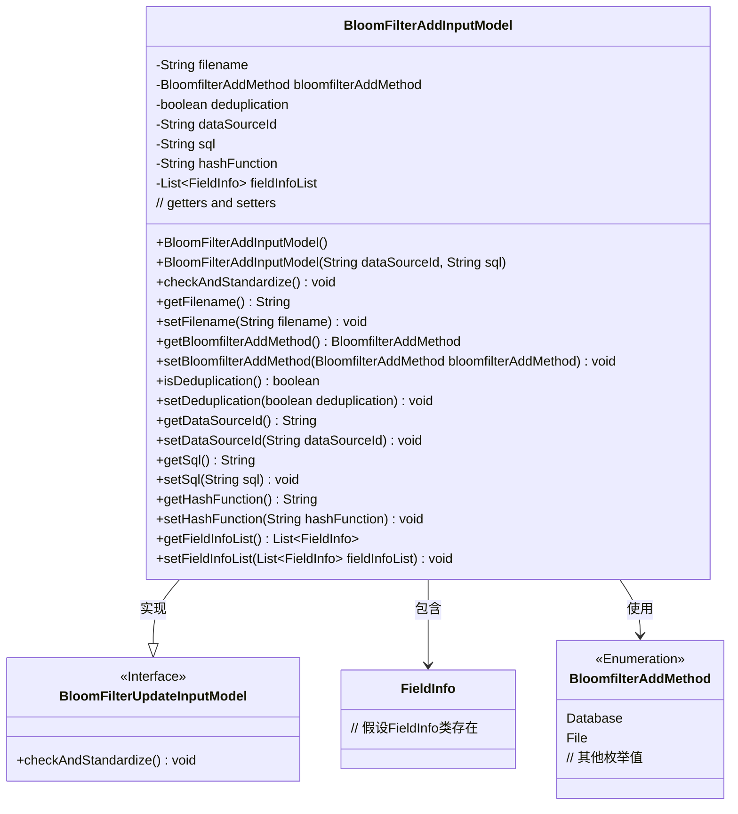
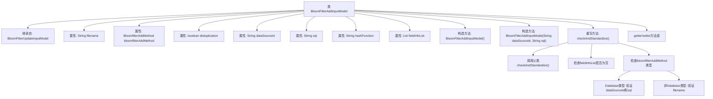

# 基础信息

|      |      |
|------|------|
| 名称 | BloomFilterAddInputModel |
| 编码语言 | .java |
| 代码路径 | WeFe/board/board-service/src/main/java/com/welab/wefe/board/service/dto/vo/data_resource/BloomFilterAddInputModel.java |
| 包名 | com.welab.wefe.board.service.dto.vo.data_resource |
| 依赖项 | ['com.welab.wefe.board.service.constant.BloomfilterAddMethod', 'com.welab.wefe.board.service.util.primarykey.FieldInfo', 'com.welab.wefe.common.StatusCode', 'com.welab.wefe.common.exception.StatusCodeWithException', 'com.welab.wefe.common.fieldvalidate.annotation.Check', 'org.apache.commons.collections4.CollectionUtils', 'org.apache.commons.lang3.StringUtils', 'java.util.List'] |
| 概述说明 | BloomFilterAddInputModel类继承自BloomFilterUpdateInputModel，包含文件名、添加方法、去重标志、数据源ID、SQL脚本、哈希函数和主键字段列表等属性，并验证参数有效性。 |

# 说明

BloomFilterAddInputModel继承自BloomFilterUpdateInputModel，用于布隆过滤器添加操作的输入参数。主要字段包括必填的filename（过滤器文件）、bloomfilterAddMethod（添加方法枚举）、deduplication（去重标志），以及可选的dataSourceId（数据源ID）、sql（查询脚本）、hashFunction（哈希函数）和fieldInfoList（主键字段列表）。类中包含参数校验逻辑：若添加方法为数据库方式则需校验dataSourceId和sql非空；若为文件方式则需校验filename非空；同时强制要求fieldInfoList不能为空。提供所有字段的getter/setter方法。

# 类列表 Class Summary

| 名称   | 类型  | 说明 |
|-------|------|-------------|
| BloomFilterAddInputModel | class | BloomFilterAddInputModel类继承自BloomFilterUpdateInputModel，包含文件名、添加方法、去重标志、数据源ID、SQL脚本、哈希函数和主键列表等字段，并实现参数校验逻辑。 |

## 类 BloomFilterAddInputModel

|      |      |
|------|------|
| 访问范围 | public |
| 类型 | class |
| 名称 | BloomFilterAddInputModel |
| 说明 | BloomFilterAddInputModel类继承自BloomFilterUpdateInputModel，包含文件名、添加方法、去重标志、数据源ID、SQL脚本、哈希函数和主键列表等字段，并实现参数校验逻辑。 |

### UML类图

类图描述：BloomFilterAddInputModel继承自BloomFilterUpdateInputModel接口，包含文件名、数据源ID、SQL查询等字段，并实现了参数校验逻辑。该类通过枚举BloomfilterAddMethod区分数据来源方式（数据库或文件），并包含FieldInfo列表用于主键处理。校验方法会检查字段合法性并根据不同数据来源方式验证必填字段。

### 内部方法调用关系图

该流程图展示了BloomFilterAddInputModel类的完整结构，包括继承关系、属性定义、构造方法和核心校验逻辑。重点描述了checkAndStandardize()方法的内部验证流程，该方法会先调用父类校验，然后检查主键字段列表，最后根据数据来源类型（数据库或文件）进行不同的参数验证。图形清晰呈现了类成员间的层级关系和校验逻辑的分支路径，便于理解这个布隆过滤器参数模型的完整验证机制。

### 字段列表 Field List

| 名称  | 类型  | 说明 |
|-------|-------|------|
| hashFunction | String | 代码定义了一个私有字符串变量hashFunction，用于存储选择的id特征列，并通过@Check注解进行校验。 |
| filename | String | 代码片段定义了一个私有字符串变量filename，使用@Check注解确保非空，若为空则提示"请指定过滤器文件"。 |
| fieldInfoList | List<FieldInfo> | 字段fieldInfoList用于主键处理，标注为@Check。 |
| bloomfilterAddMethod | BloomfilterAddMethod | 强制检查的布隆过滤器添加方法属性。 |
| sql | String | 私有字符串变量sql，使用@Check注解标记为需验证的SQL脚本。 |
| deduplication | boolean | 类成员变量deduplication，布尔类型，用于控制是否需要去重，默认必填。 |
| dataSourceId | String | 检查数据源ID的字符串变量。 |

### 方法列表

| 名称  | 类型  | 说明 |
|-------|-------|------|
| isDeduplication | boolean | 方法返回布尔值deduplication，表示是否去重。 |
| setHashFunction | void | 这是一个Java方法，用于设置对象的hashFunction属性值。方法接受一个字符串参数，并将其赋值给当前对象的hashFunction字段。 |
| getFieldInfoList | List<FieldInfo> | 方法返回字段信息列表。 |
| setFieldInfoList | void | 设置字段信息列表的方法，将输入列表赋值给类的成员变量fieldInfoList。 |
| getFilename | String | 该方法返回字符串类型的filename变量值。 |
| setFilename | void | 设置文件名的方法，将输入参数赋值给类的filename成员变量。 |
| setSql | void | 这是一个Java方法，用于设置SQL字符串的值。方法名为setSql，接受一个String类型参数sql，并将其赋值给当前对象的sql属性。 |
| setBloomfilterAddMethod | void | 设置布隆过滤器添加方法。 |
| setDataSourceId | void | 设置数据源ID的方法，将输入参数赋值给类的dataSourceId成员变量。 |
| getDataSourceId | String | 这是一个Java方法，返回私有成员变量dataSourceId的值。 |
| checkAndStandardize | void | 方法检查参数有效性：主键列表非空；若数据源为数据库，需提供dataSourceId和SQL；否则需指定文件名。参数缺失时抛出异常。 |
| setDeduplication | void | 设置去重功能的开关方法。 |
| getHashFunction | String | 获取哈希函数名称的方法。 |
| getBloomfilterAddMethod | BloomfilterAddMethod | 获取布隆过滤器的添加方法。 |
| getSql | String | 方法返回字符串类型的sql变量值。 |

