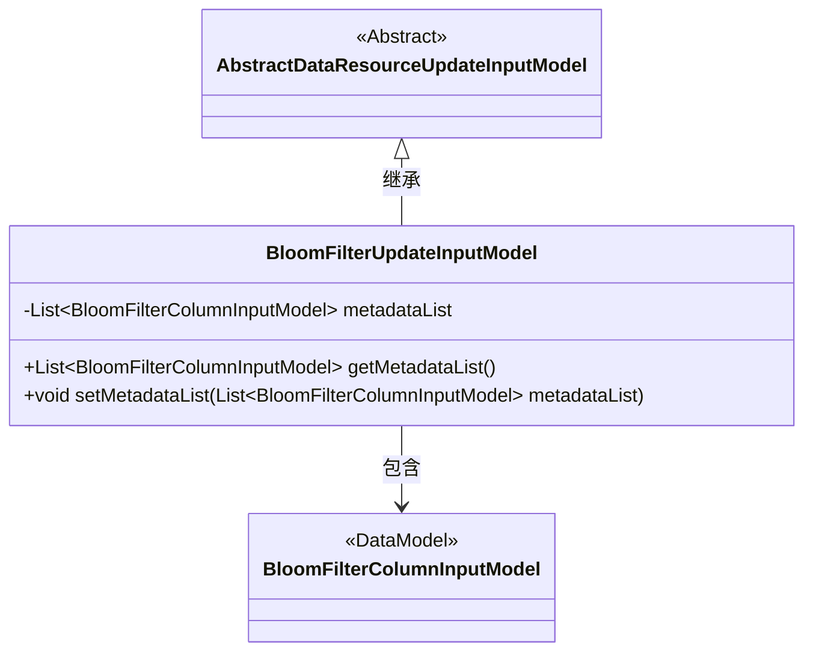
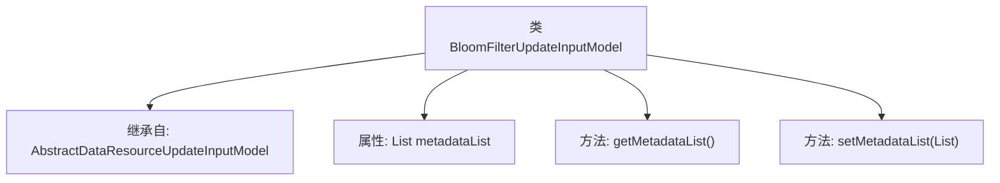

# 基础信息

|      |      |
|------|------|
| 名称 | BloomFilterUpdateInputModel |
| 编码语言 | .java |
| 代码路径 | WeFe/board/board-service/src/main/java/com/welab/wefe/board/service/dto/vo/data_resource/BloomFilterUpdateInputModel.java |
| 包名 | com.welab.wefe.board.service.dto.vo.data_resource |
| 依赖项 | ['com.welab.wefe.board.service.dto.fusion.BloomFilterColumnInputModel', 'java.util.List'] |
| 概述说明 | BloomFilterUpdateInputModel类继承AbstractDataResourceUpdateInputModel，包含metadataList属性和其getter/setter方法。 |

# 说明

BloomFilterUpdateInputModel类继承自AbstractDataResourceUpdateInputModel，包含一个私有成员metadataList，类型为BloomFilterColumnInputModel的列表。该类提供了metadataList的getter和setter方法，用于获取和设置该列表的值。

# 类列表 Class Summary

| 名称   | 类型  | 说明 |
|-------|------|-------------|
| BloomFilterUpdateInputModel | class | BloomFilterUpdateInputModel类继承AbstractDataResourceUpdateInputModel，包含metadataList属性及其getter/setter方法。 |

## 类 BloomFilterUpdateInputModel

|      |      |
|------|------|
| 访问范围 | public |
| 类型 | class |
| 名称 | BloomFilterUpdateInputModel |
| 说明 | BloomFilterUpdateInputModel类继承AbstractDataResourceUpdateInputModel，包含metadataList属性及其getter/setter方法。 |

### UML类图

这段类图展示了BloomFilterUpdateInputModel继承自抽象类AbstractDataResourceUpdateInputModel，并包含一个BloomFilterColumnInputModel类型的列表。BloomFilterUpdateInputModel提供了对metadataList的getter和setter方法，用于管理布隆过滤器列的元数据集合。该设计实现了数据资源的层级结构，便于扩展和维护布隆过滤器的配置信息。

### 内部方法调用关系图

这段代码展示了一个名为BloomFilterUpdateInputModel的类，它继承自AbstractDataResourceUpdateInputModel。该类包含一个metadataList属性，用于存储BloomFilterColumnInputModel对象的列表，并提供了对应的getter和setter方法。流程图清晰地展示了类的继承关系、属性定义以及方法结构，体现了该模型类作为数据资源更新输入模型的基本组成。

### 字段列表 Field List

| 名称  | 类型  | 说明 |
|-------|-------|------|
| metadataList | List<BloomFilterColumnInputModel> | 私有成员变量metadataList，类型为BloomFilterColumnInputModel的列表。 |

### 方法列表

| 名称  | 类型  | 说明 |
|-------|-------|------|
| getMetadataList | List<BloomFilterColumnInputModel> | 获取元数据列表的方法，返回类型为BloomFilterColumnInputModel的List集合。 |
| setMetadataList | void | 设置元数据列表的方法，将输入参数赋值给类的成员变量metadataList。 |

