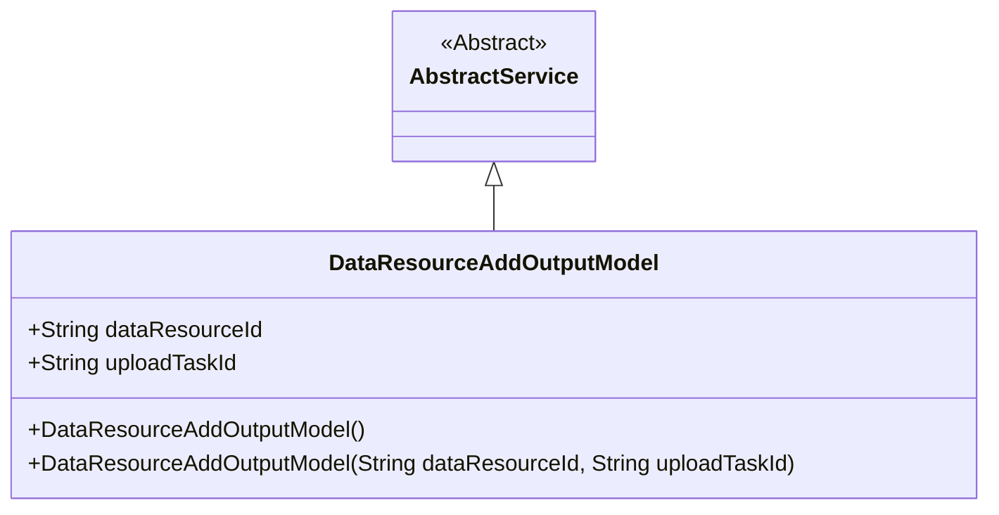
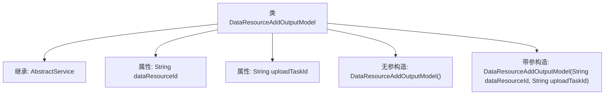

# 基础信息

|      |      |
|------|------|
| 名称 | DataResourceAddOutputModel |
| 编码语言 | .java |
| 代码路径 | WeFe/board/board-service/src/main/java/com/welab/wefe/board/service/dto/vo/data_resource/DataResourceAddOutputModel.java |
| 包名 | com.welab.wefe.board.service.dto.vo.data_resource |
| 依赖项 | ['com.welab.wefe.board.service.service.AbstractService'] |
| 概述说明 | DataResourceAddOutputModel类继承AbstractService，包含dataResourceId和uploadTaskId两个字符串属性，提供无参和带参构造方法。 |

# 说明

这是一个名为DataResourceAddOutputModel的Java类，继承自AbstractService。它包含两个公共字符串字段：dataResourceId和uploadTaskId。类提供了两个构造函数：一个无参构造函数和一个带参构造函数，用于初始化这两个字段的值。该类用于表示数据资源添加操作的输出模型。

# 类列表 Class Summary

| 名称   | 类型  | 说明 |
|-------|------|-------------|
| DataResourceAddOutputModel | class | DataResourceAddOutputModel类继承AbstractService，包含dataResourceId和uploadTaskId两个字符串属性，提供无参和带参构造方法。 |

## 类 DataResourceAddOutputModel

|      |      |
|------|------|
| 访问范围 | public |
| 类型 | class |
| 名称 | DataResourceAddOutputModel |
| 说明 | DataResourceAddOutputModel类继承AbstractService，包含dataResourceId和uploadTaskId两个字符串属性，提供无参和带参构造方法。 |

### UML类图

该类图展示了DataResourceAddOutputModel继承自AbstractService的层级关系。DataResourceAddOutputModel包含两个公有字符串字段(dataResourceId和uploadTaskId)以及两个构造函数，其中一个是无参构造，另一个接收两个字符串参数。AbstractService被标记为抽象类，作为基类提供基础服务功能。这种设计体现了资源添加操作的输出模型结构，通过继承复用抽象服务类的功能。

### 内部方法调用关系图

该流程图展示了DataResourceAddOutputModel类的结构，该类继承自AbstractService，包含两个字符串属性(dataResourceId和uploadTaskId)，以及两个构造函数（无参构造和带参构造）。带参构造用于初始化两个属性值，类层级清晰体现了继承关系和成员组成，总节点数控制在合理范围便于理解类的基本设计。

### 字段列表 Field List

| 名称  | 类型  | 说明 |
|-------|-------|------|
| uploadTaskId | String | 上传任务的唯一标识符。 |
| dataResourceId | String | 公共字符串变量dataResourceId。 |

### 方法列表

| 名称  | 类型  | 说明 |
|-------|-------|------|

