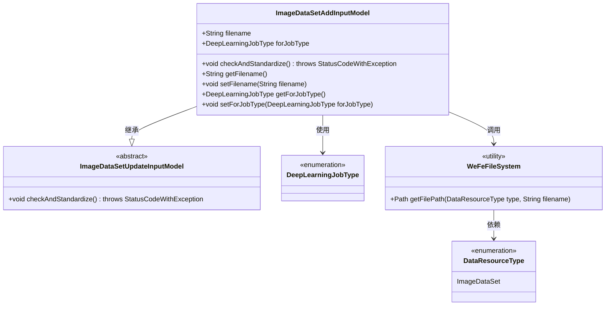
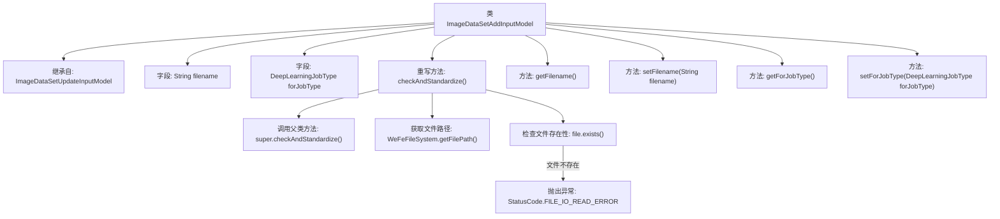

# 基础信息

|      |      |
|------|------|
| 名称 | ImageDataSetAddInputModel |
| 编码语言 | .java |
| 代码路径 | WeFe/board/board-service/src/main/java/com/welab/wefe/board/service/dto/vo/data_resource/ImageDataSetAddInputModel.java |
| 包名 | com.welab.wefe.board.service.dto.vo.data_resource |
| 依赖项 | ['com.welab.wefe.board.service.base.file_system.WeFeFileSystem', 'com.welab.wefe.common.StatusCode', 'com.welab.wefe.common.exception.StatusCodeWithException', 'com.welab.wefe.common.fieldvalidate.annotation.Check', 'com.welab.wefe.common.wefe.enums.DataResourceType', 'com.welab.wefe.common.wefe.enums.DeepLearningJobType', 'java.io.File'] |
| 概述说明 | 图像数据集添加输入模型类，继承自更新模型，包含文件名和任务类型字段，检查文件存在性并提供getter/setter方法。 |

# 说明

该内容描述了一个名为ImageDataSetAddInputModel的Java类，继承自ImageDataSetUpdateInputModel。该类包含两个必填字段：filename（数据集文件名）和forJobType（数据集应用的任务类型）。类中实现了checkAndStandardize方法，用于验证文件是否存在，若不存在则抛出异常。此外，还提供了filename和forJobType的getter和setter方法。

# 类列表 Class Summary

| 名称   | 类型  | 说明 |
|-------|------|-------------|
| ImageDataSetAddInputModel | class | ImageDataSetAddInputModel继承自ImageDataSetUpdateInputModel，包含必填字段filename和forJobType，并验证文件是否存在。提供getter/setter方法。 |

## 类 ImageDataSetAddInputModel

|      |      |
|------|------|
| 访问范围 | public |
| 类型 | class |
| 名称 | ImageDataSetAddInputModel |
| 说明 | ImageDataSetAddInputModel继承自ImageDataSetUpdateInputModel，包含必填字段filename和forJobType，并验证文件是否存在。提供getter/setter方法。 |

### UML类图

这段类图展示了图像数据集添加输入模型的继承关系和依赖。ImageDataSetAddInputModel继承自抽象基类ImageDataSetUpdateInputModel，包含文件名和任务类型两个核心字段，并通过重写checkAndStandardize方法实现文件存在性校验。该类依赖枚举类型DeepLearningJobType定义任务类型，调用工具类WeFeFileSystem进行文件路径操作，其中WeFeFileSystem又依赖DataResourceType枚举确定资源类型。整体结构体现了输入模型验证、文件操作和类型约束的协作关系。

### 内部方法调用关系图

该流程图展示了ImageDataSetAddInputModel类的结构和主要方法调用关系。该类继承自ImageDataSetUpdateInputModel，包含两个带校验注解的字段(filename和forJobType)，并重写了checkAndStandardize()方法。该方法首先调用父类校验逻辑，然后检查指定文件是否存在，若不存在则抛出文件读取异常。图中清晰呈现了类继承关系、字段定义、方法调用链和异常处理路径，体现了数据校验和文件操作的核心流程。

### 字段列表 Field List

| 名称  | 类型  | 说明 |
|-------|-------|------|
| forJobType | DeepLearningJobType | 检查数据集应用的任务类型，必填字段，类型为DeepLearningJobType。 |
| filename | String | 代码定义了一个必填字段filename，若为空则提示"请指定数据集文件"。 |

### 方法列表

| 名称  | 类型  | 说明 |
|-------|-------|------|
| checkAndStandardize | void | 方法检查并标准化文件，若文件不存在则抛出异常提示未找到文件。 |
| setFilename | void | 设置文件名的方法，将输入参数赋值给类成员变量filename。 |
| getFilename | String | 获取文件名的公共方法，返回字符串类型的filename变量。 |
| getForJobType | DeepLearningJobType | 获取当前深度学习任务类型的方法，返回DeepLearningJobType对象。 |
| setForJobType | void | 设置深度学习任务类型的方法，将参数赋值给类成员变量。 |

