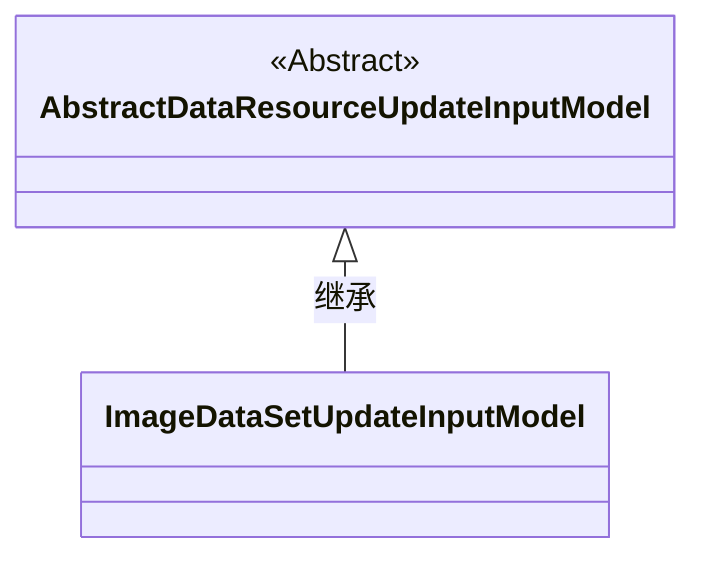
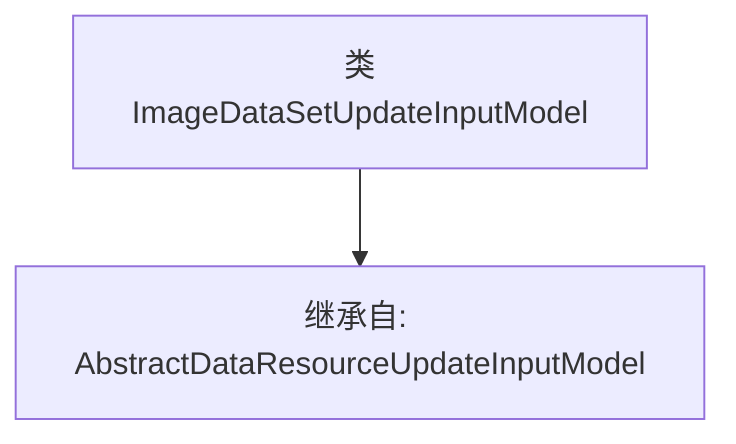

# 基础信息

|      |      |
|------|------|
| 名称 | ImageDataSetUpdateInputModel |
| 编码语言 | .java |
| 代码路径 | WeFe/board/board-service/src/main/java/com/welab/wefe/board/service/dto/vo/data_resource/ImageDataSetUpdateInputModel.java |
| 包名 | com.welab.wefe.board.service.dto.vo.data_resource |
| 依赖项 | [] |
| 概述说明 | ImageDataSetUpdateInputModel继承自AbstractDataResourceUpdateInputModel，用于图像数据集更新输入。 |

# 说明

该内容定义了一个名为ImageDataSetUpdateInputModel的Java类，该类继承自AbstractDataResourceUpdateInputModel。这表明ImageDataSetUpdateInputModel是一个用于更新图像数据集输入数据的模型类，它继承了父类的基本数据资源更新功能。类定义中未包含额外属性或方法，说明其核心功能可能完全依赖于父类实现。

# 类列表 Class Summary

| 名称   | 类型  | 说明 |
|-------|------|-------------|
| ImageDataSetUpdateInputModel | class | ImageDataSetUpdateInputModel继承自AbstractDataResourceUpdateInputModel，用于图像数据集更新输入模型。 |

## 类 ImageDataSetUpdateInputModel

|      |      |
|------|------|
| 访问范围 | public |
| 类型 | class |
| 名称 | ImageDataSetUpdateInputModel |
| 说明 | ImageDataSetUpdateInputModel继承自AbstractDataResourceUpdateInputModel，用于图像数据集更新输入模型。 |

### UML类图

这段类图展示了ImageDataSetUpdateInputModel继承自AbstractDataResourceUpdateInputModel的类层级关系。AbstractDataResourceUpdateInputModel是一个抽象基类（用<<Abstract>>标记），而ImageDataSetUpdateInputModel是其具体子类，通过空心箭头表示继承关系。该结构体现了面向对象设计中通过继承实现代码复用的典型模式，子类将继承父类的所有属性和方法。

### 内部方法调用关系图

这段代码定义了一个名为`ImageDataSetUpdateInputModel`的类，该类继承自`AbstractDataResourceUpdateInputModel`。流程图清晰地展示了类之间的继承关系，`ImageDataSetUpdateInputModel`作为子类通过箭头指向父类`AbstractDataResourceUpdateInputModel`。该设计表明子类将复用父类的属性和方法，同时可根据需要扩展或重写功能，适用于图像数据集更新操作的输入模型场景。

### 字段列表 Field List

| 名称  | 类型  | 说明 |
|-------|-------|------|

### 方法列表

| 名称  | 类型  | 说明 |
|-------|-------|------|

