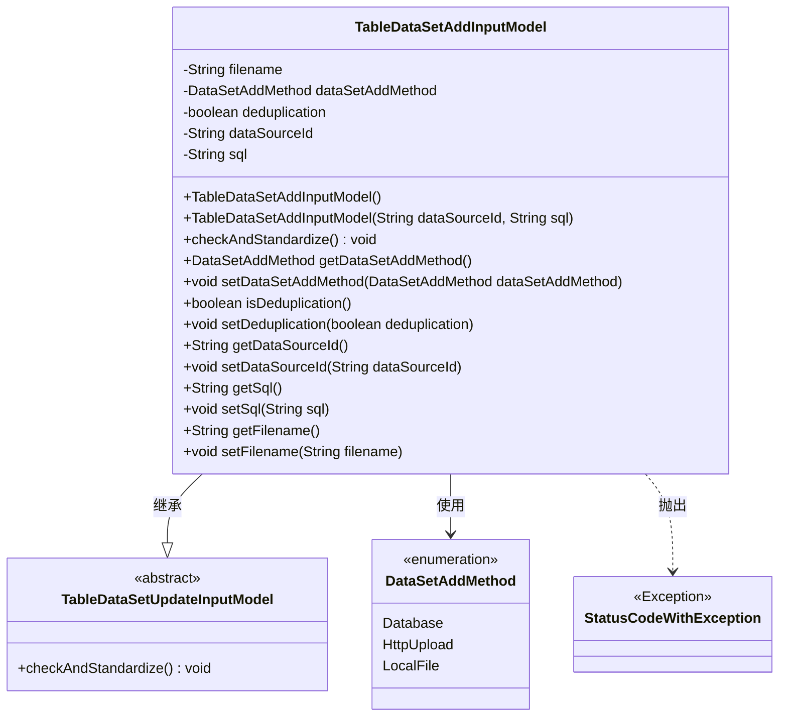
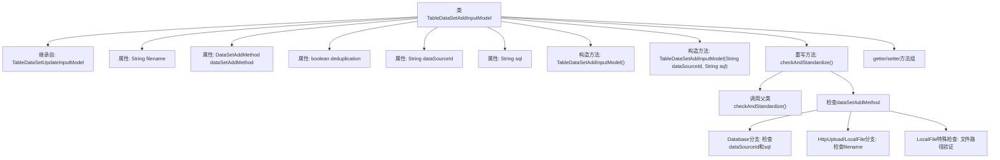

# 基础信息

|      |      |
|------|------|
| 名称 | TableDataSetAddInputModel |
| 编码语言 | .java |
| 代码路径 | WeFe/board/board-service/src/main/java/com/welab/wefe/board/service/dto/vo/data_resource/TableDataSetAddInputModel.java |
| 包名 | com.welab.wefe.board.service.dto.vo.data_resource |
| 依赖项 | ['com.welab.wefe.board.service.base.file_system.WeFeFileSystem', 'com.welab.wefe.board.service.constant.DataSetAddMethod', 'com.welab.wefe.common.StatusCode', 'com.welab.wefe.common.exception.StatusCodeWithException', 'com.welab.wefe.common.fieldvalidate.annotation.Check', 'org.apache.commons.lang3.StringUtils'] |
| 概述说明 | TableDataSetAddInputModel类用于数据集添加，包含文件名、添加方式、去重标志、数据源ID和SQL脚本等字段，并进行输入校验。 |

# 说明

TableDataSetAddInputModel继承自TableDataSetUpdateInputModel，用于处理数据集添加的输入参数。包含必填字段filename、dataSetAddMethod、deduplication，可选字段dataSourceId和sql。提供两种构造方法，默认构造方法和带dataSourceId、sql参数的构造方法。重写checkAndStandardize方法，根据dataSetAddMethod类型进行校验：Database类型需校验dataSourceId和sql非空；HttpUpload和LocalFile类型需校验filename非空；LocalFile类型还需校验文件路径符合要求。提供各字段的getter和setter方法。

# 类列表 Class Summary

| 名称   | 类型  | 说明 |
|-------|------|-------------|
| TableDataSetAddInputModel | class | TableDataSetAddInputModel类继承TableDataSetUpdateInputModel，包含文件名、数据添加方法、去重标志、数据源ID和SQL脚本字段，提供校验逻辑确保参数有效性。 |

## 类 TableDataSetAddInputModel

|      |      |
|------|------|
| 访问范围 | public |
| 类型 | class |
| 名称 | TableDataSetAddInputModel |
| 说明 | TableDataSetAddInputModel类继承TableDataSetUpdateInputModel，包含文件名、数据添加方法、去重标志、数据源ID和SQL脚本字段，提供校验逻辑确保参数有效性。 |

### UML类图

这段类图展示了TableDataSetAddInputModel类继承自抽象类TableDataSetUpdateInputModel，并包含多个私有字段和对应的getter/setter方法。该类主要用于处理数据集添加的输入模型，通过枚举类型DataSetAddMethod指定不同的添加方式，并在checkAndStandardize方法中进行参数校验。当校验失败时会抛出StatusCodeWithException异常。类图中清晰地展示了类之间的继承关系、依赖关系和异常处理机制。

### 内部方法调用关系图

这段代码展示了一个数据集添加输入模型类，继承自基础更新模型类。主要功能包括：1) 通过注解实现参数校验；2) 提供两种构造方法；3) 重写校验方法实现多分支验证逻辑；4) 包含完整的getter/setter方法。核心校验逻辑根据不同的数据集添加方法（Database/HttpUpload/LocalFile）执行不同的参数检查，特别是对本地文件路径有严格的目录限制验证。

### 字段列表 Field List

| 名称  | 类型  | 说明 |
|-------|-------|------|
| deduplication | boolean | 类成员变量deduplication，布尔类型，用于控制是否需要去重，默认必填。 |
| filename | String | 代码片段定义了一个私有字符串变量filename，使用@Check注解确保其非空，否则提示"请指定数据集文件"。 |
| dataSetAddMethod | DataSetAddMethod | 强制校验字段dataSetAddMethod不可为空。 |
| dataSourceId | String | 检查数据源ID的字符串变量。 |
| sql | String | 类成员变量sql，使用@Check注解标记为"sql脚本"。 |

### 方法列表

| 名称  | 类型  | 说明 |
|-------|-------|------|
| getDataSetAddMethod | DataSetAddMethod | 获取数据集添加方法的函数，返回dataSetAddMethod的值。 |
| checkAndStandardize | void | 方法检查数据集添加方式：数据库需dataSourceId和sql；HttpUpload和LocalFile需filename；LocalFile还需文件路径在指定目录下。 |
| isDeduplication | boolean | 方法isDeduplication返回deduplication的布尔值。 |
| setSql | void | 这是一个Java方法，用于设置SQL语句字符串到类的成员变量sql中。 |
| getDataSourceId | String | 获取数据源ID的方法，返回字符串类型的数据源ID。 |
| setDataSourceId | void | 设置数据源ID的方法，将输入参数赋值给类的成员变量dataSourceId。 |
| getSql | String | 获取SQL语句的方法。 |
| setDataSetAddMethod | void | 设置数据集添加方法，将参数赋值给类的成员变量dataSetAddMethod。 |
| setDeduplication | void | 设置去重功能的开关方法，参数为布尔值。 |
| getFilename | String | 这是一个Java方法，返回字符串类型的filename变量值。 |
| setFilename | void | 设置文件名的方法，将输入参数赋值给类成员变量filename。 |

