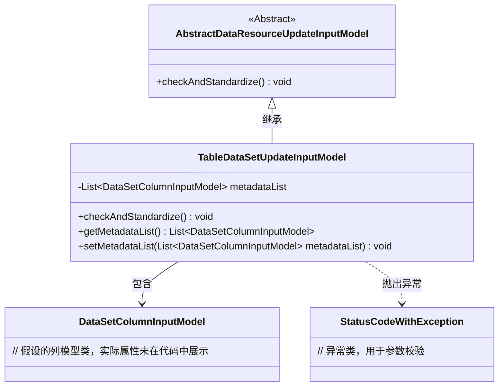
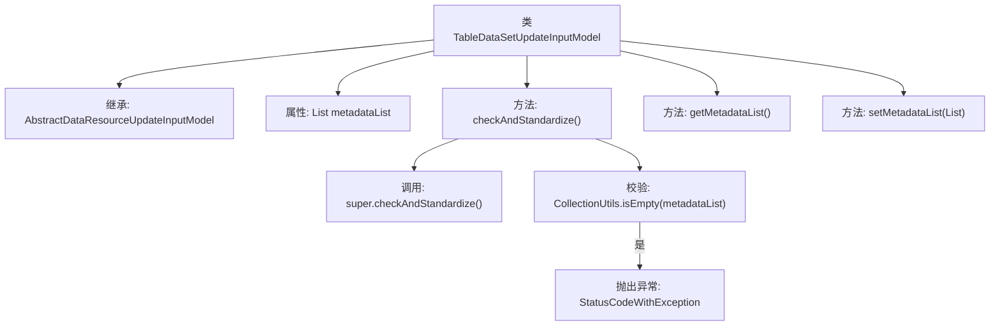

# 基础信息

|      |      |
|------|------|
| 名称 | TableDataSetUpdateInputModel |
| 编码语言 | .java |
| 代码路径 | WeFe/board/board-service/src/main/java/com/welab/wefe/board/service/dto/vo/data_resource/TableDataSetUpdateInputModel.java |
| 包名 | com.welab.wefe.board.service.dto.vo.data_resource |
| 依赖项 | ['com.welab.wefe.board.service.dto.entity.data_set.DataSetColumnInputModel', 'com.welab.wefe.common.StatusCode', 'com.welab.wefe.common.exception.StatusCodeWithException', 'com.welab.wefe.common.fieldvalidate.annotation.Check', 'org.apache.commons.collections4.CollectionUtils', 'java.util.List'] |
| 概述说明 | TableDataSetUpdateInputModel继承AbstractDataResourceUpdateInputModel，包含metadataList字段，校验非空，提供getter/setter方法。 |

# 说明

这是一个名为TableDataSetUpdateInputModel的Java类，继承自AbstractDataResourceUpdateInputModel。它包含一个必填的metadataList属性，类型为DataSetColumnInputModel的列表。类中实现了checkAndStandardize方法，用于校验metadataList是否为空，若为空则抛出异常提示设置数据集元数据。同时提供了metadataList的getter和setter方法。

# 类列表 Class Summary

| 名称   | 类型  | 说明 |
|-------|------|-------------|
| TableDataSetUpdateInputModel | class | TableDataSetUpdateInputModel继承AbstractDataResourceUpdateInputModel，包含metadataList字段及校验逻辑，要求metadataList非空。提供getter/setter方法。 |

## 类 TableDataSetUpdateInputModel

|      |      |
|------|------|
| 访问范围 | public |
| 类型 | class |
| 名称 | TableDataSetUpdateInputModel |
| 说明 | TableDataSetUpdateInputModel继承AbstractDataResourceUpdateInputModel，包含metadataList字段及校验逻辑，要求metadataList非空。提供getter/setter方法。 |

### UML类图

类图描述：该图展示了TableDataSetUpdateInputModel继承自抽象类AbstractDataResourceUpdateInputModel，并包含对DataSetColumnInputModel的聚合关系。TableDataSetUpdateInputModel通过checkAndStandardize()方法实现参数校验逻辑，当metadataList为空时抛出StatusCodeWithException异常，体现了对数据集元数据的强校验机制。

### 内部方法调用关系图

这段代码展示了一个继承自AbstractDataResourceUpdateInputModel的TableDataSetUpdateInputModel类，主要用于处理数据集更新输入模型。核心功能包括对metadataList属性的校验（非空检查）、getter/setter方法以及标准化检查流程。当metadataList为空时，会抛出StatusCodeWithException异常。流程图清晰呈现了类继承关系、属性结构和方法调用链，特别突出了校验逻辑的异常处理路径。

### 字段列表 Field List

| 名称  | 类型  | 说明 |
|-------|-------|------|
| metadataList | List<DataSetColumnInputModel> | 强制检查的私有列表metadataList，类型为DataSetColumnInputModel。 |

### 方法列表

| 名称  | 类型  | 说明 |
|-------|-------|------|
| checkAndStandardize | void | 检查并标准化数据集，若元数据为空则抛出参数无效异常。 |
| getMetadataList | List<DataSetColumnInputModel> | 方法返回数据集列输入模型列表metadataList。 |
| setMetadataList | void | 这是一个Java方法，用于设置metadataList属性的值，参数为DataSetColumnInputModel类型的列表。 |

