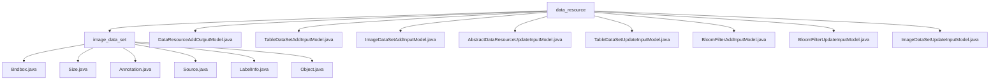

# 基础信息

|      |      |
|------|------|
| 名称 | data_resource |
| 编码语言 | .java |
| 代码路径 | WeFe/board/board-service/src/main/java/com/welab/wefe/board/service/dto/vo/data_resource |
| 包名 | docs.board.board-service.src.main.java.com.welab.wefe.board.service.dto.vo.data_resource |
| 概述说明 | 该模块管理图像数据集标注，含边界框、尺寸和对象属性。支持标注全流程，依赖XStream序列化。包含多个输入输出模型类，处理数据资源添加、更新及校验，如DataResourceAddOutputModel、TableDataSetAddInputModel等。 |

# 说明

## 概述  
该模块核心职责是统一管理多类型数据资源（图像/表格/布隆过滤器）的增删改查操作，采用分层输入模型设计。接口规范遵循继承体系：基础字段由AbstractDataResourceUpdateInputModel定义，各子类扩展特定校验逻辑（例如ImageDataSetAddInputModel验证文件存在性）。关键数据结构包含资源标识字段（id/dataResourceId）、元数据列表（metadataList）和添加方法枚举（dataSetAddMethod）。外部依赖仅涉及XStream序列化框架。例如TableDataSetAddInputModel通过SQL校验实现数据库类型资源添加，类似ETL工具的数据源配置。

## 主要业务场景  
模块支持三类数据资源的全生命周期管理：图像数据集（文件校验）、表格数据（元数据校验）和布隆过滤器（哈希配置）。典型交互模式为AddInputModel继承UpdateInputModel实现差异化校验，例如BloomFilterAddInputModel强制要求fieldInfoList非空。功能覆盖资源添加（构造参数初始化）、更新（publicLevel校验）和转换（toLabelInfo），形成标准化资源管理流程。例如通过publicMemberList控制资源可见性，类似RBAC权限模型。

### 包内部结构视图

该流程图展示了data_resource目录下的层级结构，包含一个子目录image_data_set和多个Java文件。image_data_set子目录下又包含7个具体的Java类文件，而data_resource根目录下则包含8个不同的模型类文件，涵盖了数据资源的不同操作类型（如添加、更新等）和数据类型（如表数据、图像数据等）。

# 文件列表

| 名称   | 类型  | 说明 |
|-------|------|-------------|
| [DataResourceAddOutputModel.java](DataResourceAddOutputModel.md) | file | DataResourceAddOutputModel类继承AbstractService，包含dataResourceId和uploadTaskId两个字符串属性，提供无参和带参构造方法。 |
| [TableDataSetAddInputModel.java](TableDataSetAddInputModel.md) | file | TableDataSetAddInputModel类用于数据集添加，包含文件名、添加方式、去重标志、数据源ID和SQL脚本等字段，并进行输入校验。 |
| [ImageDataSetAddInputModel.java](ImageDataSetAddInputModel.md) | file | 图像数据集添加输入模型类，继承自更新模型，包含文件名和任务类型字段，检查文件存在性并提供getter/setter方法。 |
| [AbstractDataResourceUpdateInputModel.java](AbstractDataResourceUpdateInputModel.md) | file | 数据集更新输入模型，包含名称、描述、标签、可见级别和成员列表等字段，并进行校验和标准化处理，确保数据合法性和唯一性。 |
| [TableDataSetUpdateInputModel.java](TableDataSetUpdateInputModel.md) | file | TableDataSetUpdateInputModel继承AbstractDataResourceUpdateInputModel，包含metadataList字段，校验非空，提供getter/setter方法。 |
| [BloomFilterAddInputModel.java](BloomFilterAddInputModel.md) | file | BloomFilterAddInputModel类继承自BloomFilterUpdateInputModel，包含文件名、添加方法、去重标志、数据源ID、SQL脚本、哈希函数和主键字段列表等属性，并验证参数有效性。 |
| [BloomFilterUpdateInputModel.java](BloomFilterUpdateInputModel.md) | file | BloomFilterUpdateInputModel类继承AbstractDataResourceUpdateInputModel，包含metadataList属性和其getter/setter方法。 |
| [ImageDataSetUpdateInputModel.java](ImageDataSetUpdateInputModel.md) | file | ImageDataSetUpdateInputModel继承自AbstractDataResourceUpdateInputModel，用于图像数据集更新输入。 |
| [image_data_set](image_data_set/_module.md) | package | Bndbox类表示矩形边界框，含xmin、ymin、xmax、ymax坐标。Size类存储三维尺寸width、height、depth。Annotation类处理标注数据，含文件信息、对象列表及转换方法。Source类简单存储数据库信息。LabelInfo类管理标注信息，含标签列表和检查方法。Object类描述物体属性，含名称、姿态、遮挡标记及边界框。 |

