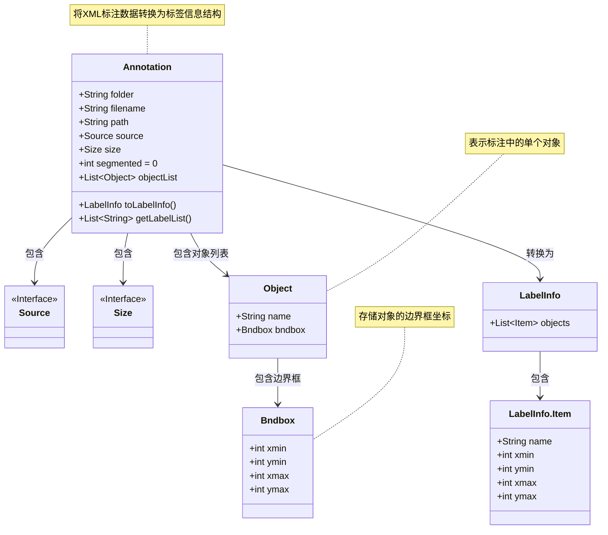
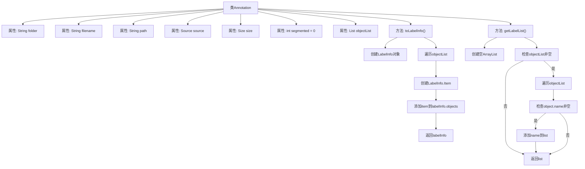

# 基础信息

|      |      |
|------|------|
| 名称 | Annotation |
| 编码语言 | .java |
| 代码路径 | WeFe/board/board-service/src/main/java/com/welab/wefe/board/service/dto/vo/data_resource/image_data_set/Annotation.java |
| 包名 | com.welab.wefe.board.service.dto.vo.data_resource.image_data_set |
| 依赖项 | ['com.thoughtworks.xstream.annotations.XStreamAlias', 'com.thoughtworks.xstream.annotations.XStreamImplicit', 'com.welab.wefe.common.util.StringUtil', 'java.util.ArrayList', 'java.util.List'] |
| 概述说明 | Annotation类用于标注信息，包含文件夹、文件名、路径、来源、尺寸等属性，可将对象列表转换为LabelInfo或提取标签列表。 |

# 说明

该代码定义了一个名为Annotation的类，用于处理标注数据。类中包含文件夹、文件名、路径等基本信息字段，以及source和size对象。segmented字段暂未使用，默认值为0。objectList存储对象列表，通过toLabelInfo方法将对象转换为LabelInfo格式，包含名称和边界框坐标。getLabelList方法提取所有对象的名称列表。整体功能涉及标注数据的存储和转换。

# 类列表 Class Summary

| 名称   | 类型  | 说明 |
|-------|------|-------------|
| Annotation | class | Annotation类用于标注信息，包含文件夹、文件名、路径、来源、尺寸等属性，可将对象列表转换为LabelInfo或提取标签列表。 |

## 类 Annotation

|      |      |
|------|------|
| 访问范围 | @XStreamAlias("annotation");public |
| 类型 | class |
| 名称 | Annotation |
| 说明 | Annotation类用于标注信息，包含文件夹、文件名、路径、来源、尺寸等属性，可将对象列表转换为LabelInfo或提取标签列表。 |

### UML类图

这段代码描述了一个标注数据转换系统，Annotation类作为核心数据结构，用于存储XML格式的标注信息（如文件路径、尺寸、对象列表等），并提供toLabelInfo()方法将原始数据转换为结构化的LabelInfo对象，同时支持提取标签列表。类图中清晰展示了Annotation与Source、Size等接口的依赖关系，以及通过Object和Bndbox类实现的多层级对象边界框存储结构，最终转换为包含Item集合的LabelInfo结果。

### 内部方法调用关系图

这段代码是用于处理标注数据的Annotation类，包含文件信息和对象列表。toLabelInfo()方法将objectList转换为LabelInfo对象，包含每个对象的名称和边界框坐标；getLabelList()方法提取所有非空的对象名称。流程图展示了属性结构和方法逻辑，特别是对objectList的遍历处理和条件判断。

### 字段列表 Field List

| 名称  | 类型  | 说明 |
|-------|-------|------|
| segmented = 0 | int | 定义了一个整型变量segmented，初始值为0。 |
| size | Size | 类成员变量size，类型为Size。 |
| source | Source | 声明一个名为source的公共Source类变量。 |
| path | String | 公共字符串变量path。 |
| objectList | List<Object> | XStream注解标记的objectList，用于隐式处理对象列表。 |
| filename | String | 声明一个公开的字符串变量filename。 |
| folder | String | 定义了一个公开的字符串变量folder。 |

### 方法列表

| 名称  | 类型  | 说明 |
|-------|-------|------|
| getLabelList | List<String> | 方法getLabelList返回非空对象列表中所有对象的name属性值组成的字符串列表。若对象列表为空则返回空列表。 |
| toLabelInfo | LabelInfo | 该方法将对象列表转换为LabelInfo对象，包含每个对象的名称和边界框坐标。若无对象列表则返回空LabelInfo。 |

