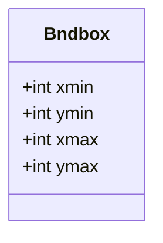
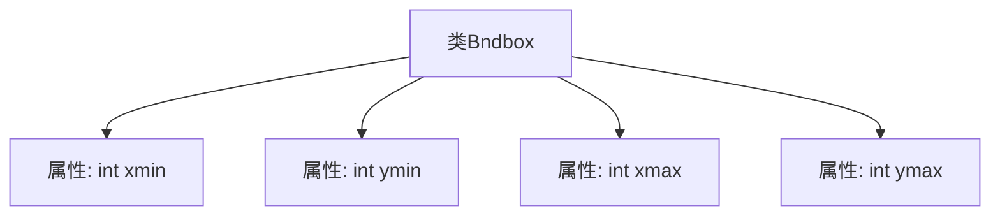

# 基础信息

|      |      |
|------|------|
| 名称 | Bndbox |
| 编码语言 | .java |
| 代码路径 | WeFe/board/board-service/src/main/java/com/welab/wefe/board/service/dto/vo/data_resource/image_data_set/Bndbox.java |
| 包名 | com.welab.wefe.board.service.dto.vo.data_resource.image_data_set |
| 依赖项 | [] |
| 概述说明 | Bndbox类定义了一个矩形框，包含左上角坐标(xmin,ymin)和右下角坐标(xmax,ymax)。 |

# 说明

这是一个名为Bndbox的公共类，用于表示一个矩形边界框。该类包含四个整型公共字段：xmin和ymin表示矩形左上角的坐标，xmax和ymax表示矩形右下角的坐标。这些字段共同定义了矩形在二维空间中的位置和大小。

# 类列表 Class Summary

| 名称   | 类型  | 说明 |
|-------|------|-------------|
| Bndbox | class | Bndbox类定义了四个整数变量，表示矩形框的左上角(xmin,ymin)和右下角(xmax,ymax)坐标。 |

## 类 Bndbox

|      |      |
|------|------|
| 访问范围 | public |
| 类型 | class |
| 名称 | Bndbox |
| 说明 | Bndbox类定义了四个整数变量，表示矩形框的左上角(xmin,ymin)和右下角(xmax,ymax)坐标。 |

### UML类图

这段代码定义了一个名为Bndbox的类，用于表示二维空间中的一个边界框。该类包含四个公有整型字段：xmin和ymin表示边界框左上角的坐标，xmax和ymax表示右下角的坐标。这种结构通常用于计算机视觉和图形处理中，用于标识物体在图像中的位置范围。由于所有字段都是公开的，外部可以直接访问和修改这些坐标值，但缺乏封装保护可能导致数据被意外修改。

### 内部方法调用关系图

该流程图展示了Bndbox类的结构，包含四个公开的整数类型属性：xmin、ymin、xmax和ymax。这是一个简单的数据容器类，用于存储二维边界框的坐标信息，通常用于图像处理或物体检测领域。图中清晰呈现了类与属性之间的从属关系，每个属性直接关联到Bndbox类主体。

### 字段列表 Field List

| 名称  | 类型  | 说明 |
|-------|-------|------|
| xmin | int | 声明一个公共整型变量xmin。 |
| ymin | int | 声明一个公共整型变量ymin。 |
| xmax | int | 公共整型变量xmax，用于存储最大值。 |
| ymax | int | 公共整型变量，表示y轴最大值。 |

### 方法列表

| 名称  | 类型  | 说明 |
|-------|-------|------|

