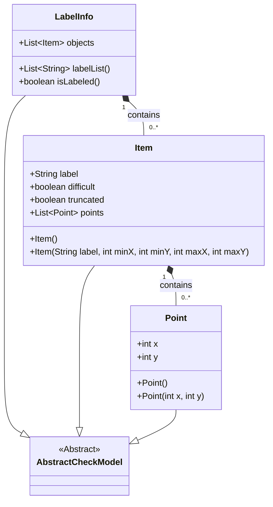
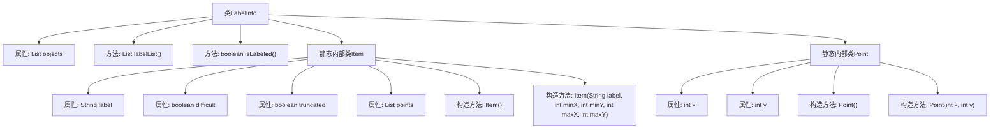
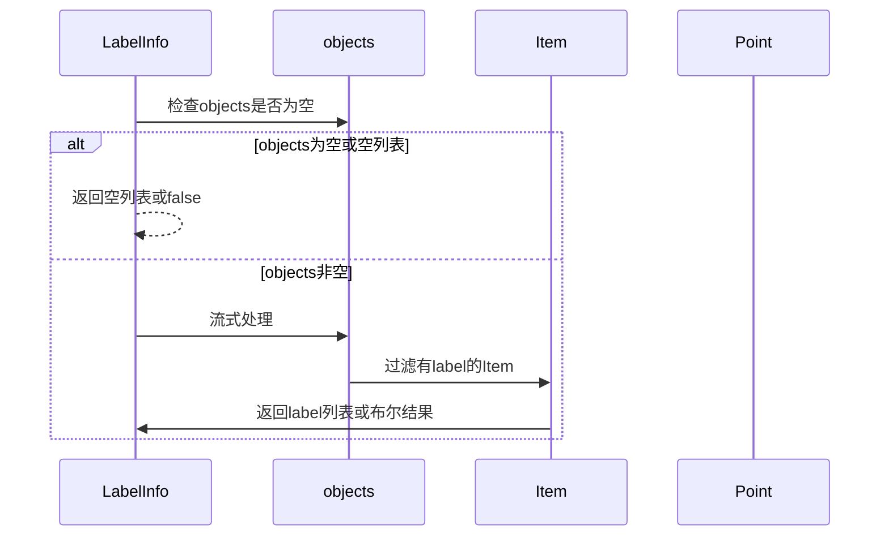

# 基础信息

|      |      |
|------|------|
| 名称 | LabelInfo |
| 编码语言 | .java |
| 代码路径 | WeFe/board/board-service/src/main/java/com/welab/wefe/board/service/dto/vo/data_resource/image_data_set/LabelInfo.java |
| 包名 | com.welab.wefe.board.service.dto.vo.data_resource.image_data_set |
| 依赖项 | ['com.welab.wefe.common.fieldvalidate.AbstractCheckModel', 'com.welab.wefe.common.fieldvalidate.annotation.Check', 'com.welab.wefe.common.util.StringUtil', 'java.util.ArrayList', 'java.util.List', 'java.util.stream.Collectors'] |
| 概述说明 | LabelInfo类管理图片标注信息，包含对象列表及标签提取方法。Item类存储单个标注的标签、遮挡状态及坐标点。Point类定义坐标。提供检查标注存在的方法。 |

# 说明

LabelInfo类继承AbstractCheckModel，包含objects列表存储Item对象。提供labelList方法返回非空标签列表，isLabeled方法检查是否存在标注信息。Item类包含label、difficult、truncated标志及points坐标列表，可通过构造器初始化标签和坐标范围。Point类存储x、y坐标值。整体实现图片标注信息的管理与查询功能。

# 类列表 Class Summary

| 名称   | 类型  | 说明 |
|-------|------|-------------|
| LabelInfo | class | LabelInfo类管理图片标注信息，包含对象列表和标签提取方法。Item类存储单个标注的标签、难度、遮挡状态及坐标点。Point类表示坐标。提供检查标注存在的方法。 |

## 类 LabelInfo

|      |      |
|------|------|
| 访问范围 | public |
| 类型 | class |
| 名称 | LabelInfo |
| 说明 | LabelInfo类管理图片标注信息，包含对象列表和标签提取方法。Item类存储单个标注的标签、难度、遮挡状态及坐标点。Point类表示坐标。提供检查标注存在的方法。 |

### UML类图

这段代码展示了一个标注信息处理系统的类结构。LabelInfo作为主类继承自AbstractCheckModel，包含Item对象列表和两个核心方法：提取标签列表(labelList)和判断是否已标注(isLabeled)。Item类表示单个标注项，包含标签、难度标志和坐标点列表。Point类则封装二维坐标信息。整个设计采用组合模式，LabelInfo聚合多个Item，每个Item又聚合多个Point，形成层级数据结构。

### 内部方法调用关系图

这段代码定义了一个LabelInfo类，用于管理图片标注信息。主要功能包括：1)通过objects集合存储标注项(Item)；2)提供labelList()方法提取有效标签列表；3)isLabeled()方法检查是否存在有效标注。内部类Item表示单个标注对象，包含标签、难度标志和坐标点列表；Point类则封装二维坐标。流程图清晰展示了类结构和继承关系，时序图描述了核心方法的执行流程。

### 字段列表 Field List

| 名称  | 类型  | 说明 |
|-------|-------|------|
| objects = new ArrayList<>() | List<Item> | 代码定义了一个公共列表变量objects，用于存储图片中标记的对象，并通过@Check注解进行校验。 |

### 方法列表

| 名称  | 类型  | 说明 |
|-------|-------|------|
| labelList | List<String> | 该方法返回非空对象的标签列表。若输入为空则返回空列表，否则过滤并收集非空标签。 |
| isLabeled | boolean | 检查对象列表是否包含非空标签，若列表为空或无标签则返回false。 |

