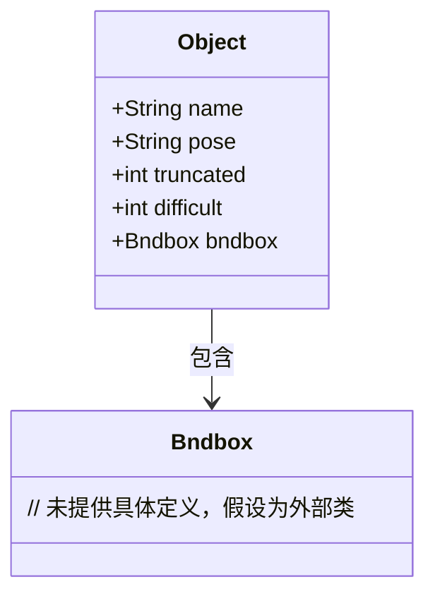
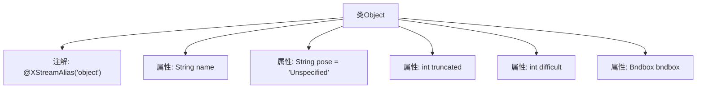

# 基础信息

|      |      |
|------|------|
| 名称 | Object |
| 编码语言 | .java |
| 代码路径 | WeFe/board/board-service/src/main/java/com/welab/wefe/board/service/dto/vo/data_resource/image_data_set/Object.java |
| 包名 | com.welab.wefe.board.service.dto.vo.data_resource.image_data_set |
| 依赖项 | ['com.thoughtworks.xstream.annotations.XStreamAlias'] |
| 概述说明 | Java类Object定义物体属性：名称name，姿态pose（非必须），遮挡truncated（非必须），难识别difficult（非必须），边界框bndbox。 |

# 说明

该代码定义了一个名为Object的类，使用XStreamAlias注解标记为object。类包含五个字段：name（字符串类型，必填）、pose（字符串类型，默认值Unspecified，描述物体姿态的非必须字段）、truncated（整型，非必须字段，用于标记物体遮挡超过15-20%且位于边界框外的情况）、difficult（整型，非必须字段，用于标记难以识别的物体）、bndbox（Bndbox类型，必填字段）。所有非必须字段均有注释说明其用途。

# 类列表 Class Summary

| 名称   | 类型  | 说明 |
|-------|------|-------------|
| Object | class | Java类Object定义物体属性：名称name，姿态pose（非必须），遮挡标记truncated（非必须），识别难度difficult（非必须），边界框bndbox。 |

## 类 Object

|      |      |
|------|------|
| 访问范围 | @XStreamAlias("object");public |
| 类型 | class |
| 名称 | Object |
| 说明 | Java类Object定义物体属性：名称name，姿态pose（非必须），遮挡标记truncated（非必须），识别难度difficult（非必须），边界框bndbox。 |

### UML类图

这段类图描述了一个标注物体信息的Object类，包含名称(name)、姿态(pose)、截断状态(truncated)、识别难度(difficult)等字段，并通过组合关系关联到Bndbox类（表示物体边界框）。其中pose、truncated、difficult均为非必须字段，分别描述物体姿态、遮挡情况和识别难度。类通过@XStreamAlias注解实现XML序列化别名映射，整体结构用于物体检测数据的结构化存储。

### 内部方法调用关系图

该流程图展示了Object类的结构，包含5个属性和1个类注解。其中name为必填字段，pose、truncated、difficult均为带注释的非必须字段，bndbox为关联的边界框对象。注解@XStreamAlias定义了XML序列化时的标签名。所有属性均直接关联到Object类，无方法调用关系。

### 字段列表 Field List

| 名称  | 类型  | 说明 |
|-------|-------|------|
| bndbox | Bndbox | 类成员变量bndbox，类型为Bndbox。 |
| difficult | int | 定义了一个公共整型变量difficult。 |
| truncated | int | 整型变量truncated，表示截断状态。 |
| pose = "Unspecified" | String | 变量pose为字符串类型，初始值为"Unspecified"。 |
| name | String | 公开字符串变量name。 |

### 方法列表

| 名称  | 类型  | 说明 |
|-------|-------|------|

