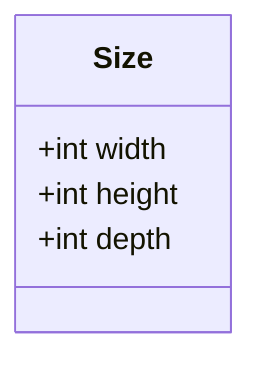
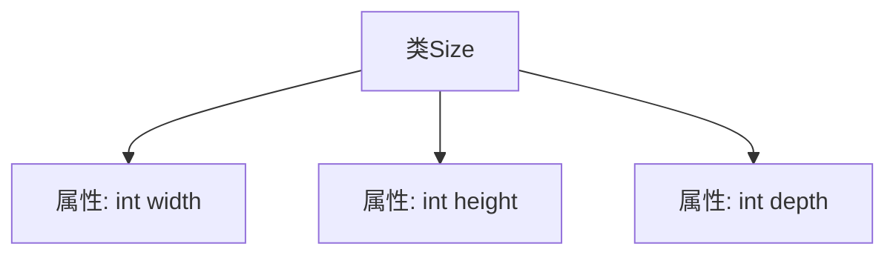

# 基础信息

|      |      |
|------|------|
| 名称 | Size |
| 编码语言 | .java |
| 代码路径 | WeFe/board/board-service/src/main/java/com/welab/wefe/board/service/dto/vo/data_resource/image_data_set/Size.java |
| 包名 | com.welab.wefe.board.service.dto.vo.data_resource.image_data_set |
| 依赖项 | [] |
| 概述说明 | Size类包含三个公共整型字段：width、height和depth，分别表示宽度、高度和深度。 |

# 说明

这是一个名为Size的公共类，包含三个公开的整型字段：width表示宽度，height表示高度，depth表示深度。该类用于存储三维尺寸信息，所有字段均可直接访问和修改。

# 类列表 Class Summary

| 名称   | 类型  | 说明 |
|-------|------|-------------|
| Size | class | Size类包含三个公共整型字段：width、height和depth，用于表示尺寸的宽、高和深。 |

## 类 Size

|      |      |
|------|------|
| 访问范围 | public |
| 类型 | class |
| 名称 | Size |
| 说明 | Size类包含三个公共整型字段：width、height和depth，用于表示尺寸的宽、高和深。 |

### UML类图

这段代码定义了一个简单的`Size`类，用于表示三维尺寸信息，包含三个公有整型字段：`width`（宽度）、`height`（高度）和`depth`（深度）。该类没有定义任何方法，仅作为数据结构使用，适合存储和传递尺寸参数。由于所有字段均为公有且可变，使用时需注意直接修改字段可能导致的数据一致性问题。这种设计常见于需要高效访问但无需封装逻辑的简单值对象场景。

### 内部方法调用关系图

这段流程图展示了Size类的结构，它是一个简单的数据类，包含三个公共整型属性：width（宽度）、height（高度）和depth（深度）。图中清晰地呈现了类与属性之间的从属关系，每个属性都直接关联到Size类，没有方法或复杂逻辑。这种结构常用于存储三维尺寸信息，适用于图形处理、几何计算或物体建模等场景。

### 字段列表 Field List

| 名称  | 类型  | 说明 |
|-------|-------|------|
| depth | int | 变量depth为整型，表示深度。 |
| height | int | 整型变量height，用于存储高度值。 |
| width | int | 声明一个公共整型变量width。 |

### 方法列表

| 名称  | 类型  | 说明 |
|-------|-------|------|

