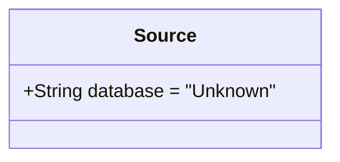
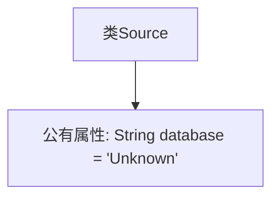

# 基础信息

|      |      |
|------|------|
| 名称 | Source |
| 编码语言 | .java |
| 代码路径 | WeFe/board/board-service/src/main/java/com/welab/wefe/board/service/dto/vo/data_resource/image_data_set/Source.java |
| 包名 | com.welab.wefe.board.service.dto.vo.data_resource.image_data_set |
| 依赖项 | [] |
| 概述说明 | 类Source包含一个字符串字段database，默认值为"Unknown"。 |

# 说明

这是一个名为Source的Java类定义，包含一个公开的字符串类型成员变量database，其默认值被初始化为"Unknown"。该变量用于存储数据库信息，当前状态为未知。类结构简单，仅包含一个字段声明，没有定义任何方法。

# 类列表 Class Summary

| 名称   | 类型  | 说明 |
|-------|------|-------------|
| Source | class | 类Source包含一个字符串字段database，默认值为"Unknown"。 |

## 类 Source

|      |      |
|------|------|
| 访问范围 | public |
| 类型 | class |
| 名称 | Source |
| 说明 | 类Source包含一个字符串字段database，默认值为"Unknown"。 |

### UML类图

这段代码定义了一个简单的`Source`类，其中包含一个公有字符串字段`database`，初始值为"Unknown"。该类没有定义任何方法，仅用于存储数据源信息。类图清晰地展示了该类的唯一成员变量及其可见性和默认值。这种结构通常用于基础数据容器或配置类。

### 内部方法调用关系图

这段代码定义了一个名为Source的简单类，其中只包含一个公有字符串属性database，其默认值为"Unknown"。该流程图清晰地展示了类与唯一属性之间的从属关系，没有任何方法或其他复杂结构。整个类结构极其简单，仅用于存储一个数据库名称的字符串值，适合作为基础数据容器使用。

### 字段列表 Field List

| 名称  | 类型  | 说明 |
|-------|-------|------|
| database = "Unknown" | String | 声明一个公共字符串变量database，初始值为"Unknown"。 |

### 方法列表

| 名称  | 类型  | 说明 |
|-------|-------|------|

