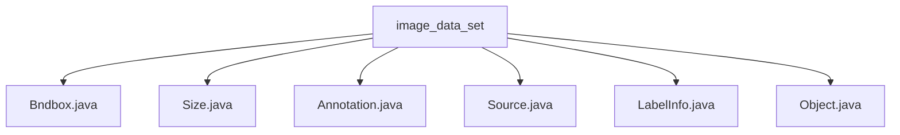

# 基础信息

|      |      |
|------|------|
| 名称 | image_data_set |
| 编码语言 | .java |
| 代码路径 | WeFe/board/board-service/src/main/java/com/welab/wefe/board/service/dto/vo/data_resource/image_data_set |
| 包名 | docs.board.board-service.src.main.java.com.welab.wefe.board.service.dto.vo.data_resource.image_data_set |
| 概述说明 | Bndbox类表示矩形边界框，含xmin、ymin、xmax、ymax坐标。Size类存储三维尺寸width、height、depth。Annotation类处理标注数据，含文件信息、对象列表及转换方法。Source类简单存储数据库信息。LabelInfo类管理标注信息，含标签列表和检查方法。Object类描述物体属性，含名称、姿态、遮挡标记及边界框。 |

# 说明

## 概述  
该模块核心职责是管理图像数据集的标注信息，包括边界框定义、尺寸描述和对象属性存储。接口规范统一采用公共字段直接访问模式，例如Bndbox的坐标字段和Size的维度字段。关键数据结构包含Bndbox（矩形坐标）、Size（三维尺寸）、Annotation（标注元数据）和Object（物体属性）。外部依赖仅涉及XStream序列化框架。例如LabelInfo通过Item对象管理标注点坐标，类似GIS系统中的要素存储。

## 主要业务场景  
模块支持完整的图像标注流程：从原始数据（Source）到几何定义（Bndbox/Size），再到对象标注（Object）的层级化处理。典型交互模式为Annotation类聚合size和objectList，通过toLabelInfo方法转换数据格式。例如Object类使用XStreamAlias实现XML映射，类似JAXB的序列化方案。功能覆盖标注创建（Item）、验证（isLabeled）和查询（labelList），形成端到端的标注管理能力。

### 包内部结构视图

该流程图展示了image_data_set目录下的文件结构关系，包含6个Java类文件：Bndbox.java、Size.java、Annotation.java、Source.java、LabelInfo.java和Object.java。所有文件都直接隶属于image_data_set目录，没有更深层级的子目录结构，形成一个简单的扁平化文件组织结构。

# 文件列表

| 名称   | 类型  | 说明 |
|-------|------|-------------|
| [Bndbox.java](Bndbox.md) | file | Bndbox类定义了一个矩形框，包含左上角坐标(xmin,ymin)和右下角坐标(xmax,ymax)。 |
| [Size.java](Size.md) | file | Size类包含三个公共整型字段：width、height和depth，分别表示宽度、高度和深度。 |
| [Annotation.java](Annotation.md) | file | Annotation类用于标注信息，包含文件夹、文件名、路径、来源、尺寸等属性，可将对象列表转换为LabelInfo或提取标签列表。 |
| [Source.java](Source.md) | file | 类Source包含一个字符串字段database，默认值为"Unknown"。 |
| [LabelInfo.java](LabelInfo.md) | file | LabelInfo类管理图片标注信息，包含对象列表及标签提取方法。Item类存储单个标注的标签、遮挡状态及坐标点。Point类定义坐标。提供检查标注存在的方法。 |
| [Object.java](Object.md) | file | Java类Object定义物体属性：名称name，姿态pose（非必须），遮挡truncated（非必须），难识别difficult（非必须），边界框bndbox。 |

