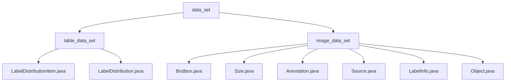

# 基础信息

|      |      |
|------|------|
| 名称 | data_set |
| 编码语言 | .java |
| 代码路径 | WeFe/board/board-service/src/main/java/com/welab/wefe/board/service/dto/vo/data_set |
| 包名 | docs.board.board-service.src.main.java.com.welab.wefe.board.service.dto.vo.data_set |
| 概述说明 | 标签管理模块封装标签数据统计及JSON序列化功能，支持排序和格式转换。图像标注模块处理边界框、尺寸及对象属性，支持Pascal VOC格式标注流程。 |

# 说明

## 概述  
该模块核心职责是统一管理结构化表格数据和图像数据的标注信息，提供数据封装、统计分析和格式转换功能。接口规范采用Java类封装，包含两类核心结构：表格侧（LabelDistributionItem/Distribution）处理标签频次统计，图像侧（Bndbox/Annotation）管理空间标注。关键数据结构形成互补体系，表格侧为标签-数值键值对，图像侧含坐标、尺寸和对象属性。外部依赖包括JSON序列化库和XStream注解库。例如LabelDistribution输出统计报表，Annotation处理Pascal VOC格式转换。

## 主要业务场景  
模块支持两类典型场景：表格标签分布统计（类似数据透视）和图像标注管理（类似标注系统中台）。业务流程均遵循"初始化-处理-输出"模式，表格侧实现排序和JSON序列化，图像侧完成标注构建和格式转换。交互模式均采用对象封装，但表格侧重聚合计算（如toJson），图像侧重结构组合（如Object嵌套Bndbox）。典型应用包括生成标签质量报告（表格）和处理遮挡标注（图像），API覆盖构造器、状态检查和数据转换。例如difficult标记难例，truncated表示遮挡。

### 包内部结构视图

该流程图展示了WeFe项目中data_set模块的层级结构，包含table_data_set和image_data_set两个子模块。table_data_set下包含标签分布相关的Java类文件，image_data_set下则包含图像标注相关的多个Java类文件，完整呈现了数据集管理模块的文件组织结构。

# 文件列表

| 名称   | 类型  | 说明 |
|-------|------|-------------|
| [image_data_set](image_data_set/_module.md) | package | Bndbox类定义二维边界框坐标。Size类存储三维尺寸。Annotation类管理标注信息。Source类存储数据库信息。LabelInfo类处理图片标注。Object类描述物体属性。 |
| [table_data_set](table_data_set/_module.md) | package | LabelDistributionItem类存储标签名和数量，提供构造方法。LabelDistribution类管理标签数据，含类别数、标签列表及排序功能，支持转JSON。 |

