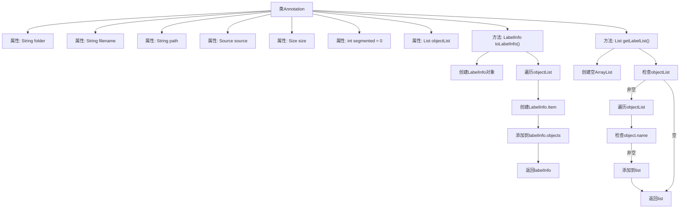

# 基础信息

|      |      |
|------|------|
| 名称 | Annotation |
| 编码语言 | .java |
| 代码路径 | WeFe/board/board-service/src/main/java/com/welab/wefe/board/service/dto/vo/data_set/image_data_set/Annotation.java |
| 包名 | com.welab.wefe.board.service.dto.vo.data_set.image_data_set |
| 依赖项 | ['com.thoughtworks.xstream.annotations.XStreamAlias', 'com.thoughtworks.xstream.annotations.XStreamImplicit', 'com.welab.wefe.common.util.StringUtil', 'java.util.ArrayList', 'java.util.List'] |
| 概述说明 | Java类Annotation用于标注数据，包含文件夹、文件名、路径、来源、尺寸等信息，支持转换为LabelInfo格式并获取标签列表。 |

# 说明

这是一个名为Annotation的Java类，用于存储标注信息。类中包含folder、filename、path等字段，其中folder取值限定为train或test。segmented字段暂未使用，默认值为0。objectList存储对象列表，使用XStreamImplicit注解。类提供了toLabelInfo方法将标注信息转换为LabelInfo对象，以及getLabelList方法获取所有对象的名称列表。方法内部会检查objectList是否为空，并处理对象名称非空的情况。

# 类列表 Class Summary

| 名称   | 类型  | 说明 |
|-------|------|-------------|
| Annotation | class | Java类Annotation用于标注数据，包含文件夹、文件名、路径、来源、尺寸等信息，支持转换为LabelInfo格式并提取标签列表。 |


## 类 Annotation

|      |      |
|------|------|
| 访问范围 | @XStreamAlias("annotation");public |
| 类型 | class |
| 名称 | Annotation |
| 说明 | Java类Annotation用于标注数据，包含文件夹、文件名、路径、来源、尺寸等信息，支持转换为LabelInfo格式并提取标签列表。 |


### UML类图

```mermaid
classDiagram
    class Annotation {
        +String folder
        +String filename
        +String path
        +Source source
        +Size size
        +int segmented
        +List~Object~ objectList
        +LabelInfo toLabelInfo()
        +List~String~ getLabelList()
    }

    class Source {
        <<Interface>>
    }

    class Size {
        <<Interface>>
    }

    class Object {
        +String name
        +Bndbox bndbox
    }

    class Bndbox {
        +int xmin
        +int ymin
        +int xmax
        +int ymax
    }

    class LabelInfo {
        +List~Item~ objects
        +class Item {
            +String name
            +int xmin
            +int ymin
            +int xmax
            +int ymax
        }
    }

    Annotation --> Source : 依赖
    Annotation --> Size : 依赖
    Annotation --> Object : 包含
    Object --> Bndbox : 包含
    Annotation --> LabelInfo : 转换
```

该类图展示了Annotation类的结构及其关联关系。Annotation作为核心类，包含文件夹、文件名等基础属性，并通过objectList管理多个Object对象。每个Object包含名称和Bndbox边界框信息。类提供了toLabelInfo()方法将数据转换为LabelInfo格式，以及getLabelList()提取标签列表。Source和Size作为接口存在，Bndbox存储坐标信息，LabelInfo内部类Item用于存储转换后的标注项。整体结构清晰展现了标注数据的组织方式和转换逻辑。


### 内部方法调用关系图



该流程图展示了Annotation类的结构和主要方法逻辑。类包含7个属性和2个核心方法：toLabelInfo()将objectList转换为LabelInfo对象，通过遍历列表创建Item并填充数据；getLabelList()提取所有非空的object.name组成列表。流程清晰展现了对象转换和列表处理的分支逻辑，特别是对objectList的空值检查和元素过滤过程。

### 字段列表 Field List

| 名称  | 类型  | 说明 |
|-------|-------|------|
| size | Size | 定义了一个公共的Size类型变量size。 |
| objectList | List<Object> | XStream注解标记的objectList，用于隐式处理对象列表。 |
| segmented = 0 | int | 定义整型变量segmented，初始值为0。 |
| source | Source | 声明一个名为source的公共Source类型变量。 |
| path | String | 公共字符串变量path |
| filename | String | 声明一个公共字符串变量filename。 |
| folder | String | 定义了一个公开的字符串变量folder。 |

### 方法列表

| 名称  | 类型  | 说明 |
|-------|-------|------|
| toLabelInfo | LabelInfo | 将对象列表转换为LabelInfo，包含每个对象的名称和边界框坐标。若对象列表非空，遍历并添加信息后返回。 |
| getLabelList | List<String> | 方法getLabelList返回非空对象名称列表，若objectList为空则返回空列表。 |


