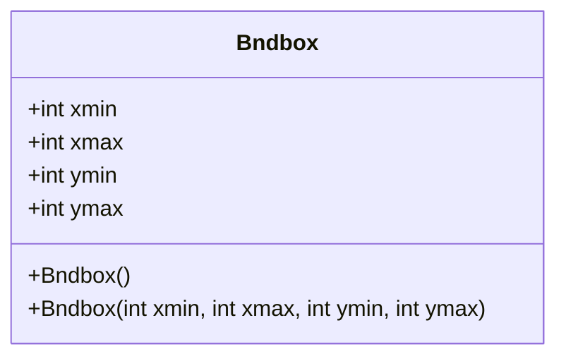
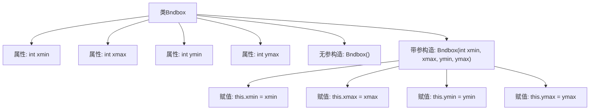

# 基础信息

|      |      |
|------|------|
| 名称 | Bndbox |
| 编码语言 | .java |
| 代码路径 | WeFe/board/board-service/src/main/java/com/welab/wefe/board/service/dto/vo/data_set/image_data_set/Bndbox.java |
| 包名 | com.welab.wefe.board.service.dto.vo.data_set.image_data_set |
| 依赖项 | [] |
| 概述说明 | Bndbox类定义了一个边界框，包含xmin、xmax、ymin、ymax四个整数属性，提供无参和带参构造方法。 |

# 说明

Bndbox类定义了一个表示二维边界框的数据结构，包含四个整型成员变量xmin、xmax、ymin和ymax，分别表示边界框在x轴和y轴方向上的最小和最大坐标值。该类提供了两个构造函数：一个无参构造函数，不进行任何初始化；另一个带参构造函数，接受四个整型参数来初始化边界框的坐标值。

# 类列表 Class Summary

| 名称   | 类型  | 说明 |
|-------|------|-------------|
| Bndbox | class | Bndbox类定义了一个边界框，包含xmin、xmax、ymin、ymax四个整数属性，提供无参和带参构造函数。 |

## 类 Bndbox

|      |      |
|------|------|
| 访问范围 | public |
| 类型 | class |
| 名称 | Bndbox |
| 说明 | Bndbox类定义了一个边界框，包含xmin、xmax、ymin、ymax四个整数属性，提供无参和带参构造函数。 |

### UML类图

这段代码定义了一个名为Bndbox的类，用于表示一个二维边界框。该类包含四个公有整型字段：xmin、xmax、ymin和ymax，分别表示边界框在x轴和y轴上的最小和最大坐标值。类提供了两个构造函数：一个无参构造函数和一个带四个参数的构造函数，用于初始化边界框的坐标值。这个类通常用于计算机视觉和图形处理领域，用于表示物体检测或图像处理中的矩形区域。

### 内部方法调用关系图

该流程图展示了Bndbox类的结构，包含四个整数属性(xmin/xmax/ymin/ymax)和两个构造函数。无参构造不执行任何操作，带参构造会接收四个参数并分别赋值给对应属性。箭头清晰地表示了类与成员之间的从属关系以及构造函数的参数赋值流程。

### 字段列表 Field List

| 名称  | 类型  | 说明 |
|-------|-------|------|
| xmax | int | 声明一个公共整型变量xmax。 |
| xmin | int | 声明一个公共整型变量xmin。 |
| ymin | int | 声明一个公共整型变量ymin。 |
| ymax | int | 定义了一个公共整型变量ymax。 |

### 方法列表

| 名称  | 类型  | 说明 |
|-------|-------|------|

