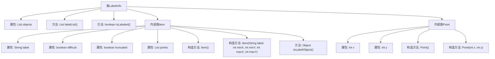

# 基础信息

|      |      |
|------|------|
| 名称 | LabelInfo |
| 编码语言 | .java |
| 代码路径 | WeFe/board/board-service/src/main/java/com/welab/wefe/board/service/dto/vo/data_set/image_data_set/LabelInfo.java |
| 包名 | com.welab.wefe.board.service.dto.vo.data_set.image_data_set |
| 依赖项 | ['com.welab.wefe.common.fieldvalidate.AbstractCheckModel', 'com.welab.wefe.common.fieldvalidate.annotation.Check', 'com.welab.wefe.common.util.StringUtil', 'java.util.ArrayList', 'java.util.List', 'java.util.stream.Collectors'] |
| 概述说明 | LabelInfo类用于管理图片标注信息，包含对象列表和标签提取方法。Item类存储单个标注的标签、位置及属性。Point类表示坐标点。支持判断是否含标注及转换为标签对象。 |

# 说明

LabelInfo类继承AbstractCheckModel，包含objects列表存储Item对象。提供labelList方法提取非空标签列表，isLabeled方法检查是否存在标注信息。Item类包含label、difficult、truncated属性和points列表，提供构造方法和toLabelObject转换方法。Point类表示坐标点，包含x和y属性。整体用于管理图片标注信息及相关操作。

# 类列表 Class Summary

| 名称   | 类型  | 说明 |
|-------|------|-------------|
| LabelInfo | class | LabelInfo类用于管理图片标注信息，包含对象列表和标签提取方法。Item类存储单个标注的标签、位置及属性。支持判断是否已标注及转换为标签对象。 |


## 类 LabelInfo

|      |      |
|------|------|
| 访问范围 | public |
| 类型 | class |
| 名称 | LabelInfo |
| 说明 | LabelInfo类用于管理图片标注信息，包含对象列表和标签提取方法。Item类存储单个标注的标签、位置及属性。支持判断是否已标注及转换为标签对象。 |


### UML类图

```mermaid
classDiagram
    class AbstractCheckModel {
        <<Abstract>>
    }

    class LabelInfo {
        +List~Item~ objects
        +List~String~ labelList()
        +boolean isLabeled()
    }
    LabelInfo --|> AbstractCheckModel

    class Item {
        +String label
        +boolean difficult
        +boolean truncated
        +List~Point~ points
        +Item()
        +Item(String label, int minX, int minY, int maxX, int maxY)
        +Object toLabelObject()
    }
    Item --|> AbstractCheckModel

    class Point {
        +int x
        +int y
        +Point()
        +Point(int x, int y)
    }
    Point --|> AbstractCheckModel

    class Object {
        +Bndbox bndbox
        +String name
        +int difficult
        +int truncated
    }

    class Bndbox {
        +int xmin
        +int ymin
        +int xmax
        +int ymax
    }

    // LabelInfo包含Item对象列表
    LabelInfo "1" *-- "0..*" Item : contains
    // Item包含Point对象列表
    Item "1" *-- "0..*" Point : contains
    // Item的toLabelObject方法创建Object实例
    Item ..> Object : creates
    // Object依赖Bndbox
    Object ..> Bndbox : depends
```

这段代码描述了一个标注信息管理系统，核心类LabelInfo继承自AbstractCheckModel，包含Item对象列表和标注处理方法。Item类表示单个标注项，包含标签、难度标志和坐标点集合，并能转换为标准Object格式。Point类表示二维坐标点。整个结构采用组合模式，LabelInfo聚合多个Item，每个Item又聚合多个Point，形成层级数据关系，用于图像标注信息的存储和处理。


### 内部方法调用关系图



这段代码定义了一个`LabelInfo`类，用于管理图片标注信息。主要功能包括：通过`labelList()`方法获取所有有效标签列表，通过`isLabeled()`检查是否存在有效标注。包含两个内部类：`Item`表示标注项（含标签、坐标点及状态属性），`Point`表示二维坐标点。流程图清晰展示了类结构、属性及方法间的层级关系，反映了标注数据的核心处理逻辑。

### 字段列表 Field List

| 名称  | 类型  | 说明 |
|-------|-------|------|
| objects = new ArrayList<>() | List<Item> | 代码定义了一个公共列表objects，用于存储图片中标记的对象，并通过@Check注解进行名称标注。 |

### 方法列表

| 名称  | 类型  | 说明 |
|-------|-------|------|
| labelList | List<String> | 方法`labelList`检查对象列表`objects`是否为空，若空返回空列表。否则过滤非空标签并收集到新列表返回。 |
| isLabeled | boolean | 检查对象列表是否含有非空标签。若列表为空或无标签则返回false，否则返回true。 |


