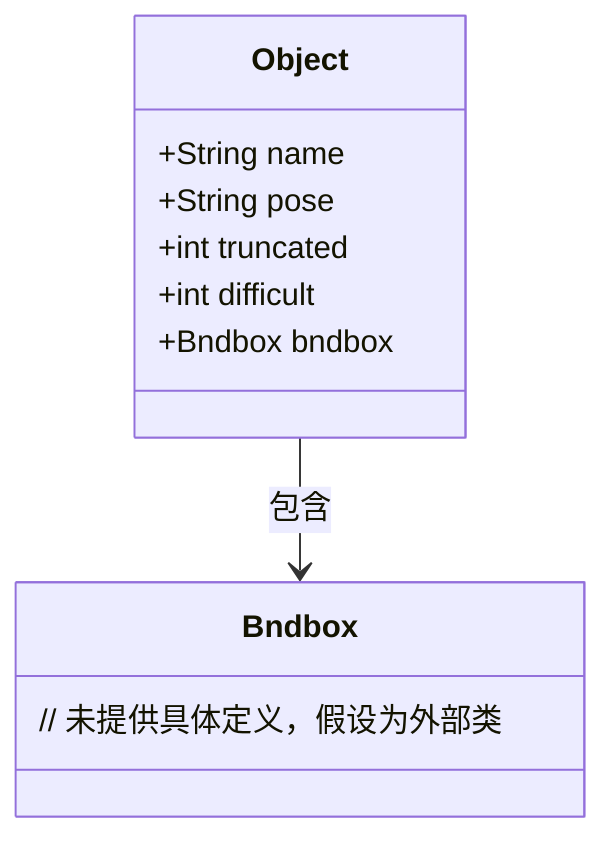
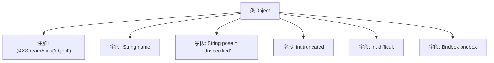

# 基础信息

|      |      |
|------|------|
| 名称 | Object |
| 编码语言 | .java |
| 代码路径 | WeFe/board/board-service/src/main/java/com/welab/wefe/board/service/dto/vo/data_set/image_data_set/Object.java |
| 包名 | com.welab.wefe.board.service.dto.vo.data_set.image_data_set |
| 依赖项 | ['com.thoughtworks.xstream.annotations.XStreamAlias'] |
| 概述说明 | Java类Object定义物体属性：名称、姿态（默认未指定）、遮挡标记、识别难度标记及边界框。非必须字段有默认值。 |

# 说明

该代码定义了一个名为Object的类，使用XStreamAlias注解标记为object。类包含五个字段：name（字符串类型，必填）、pose（字符串类型，默认值Unspecified，描述物体姿态的非必须字段）、truncated（整型，非必须字段，用于标记物体遮挡情况）、difficult（整型，非必须字段，标记难以识别的物体）以及bndbox（Bndbox类型，必填字段）。注释详细说明了各非必须字段的使用条件。

# 类列表 Class Summary

| 名称   | 类型  | 说明 |
|-------|------|-------------|
| Object | class | Object类包含名称、姿态、遮挡标记、识别难度标记和边界框属性，后三者为非必须字段。 |

## 类 Object

|      |      |
|------|------|
| 访问范围 | @XStreamAlias("object");public |
| 类型 | class |
| 名称 | Object |
| 说明 | Object类包含名称、姿态、遮挡标记、识别难度标记和边界框属性，后三者为非必须字段。 |

### UML类图

该类图展示了Object类及其与Bndbox类的关系。Object类包含五个公有字段：name（名称）、pose（姿态描述）、truncated（截断标记）、difficult（识别难度标记）和bndbox（边界框对象）。其中pose、truncated和difficult均为非必须字段，带有默认值或注释说明。Object类通过组合关系持有Bndbox类的实例，用于表示物体的边界框信息。所有字段均为公有可见，未定义方法。

### 内部方法调用关系图

这段代码定义了一个名为Object的类，用于表示一个带有边界框的物体对象。类中包含五个字段：name表示物体名称，pose描述物体姿态（默认值为"Unspecified"），truncated标记物体是否被截断，difficult标记物体是否难以识别，bndbox存储物体的边界框信息。类上使用了@XStreamAlias注解，指定XML序列化时的别名为"object"。所有非必须字段均带有详细的注释说明。

### 字段列表 Field List

| 名称  | 类型  | 说明 |
|-------|-------|------|
| truncated | int | 整型变量truncated，用于存储截断后的值。 |
| difficult | int | 声明一个公共整型变量difficult。 |
| name | String | 公共字符串变量name。 |
| bndbox | Bndbox | 类成员变量bndbox，类型为Bndbox。 |
| pose = "Unspecified" | String | 变量pose为字符串类型，初始值为"Unspecified"。 |

### 方法列表

| 名称  | 类型  | 说明 |
|-------|-------|------|

