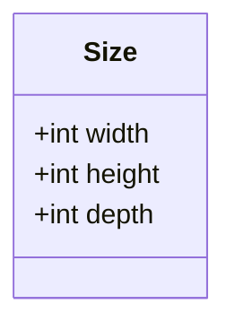
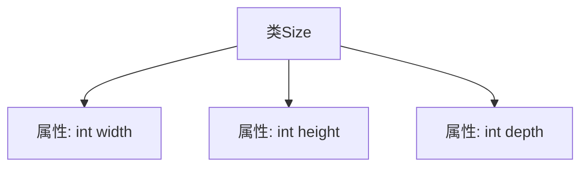

# 基础信息

|      |      |
|------|------|
| 名称 | Size |
| 编码语言 | .java |
| 代码路径 | WeFe/board/board-service/src/main/java/com/welab/wefe/board/service/dto/vo/data_set/image_data_set/Size.java |
| 包名 | com.welab.wefe.board.service.dto.vo.data_set.image_data_set |
| 依赖项 | [] |
| 概述说明 | Size类包含三个公共整型字段：width、height和depth，分别表示宽度、高度和深度。 |

# 说明

这是一个名为Size的公共类，包含三个公开的整型字段：width表示宽度，height表示高度，depth表示深度。该类用于存储三维尺寸数据。

# 类列表 Class Summary

| 名称   | 类型  | 说明 |
|-------|------|-------------|
| Size | class | Size类包含三个公共整型字段：宽度、高度和深度。 |

## 类 Size

|      |      |
|------|------|
| 访问范围 | public |
| 类型 | class |
| 名称 | Size |
| 说明 | Size类包含三个公共整型字段：宽度、高度和深度。 |

### UML类图

这段代码定义了一个名为`Size`的简单类，用于表示三维尺寸信息。该类包含三个公有整型字段：`width`（宽度）、`height`（高度）和`depth`（深度），没有定义任何方法。这是一个典型的数据载体类，通常用于存储和传递尺寸相关数据，可能应用于图形处理、三维建模或物体测量等场景。由于所有字段都是公开的，使用时可以直接访问而无需通过getter/setter方法。

### 内部方法调用关系图

这段代码定义了一个名为Size的简单类，包含三个公共整型属性：width（宽度）、height（高度）和depth（深度）。该类没有定义任何方法，仅用于存储三维尺寸数据。这种结构通常用于图形处理、游戏开发或物体测量等场景，作为基础数据容器使用。由于所有字段都是public的，外部代码可以直接访问和修改这些属性值。

### 字段列表 Field List

| 名称  | 类型  | 说明 |
|-------|-------|------|
| width | int | 定义了一个公共整型变量width。 |
| height | int | 定义了一个公共整型变量height。 |
| depth | int | 变量depth为整型，表示深度。 |

### 方法列表

| 名称  | 类型  | 说明 |
|-------|-------|------|

