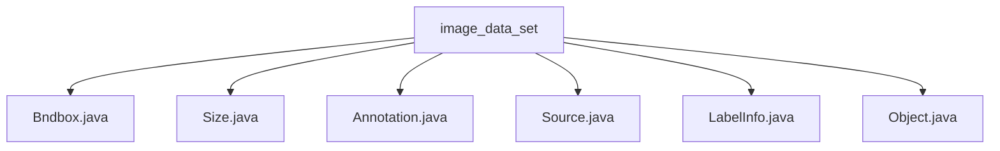

# 基础信息

|      |      |
|------|------|
| 名称 | image_data_set |
| 编码语言 | .java |
| 代码路径 | WeFe/board/board-service/src/main/java/com/welab/wefe/board/service/dto/vo/data_set/image_data_set |
| 包名 | docs.board.board-service.src.main.java.com.welab.wefe.board.service.dto.vo.data_set.image_data_set |
| 概述说明 | Bndbox类定义二维边界框坐标。Size类存储三维尺寸。Annotation类管理标注信息。Source类存储数据库信息。LabelInfo类处理图片标注。Object类描述物体属性。 |

# 说明

## 概述  
该模块核心职责是管理图像数据集的标注信息，包括边界框定义、尺寸描述和标注对象属性。接口规范统一采用Java类封装数据结构，例如Bndbox定义二维边界框，Size存储三维尺寸，Annotation整合标注元数据。关键数据结构包含Bndbox（坐标范围）、Size（宽高深）、Object（标注对象）和LabelInfo（标签管理）。外部依赖仅涉及XStream注解库，用于对象序列化。例如Object类使用XStreamAlias标记字段，Annotation通过XStreamImplicit处理对象列表。

## 主要业务场景  
模块支持图像标注全流程，类似标注系统数据层。业务流程包括：初始化标注信息（如Annotation设置folder为train/test）、构建标注对象（如Object绑定Bndbox）、转换标签格式（如toLabelInfo方法）。交互模式基于对象组合，例如LabelInfo聚合Item和Point实现标签管理。典型应用为Pascal VOC格式标注处理，API类型涵盖数据转换（getLabelList）和状态检查（isLabeled）。例如通过difficult标记难例，truncated表示遮挡情况。

### 包内部结构视图

该流程图展示了image_data_set目录下的文件结构关系，包含6个Java类文件：Bndbox.java、Size.java、Annotation.java、Source.java、LabelInfo.java和Object.java。所有文件都直接隶属于image_data_set目录，没有更深层级的子目录结构，呈现出一个简单的星型拓扑关系。

# 文件列表

| 名称   | 类型  | 说明 |
|-------|------|-------------|
| [Bndbox.java](Bndbox.md) | file | Bndbox类定义了一个边界框，包含xmin、xmax、ymin、ymax四个整数属性，提供无参和带参构造方法。 |
| [Size.java](Size.md) | file | Size类包含三个公共整型字段：width、height和depth，分别表示宽度、高度和深度。 |
| [Annotation.java](Annotation.md) | file | Java类Annotation用于标注数据，包含文件夹、文件名、路径、来源、尺寸等信息，支持转换为LabelInfo格式并获取标签列表。 |
| [Source.java](Source.md) | file | 类Source包含一个公有字符串字段database，默认值为"Unknown"。 |
| [LabelInfo.java](LabelInfo.md) | file | LabelInfo类用于管理图片标注信息，包含对象列表和标签提取方法。Item类存储单个标注的标签、位置及属性。Point类表示坐标点。支持判断是否含标注及转换为标签对象。 |
| [Object.java](Object.md) | file | Java类Object定义物体属性：名称、姿态（默认未指定）、遮挡标记、识别难度标记及边界框。非必须字段有默认值。 |

