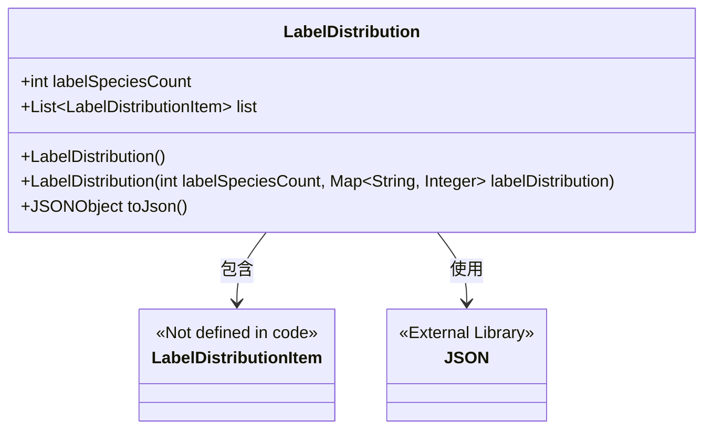
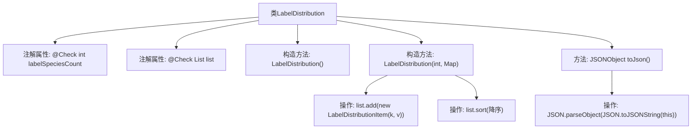

# 基础信息

|      |      |
|------|------|
| 名称 | LabelDistribution |
| 编码语言 | .java |
| 代码路径 | WeFe/board/board-service/src/main/java/com/welab/wefe/board/service/dto/vo/data_set/table_data_set/LabelDistribution.java |
| 包名 | com.welab.wefe.board.service.dto.vo.data_set.table_data_set |
| 依赖项 | ['com.alibaba.fastjson.JSON', 'com.alibaba.fastjson.JSONObject', 'com.welab.wefe.common.fieldvalidate.annotation.Check', 'java.util.ArrayList', 'java.util.List', 'java.util.Map'] |
| 概述说明 | LabelDistribution类用于管理标签分布，包含标签类别数量和标签列表，支持从Map初始化并按计数排序，提供JSON转换功能。 |

# 说明

LabelDistribution类用于管理标签分布数据，包含标签类别数量（labelSpeciesCount）和标签列表（list）。列表存储LabelDistributionItem对象，通过构造函数可初始化标签数量及分布映射，并将映射项转换为列表项后按计数降序排序。提供toJson方法将对象转为JSON格式。所有字段均有@Check注解标注用途。

# 类列表 Class Summary

| 名称   | 类型  | 说明 |
|-------|------|-------------|
| LabelDistribution | class | LabelDistribution类用于管理标签分布，包含标签类别数量(labelSpeciesCount)和标签列表(list)。构造函数支持初始化并排序标签，提供toJson方法转换为JSON格式。 |

## 类 LabelDistribution

|      |      |
|------|------|
| 访问范围 | public |
| 类型 | class |
| 名称 | LabelDistribution |
| 说明 | LabelDistribution类用于管理标签分布，包含标签类别数量(labelSpeciesCount)和标签列表(list)。构造函数支持初始化并排序标签，提供toJson方法转换为JSON格式。 |

### UML类图

这段代码展示了一个标签分布类(LabelDistribution)，用于管理标签类别数量(labelSpeciesCount)和标签分布列表(list)。该类提供了两种构造方式：默认构造器和通过Map初始化数据的构造器，后者会自动将Map数据转换为LabelDistributionItem对象并排序。包含一个toJson()方法将对象转换为JSON格式。类图中显示了与LabelDistributionItem的包含关系，以及对JSON库的依赖关系。

### 内部方法调用关系图

该流程图描述了LabelDistribution类的结构及其方法调用关系。类包含两个带@Check注解的属性和两个构造方法，其中带参数的构造方法会遍历输入Map生成LabelDistributionItem列表并排序。toJson方法通过FastJSON库将对象序列化为JSONObject。流程清晰展示了属性初始化、列表操作和JSON转换的完整链路，重点突出了构造方法中的集合处理和排序逻辑。

### 字段列表 Field List

| 名称  | 类型  | 说明 |
|-------|-------|------|
| list = new ArrayList<>() | List<LabelDistributionItem> | Java代码：定义名为list的公开列表变量，存储LabelDistributionItem对象，使用@Check注解标记为"标签列表"。 |
| labelSpeciesCount | int | 公共整型变量labelSpeciesCount，用于检查标签类别数量，带有名称标注"标签类别数量"。 |

### 方法列表

| 名称  | 类型  | 说明 |
|-------|-------|------|
| toJson | JSONObject | 方法将当前对象转为JSON字符串再解析为JSONObject，实现对象到JSON的转换。 |

