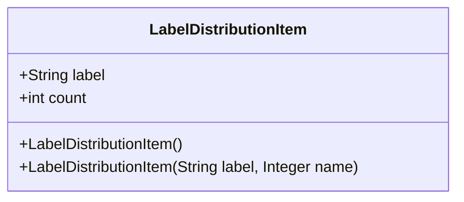
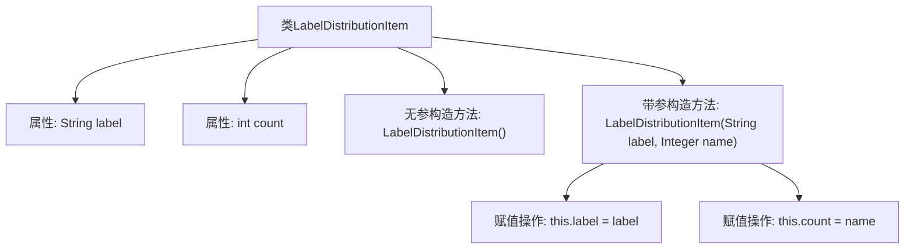

# 基础信息

|      |      |
|------|------|
| 名称 | LabelDistributionItem |
| 编码语言 | .java |
| 代码路径 | WeFe/board/board-service/src/main/java/com/welab/wefe/board/service/dto/vo/data_set/table_data_set/LabelDistributionItem.java |
| 包名 | com.welab.wefe.board.service.dto.vo.data_set.table_data_set |
| 依赖项 | [] |
| 概述说明 | Java类LabelDistributionItem，包含label字符串和count整型属性，提供无参和带参构造方法。 |

# 说明

这是一个名为LabelDistributionItem的Java类，用于存储标签及其对应数量的数据。该类包含两个成员变量：label（字符串类型，表示标签名称）和count（整型，表示标签数量）。类中提供了两个构造函数：一个无参构造函数，另一个构造函数接受label和count参数用于初始化对象。该类结构简单，主要用于封装标签分布数据。

# 类列表 Class Summary

| 名称   | 类型  | 说明 |
|-------|------|-------------|
| LabelDistributionItem | class | Java类LabelDistributionItem，包含字符串label和整数count属性，提供无参和带参构造方法。 |

## 类 LabelDistributionItem

|      |      |
|------|------|
| 访问范围 | public |
| 类型 | class |
| 名称 | LabelDistributionItem |
| 说明 | Java类LabelDistributionItem，包含字符串label和整数count属性，提供无参和带参构造方法。 |

### UML类图

这段代码定义了一个名为LabelDistributionItem的类，用于存储标签及其对应的计数信息。该类包含两个公有字段：label（字符串类型）和count（整型），以及两个构造函数：一个无参构造函数和一个带参数的构造函数（接受标签字符串和计数值）。这个类可能用于统计或记录某种标签的分布情况，适合在数据分析和统计场景中使用。

### 内部方法调用关系图

这段代码定义了一个名为LabelDistributionItem的类，包含两个属性（label和count）和两个构造方法。无参构造方法不执行任何操作，带参构造方法接收label和name参数，分别赋值给类的label属性和count属性。流程图清晰地展示了类结构与构造方法的参数传递和赋值过程，反映了对象初始化的完整逻辑路径。

### 字段列表 Field List

| 名称  | 类型  | 说明 |
|-------|-------|------|
| label | String | 声明一个公开的字符串类型变量label。 |
| count | int | 整型公共变量count。 |

### 方法列表

| 名称  | 类型  | 说明 |
|-------|-------|------|

