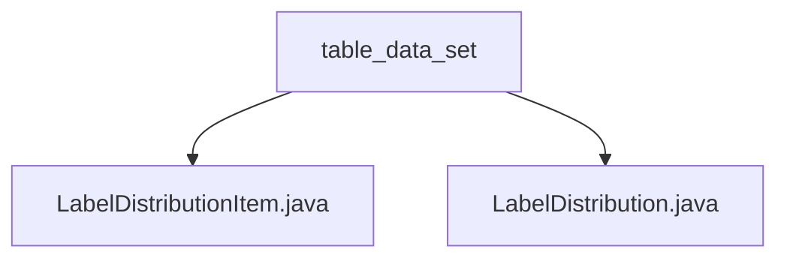

# 基础信息

|      |      |
|------|------|
| 名称 | table_data_set |
| 编码语言 | .java |
| 代码路径 | WeFe/board/board-service/src/main/java/com/welab/wefe/board/service/dto/vo/data_set/table_data_set |
| 包名 | docs.board.board-service.src.main.java.com.welab.wefe.board.service.dto.vo.data_set.table_data_set |
| 概述说明 | LabelDistributionItem类存储标签名和数量，提供构造方法。LabelDistribution类管理标签数据，含类别数、标签列表及排序功能，支持转JSON。 |

# 说明

## 概述  
该模块核心职责是封装和管理标签分布数据，提供标签数量统计及JSON序列化功能。接口规范包括构造器初始化、字段访问及数据转换方法，例如LabelDistributionItem存储标签名称与数量，LabelDistribution管理标签集合并提供排序和JSON输出。  

关键数据结构包含LabelDistributionItem（标签-数量键值对）和LabelDistribution（标签分类集合）。外部依赖仅为JSON序列化库。例如LabelDistribution通过toJson方法输出结构化数据。  

## 主要业务场景  
模块用于处理标签数据的聚合与展示，类似数据透视场景。业务流程包括：初始化标签分布（如从映射构造）、按计数降序排序、转换为JSON格式。交互模式通过对象封装实现，例如LabelDistributionItem作为数据载体，LabelDistribution整合排序逻辑。  

典型应用模式为统计数据集标签分布，例如在表格数据分析中输出标签频次报表。API类型包括构造器初始化（如LabelDistributionItem(label, count)）和工具方法（如toJson），集成案例可见于数据预处理阶段的质量报告生成。

### 包内部结构视图

该流程图展示了table_data_set目录下的两个Java文件：LabelDistributionItem.java和LabelDistribution.java。这两个文件都直接隶属于table_data_set目录，没有更深层的嵌套结构。图表清晰地呈现了这种简单的层级关系，符合给定的路径信息要求。

# 文件列表

| 名称   | 类型  | 说明 |
|-------|------|-------------|
| [LabelDistributionItem.java](LabelDistributionItem.md) | file | Java类LabelDistributionItem，包含label字符串和count整型属性，提供无参和带参构造方法。 |
| [LabelDistribution.java](LabelDistribution.md) | file | LabelDistribution类用于管理标签分布，包含标签类别数量和标签列表，支持从Map初始化并按计数排序，提供JSON转换功能。 |

